# Section d'aide en cas de problèmes techniques

## Ma Sandbox a été recréée ou supprimée

Si votre Sandbox a été supprimée, vous pouvez la recréer gratuitement en suivant les étapes définies dans 
[l'introduction du cours](./courses/01_intro.md#création-de-notre-compte-red-hat-et-provisionnement-de-notre-red-hat-developer-sandbox). 
Notez que la Sandbox est valide pour 30 jours à partir de la date de création. Après cette période, vous devrez également la recréer.

Une fois que la Sandbox est recréée, veuillez suivre les étapes suivantes pour vous reconnecter à votre projet :

- Ouvrez votre Sandbox Red Hat Developer.

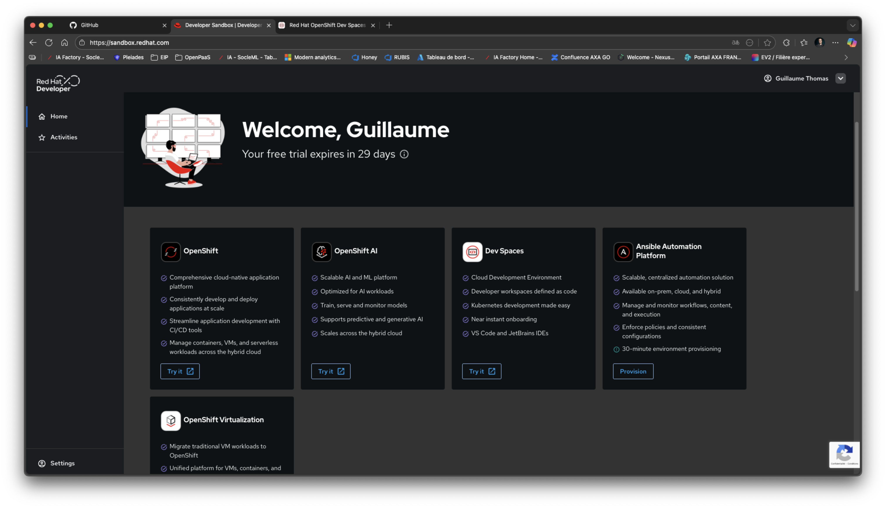

- Accédez à la section Devspaces.
- Créez un nouveau Devspace en utilisant le repository GitHub de votre projet.
- Cliquez sur Create & Open.

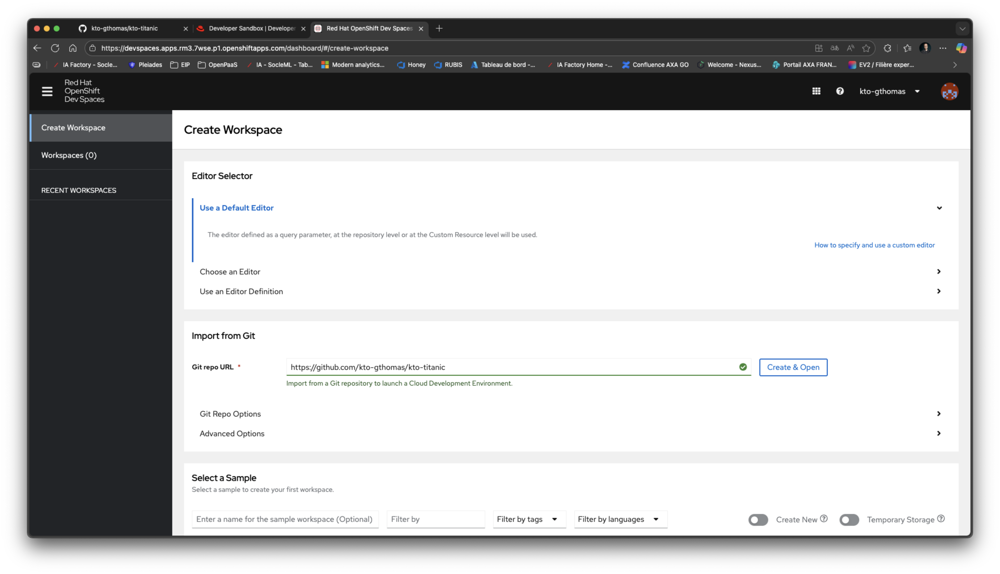

- Dites que vous faites confiance au repository en cliquant sur Continue.

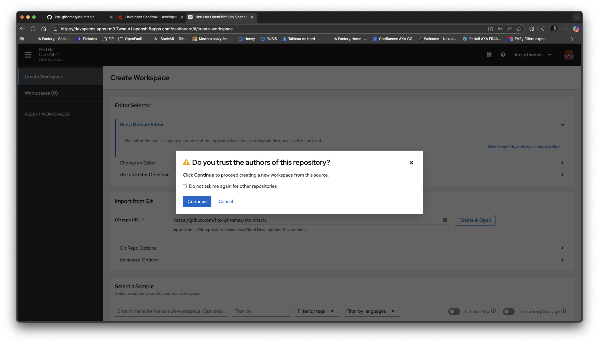

- Acceptez la connection vers GitHub en cliquant sur Authorize.

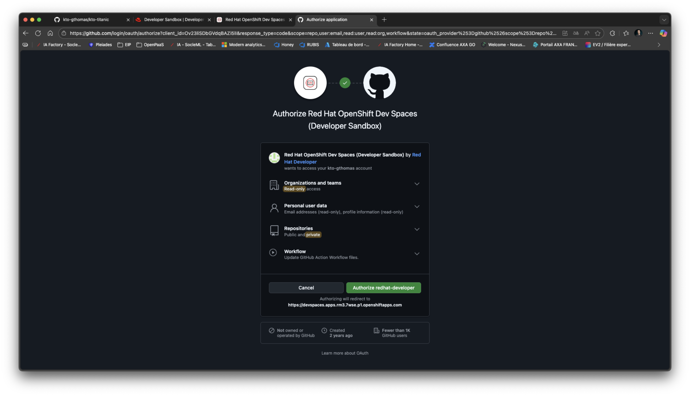

- Votre Codespace s'ouvre alors avec votre projet.

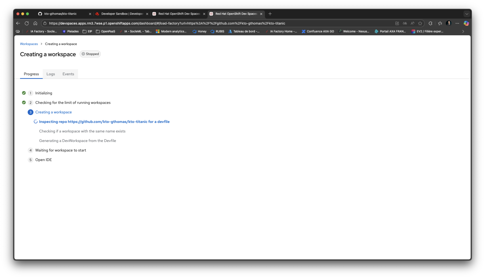

- Il vous faut reconfigurer votre git et git remote pour pointer vers votre repository GitHub personnel avec un jeton. 
Pour cela, utilisez les commande suivante en remplaçant `<votre_nom_utilisateur>`, `<votre_email>` et `<nom_du_repository>` par vos informations :

```bash
git remote set-url origin https://<votre_nom_utilisateur>:<votre_token>@github.com/<votre_nom_utilisateur>/<nom_du_repository>.git
git config user.name "<votre_nom_utilisateur>"
git config user.email "<votre_email>"
git config core.editor "vim"
```

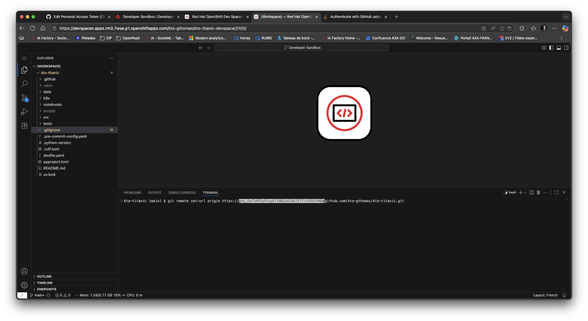
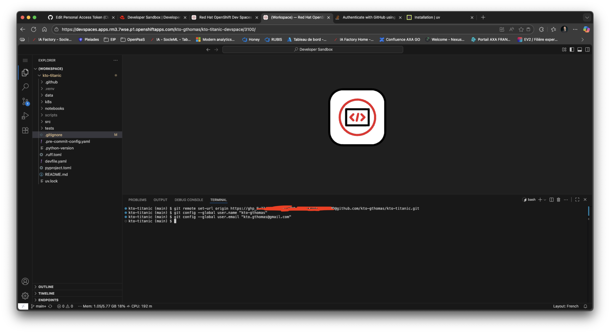

- Réinstallez uv avec la commande :

```bash
curl -LsSf https://astral.sh/uv/install.sh | sh
```

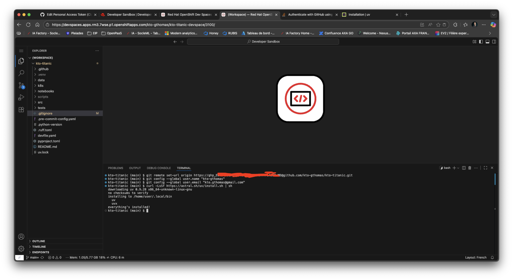

- Synchronisez votre projet avec la commande :

```bash
uv sync --all-groups
```

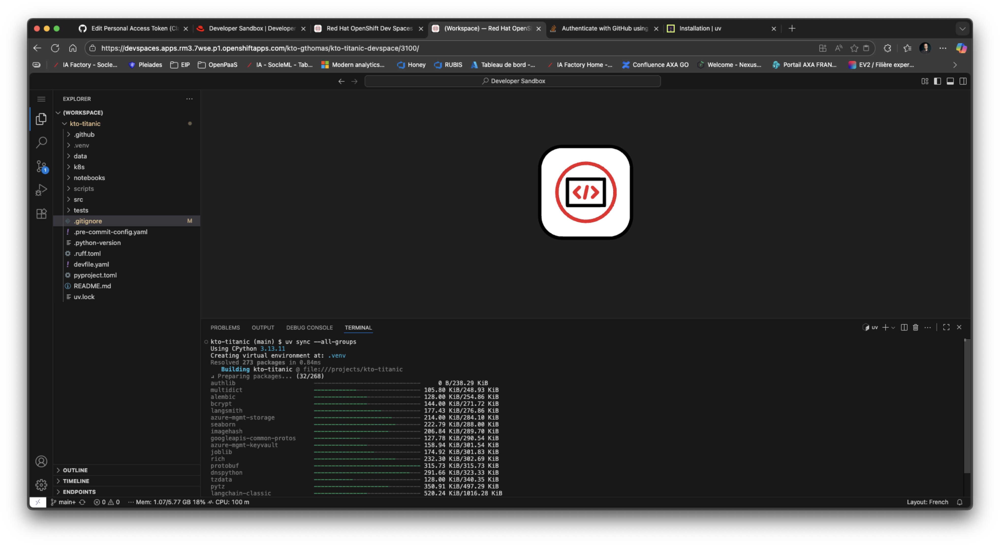

- Réinstallez mlflow avec les commandes : 

```bash
chmod -R 777 scripts
./scripts/install-mlflow.sh
```

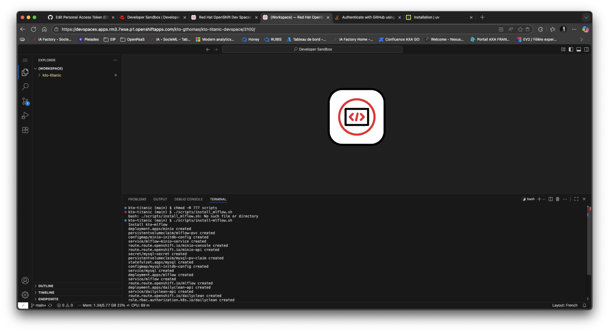

- Vous pouvez maintenant continuer à travailler sur votre projet.

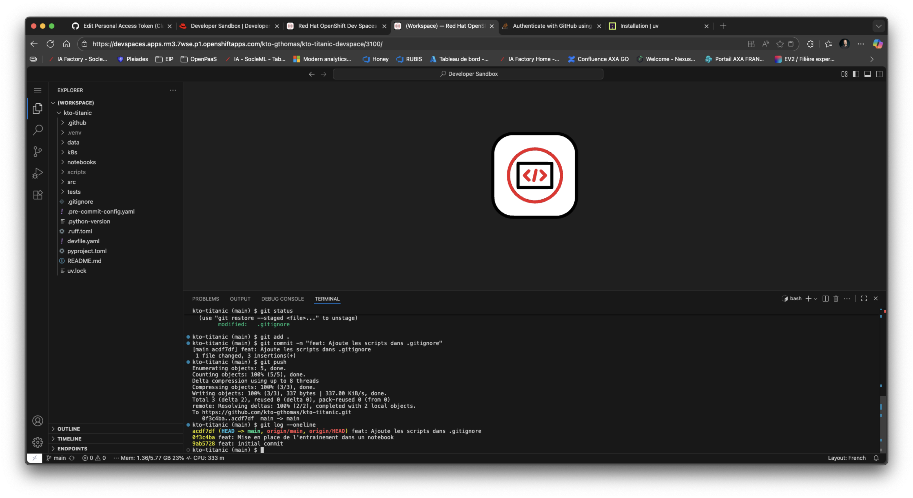

- Votre dataset a également été supprimé. Reportez vous à la section 
[Chargement du dataset dans votre Sandbox](./courses/04_scoping_data_prep_label.md#procédure-de-sauvegarde) 
pour le recharger.

- Rejouez vos dernières github actions pour régénérer les artefacts de build et de déploiement.

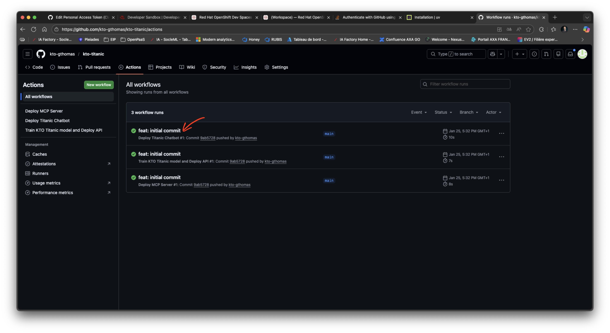
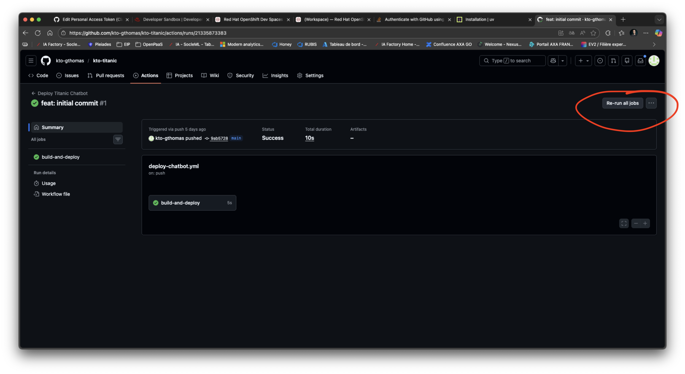
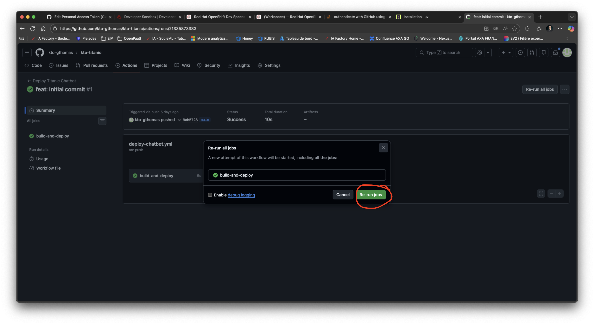
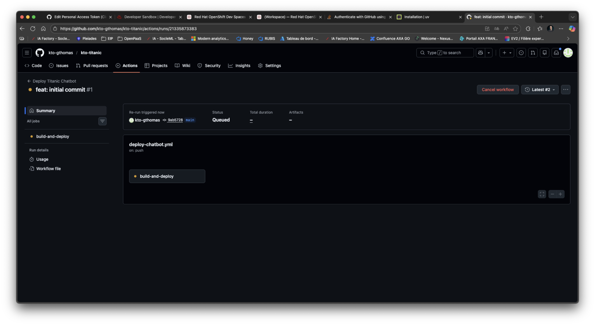

## Dailyclean a visiblement éteint mon environnement tout seul

Il est possible qu'à partir de 18H, votre Sandbox soit mise en veille par le processus Dailyclean.
Vous pouvez vous en rendre compte si vous voyez un écran similaire à celui-ci depuis votre espace Openshift :

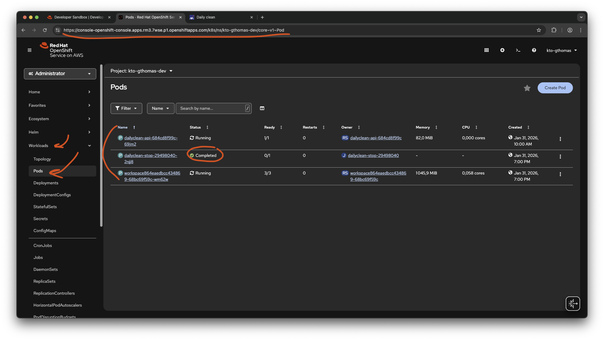

Pour continuer à travailler, il vous suffit de redémarrer votre kto-mlflow avec Dailyclean. Suivez les étapes décrites [ici](./courses/04_scoping_data_prep_label.md#présentation-de-dailyclean-et-comment-démarrer-kto-mlflow).