# 5. Train dans un notebook 

Dans cette petite partie, nous allons mettre en place l'entraînement de notre modèle dans un notebook et discuterons 
de sa pertinence.

Avant de commencer, vérifiez que votre environnement de travail est bien opérationnel en 
utilisant [Dailyclean](./04_scoping_data_prep_label.md#présentation-de-dailyclean-et-comment-démarrer-kto-mlflow). 

Lancez également votre Devspace s'il est éteint. Vous trouverez comment faire dans les [parties précédentes](./04_scoping_data_prep_label.md#installation-de-kto-mlflow-et-présentation-de-minio).

> **Note pédagogique** : Les étudiants de M2 Data & IA maîtrisent déjà les concepts
> de machine learning (métriques, modèles, validation). Ce cours se concentre sur les
> **bonnes pratiques d'industrialisation** et les outils MLOps.

Nous entrons enfin dans le royaume de la modélisation et de l'entraînement de modèles de machine learning.


## Training de notre modèle dans un Notebook

Commençons maintenant à expérimenter l'entrainement d'un modèle à partir d'un notebook. Dans le répertoire `notebooks`, ouvrez
le notebook `training-titanic-exploration.ipynb`. 

Désormais, vous êtes prêt.e à expérimenter ! 

Nous allons d'abord commencer par structurer un peu notre pensée. Normalement, un notebook peut servir à expérimenter
des boûts de code sans structure particulière. Pour les besoins de la clarté de ce cours, nous allons tout de même cadrer un
peu les choses.

Nous allons diviser notre notebook en 5 parties distinctes. 
- Supprimez la première cellule de votre notebook 

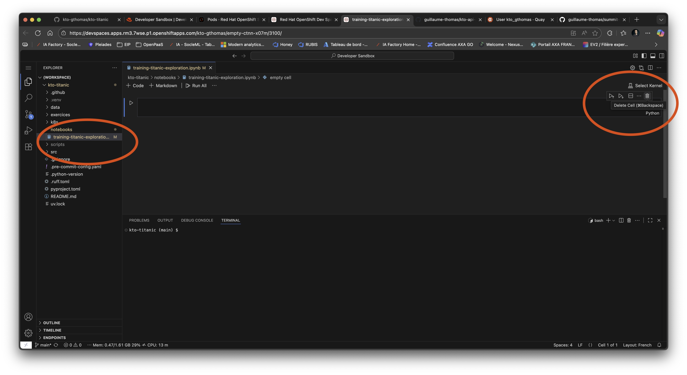

- Donc commençons par créer 4 cellules Markdown dans notre notebook avec le bouton `+ Markdown` en haut à gauche 

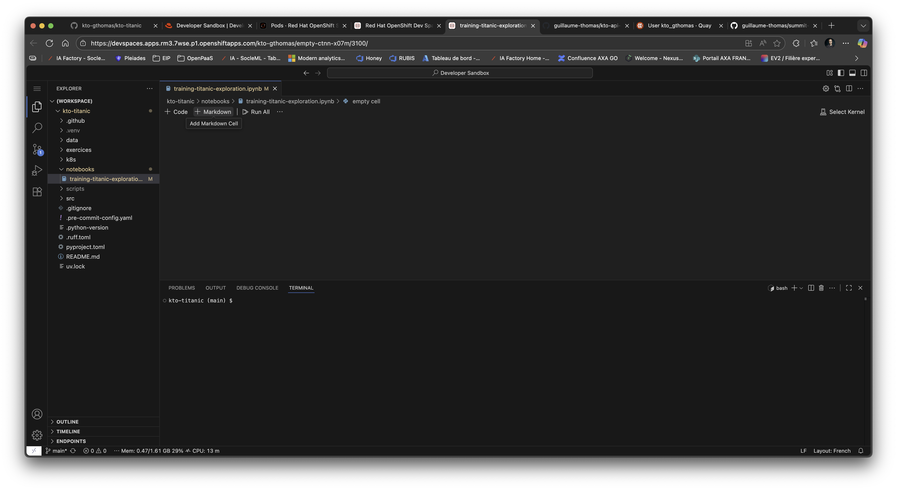


- Mettons maintenant dans chaque cellule, les 5 titres suivants :
```markdown
# Create s3 client and download data from minio
# Random split train / test
# Train ML model
# Evaluate ML model
# Training Pipeline
```

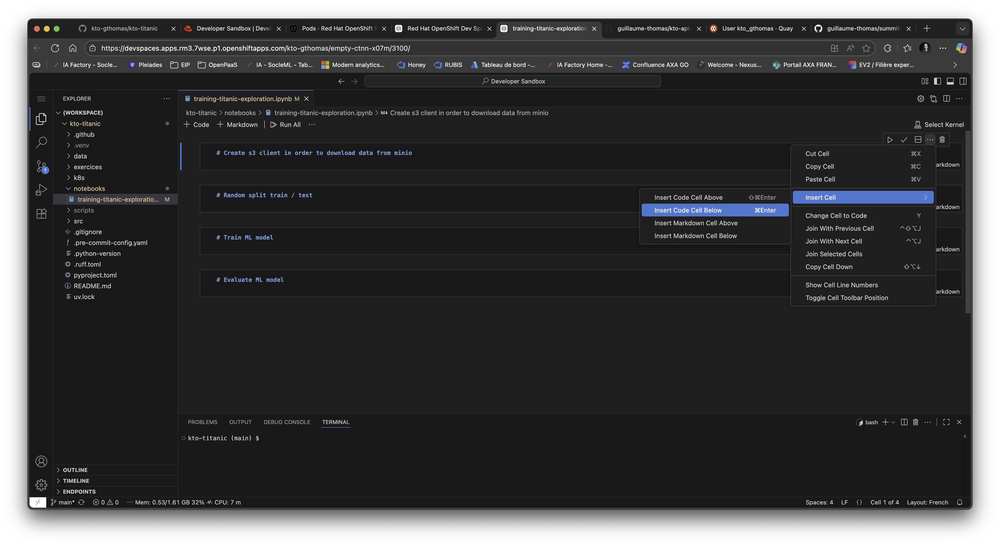

- Sous une des cellules titres, nous allons créer une cellule de code avec le bouton `...` à droite de la cellule,
  puis `Insert Cell` et enfin `Insert Code Cell Below`

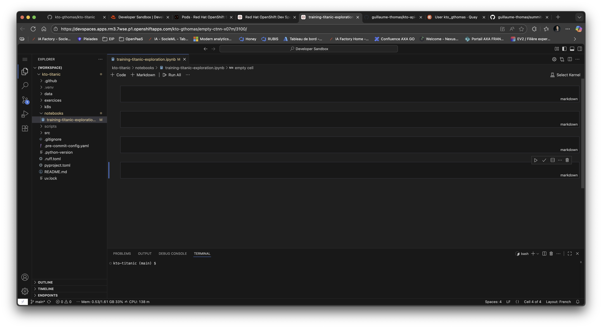


- Précisez maintenant dans cette cellule code, que le type de code est `Python` avec le bouton qui indique `plain text` à gauche de chaque cellule

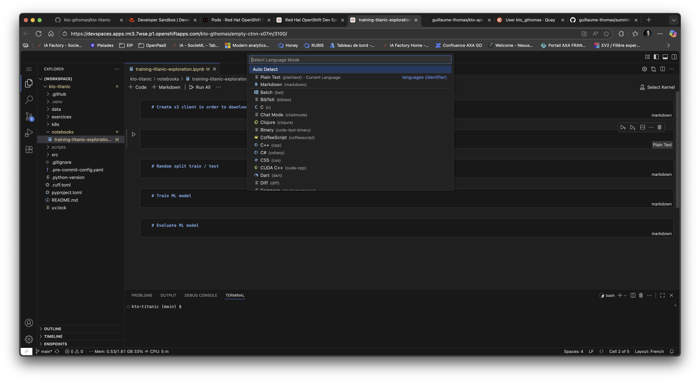
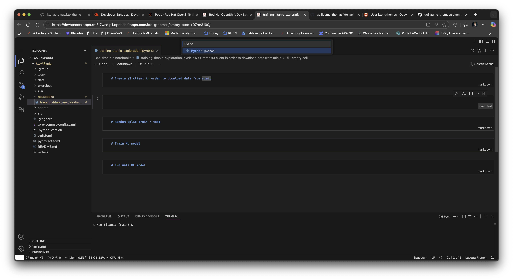
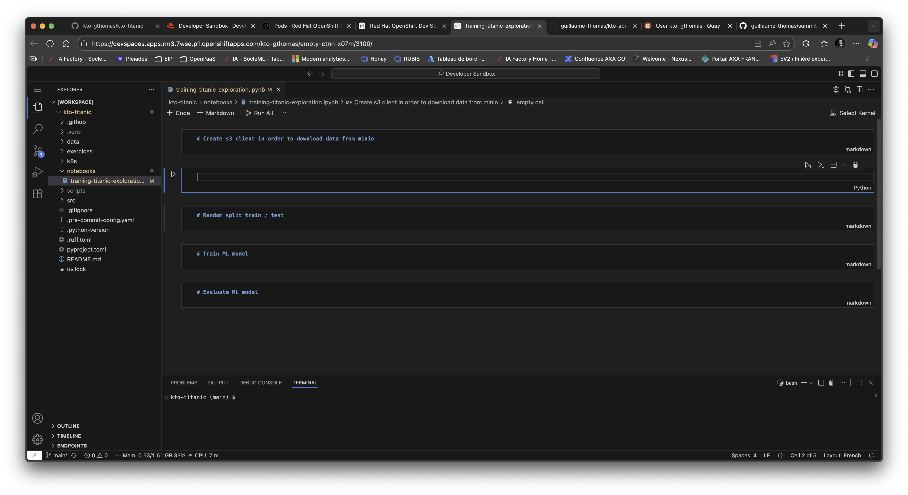

- Répétez cette opération pour chaque titre

- Vous devriez maintenant avoir quelque chose qui ressemble à ça : 

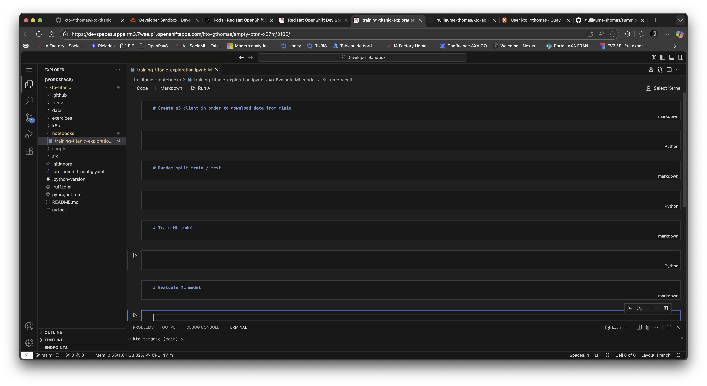

Comme vous pouvez le voir dans l'illustration ci-dessus, vous pouvez ouvrir et fermer chaque partie avec la flèche à gauche
de votre cellule titre. C'est très pratique pour y voir plus clair pendant vos expérimentations ! Maintenant, développons
chaque partie.

### Connection à S3

- Dans votre terminal, utilisez uv pour installer cette dépendance, cela installera un client permettant de télécharger les
  fichiers stockés dans minio (boto3). Nous allons également ajouter ydata-profiling pour faire un rapport de profilage des données
. Nous allons également installer scikit-learn et pandas qui nous seront utiles par la suite.:
```bash
uv add mlflow[extras]==3.8.1 --group training
uv add ydata-profiling==4.18.0 --group training
uv add scikit-learn==1.8.0
uv add pandas==2.3.3
```

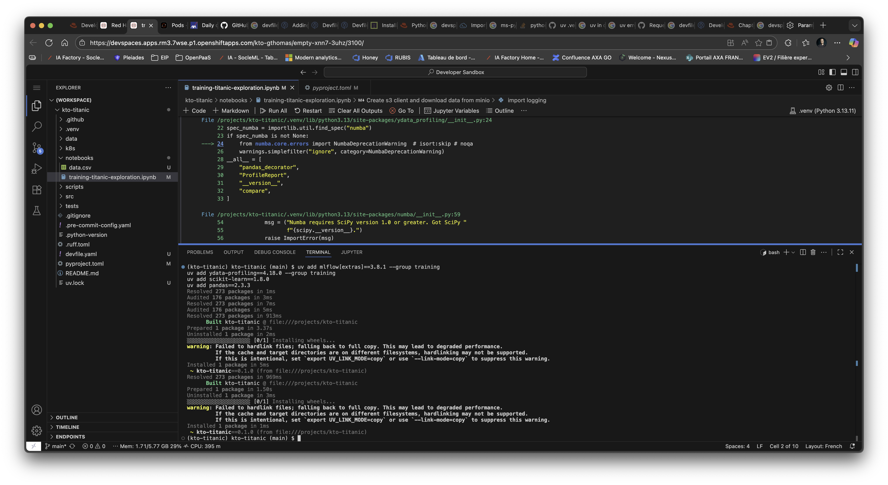

- Maintenant que la dépendance est installée, revenons dans notre notebook
- Avant d'exécuter du code, vous devez sélectionner votre kernel Python. Pour cela, cliquez sur le bouton en haut à droite
  indiquant `Select Kernel` et sélectionnez dans la liste l'installation de l'extension. Trustez le plugin si demandé.

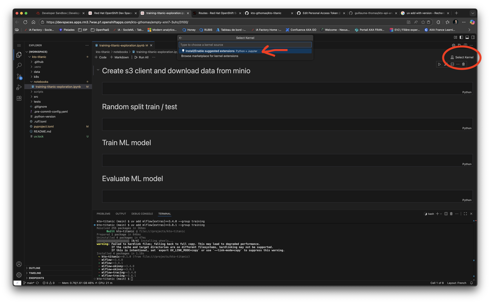
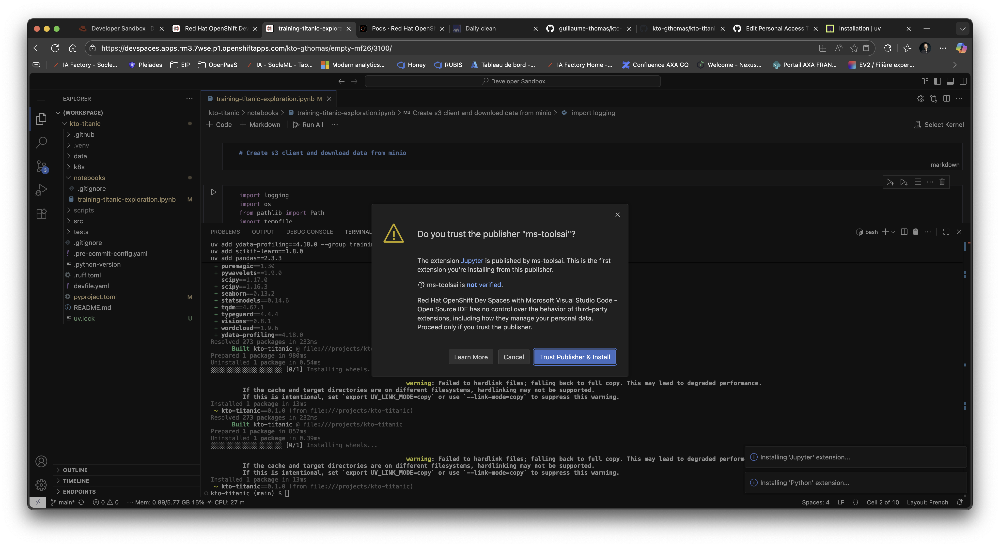

- Sélectionnez votre .venv en tant qu'environnement d'exécution en sélectionnant dans la liste `Python Environment` et en choisissant
  le chemin `/.venv/bin/python`. Notez bien que votre .venv est bien le Kernel utilisé.

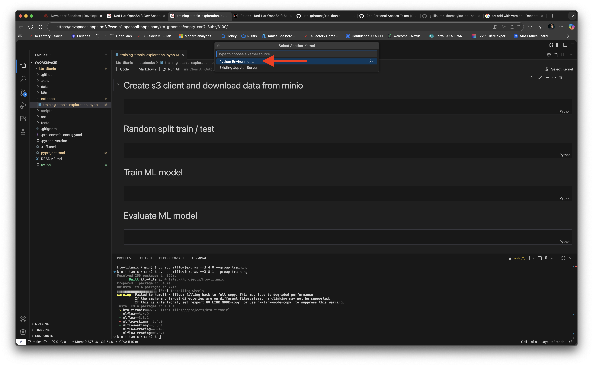
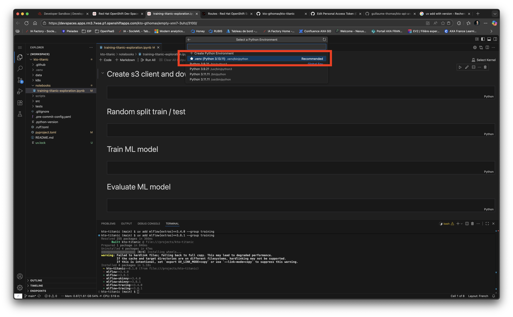


- Vous aurez besoin de récupérer les informations de connexion à minio, notamment, une url de connexion. 
Pour cela, ouvrez un terminal et exécutez la commande suivante :
```bash
echo "https://$(oc get route minio-api -o jsonpath='{.spec.host}')"
```

Vous pouvez également récupérer cette url depuis Openshift Developer Sandbox en allant 
dans `Networking` > `Routes` > `minio-api` et en copiant le lien dans le champ `Location`.

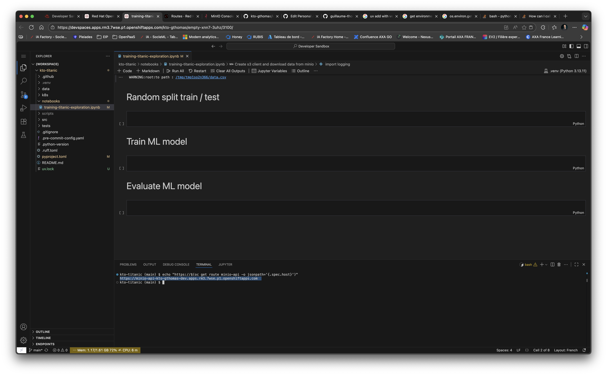

- Maintenant, dans la cellule correspondante, insérez le code ci-dessous : 
```python
import logging
import os
from pathlib import Path
import tempfile
import subprocess

import boto3
import pandas as pd
from ydata_profiling import ProfileReport

MLFLOW_S3_ENDPOINT_URL = "https://minio-api-blablabla-dev.apps.toto.openshiftapps.com" # <--- mettez ici votre endpoint minio
AWS_ACCESS_KEY_ID = "minio"
AWS_SECRET_ACCESS_KEY = "minio123"

def load_data(path: str) -> str:
  local_path = Path("./", "data.csv")
  logging.warning(f"to path : {local_path}")

  s3_client = boto3.client(
    "s3",
    endpoint_url=MLFLOW_S3_ENDPOINT_URL,
    aws_access_key_id=AWS_ACCESS_KEY_ID,
    aws_secret_access_key=AWS_SECRET_ACCESS_KEY,
  )

  s3_client.download_file("kto-titanic", path, local_path)
  df = pd.read_csv(local_path)

  profile = ProfileReport(df, title=f"Profiling Report - {local_path.stem}")
  profile_path = Path("./", "profile.html")
  profile.to_file(profile_path)

  return local_path
```
- **Prenez bien garde à bien mettre le lien vers votre API minio à vous**
- Exécutez ce code

Discutons de ce code ensemble puis exécutez cette cellule. Vous disposez maintenant d'une variable s3_client qui dispose
d'une connection vers votre minio (minio est compatible S3 dont voici 
un [lien Wikipédia](https://fr.wikipedia.org/wiki/Amazon_S3) si vous voulez en savoir plus). Nous sommes donc maintenant
en mesure de télécharger des fichiers se trouvant dans minio.

Cette partie de votre notebook, sans les logs d'exécutions, doit ressembler à ceci :

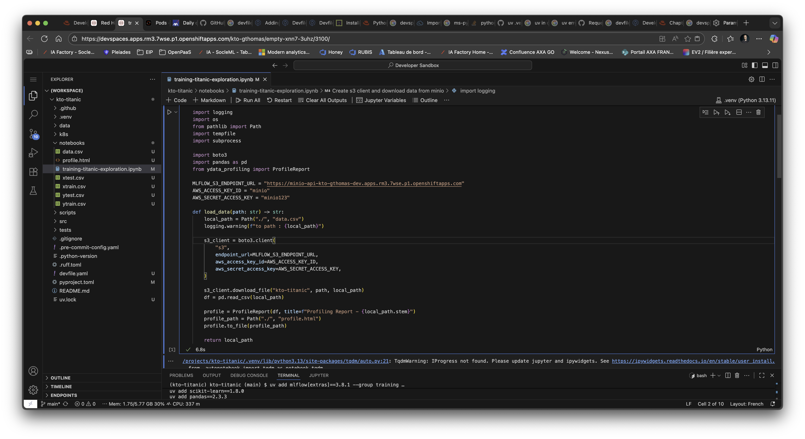


### Split de la donnée

Le but de cette partie est de diviser notre dataset en deux parties. Chaque partie est dédiée :
- à l'entraînement de notre modèle
- à l'évaluation de notre modèle

Pour ce faire, nous allons partager aléatoirement le dataset en utilisant scikit-learn.

- Dans une nouvelle cellule, définissez cette fonction : 
```python
import sklearn.model_selection

FEATURES = ["Pclass", "Sex", "SibSp", "Parch"]

TARGET = "Survived"


def split_train_test(data_path: str) -> tuple[str, str, str, str]:
  logging.warning(f"split on {data_path}")

  df = pd.read_csv(data_path, index_col=False)

  y = df[TARGET]
  x = df[FEATURES]
  x_train, x_test, y_train, y_test = sklearn.model_selection.train_test_split(x, y, test_size=0.3, random_state=42)

  datasets = [
    (x_train, "xtrain", "xtrain.csv"),
    (x_test, "xtest", "xtest.csv"),
    (y_train, "ytrain", "ytrain.csv"),
    (y_test, "ytest", "ytest.csv"),
  ]

  artifact_paths = []
  for data, artifact_path, filename in datasets:
    file_path = Path("./", filename)
    data.to_csv(file_path, index=False)
    artifact_paths.append(file_path)

  return tuple(artifact_paths)
```
- Discutons rapidement de ce code
- Exécutons cette cellule

Votre partie devrait ressembler à ceci dans votre notebook :

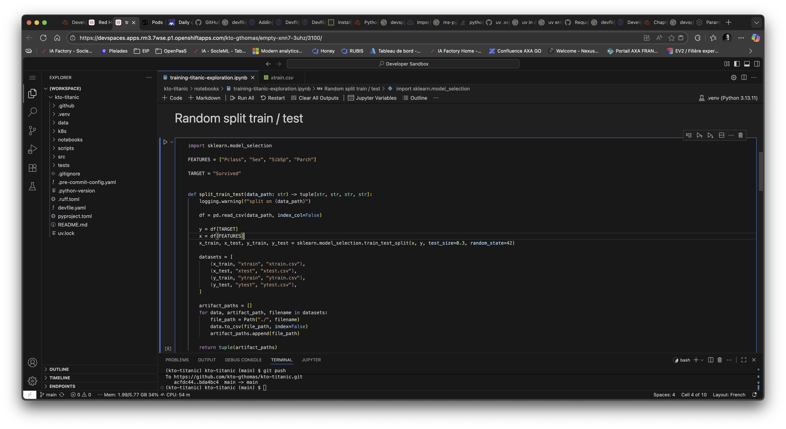

### Entrainement de notre modèle

Pour entraîner notre modèle, nous allons utiliser scikit-learn. Dans la cellule de cette partie,
mettez ce code :

```python
import joblib
from sklearn.ensemble import RandomForestClassifier

ARTIFACT_PATH = "model_trained"


def train(x_train_path: str, y_train_path: str, n_estimators: int, max_depth: int, random_state: int) -> str:
  logging.warning(f"train {x_train_path} {y_train_path}")
  x_train = pd.read_csv(x_train_path, index_col=False)
  y_train = pd.read_csv(y_train_path, index_col=False)

  x_train = pd.get_dummies(x_train)

  model = RandomForestClassifier(n_estimators=n_estimators, max_depth=max_depth, random_state=random_state)
  model.fit(x_train, y_train)

  model_filename = "model.joblib"

  model_path = Path("./", model_filename)
  joblib.dump(model, model_path)


  return model_path
```

- Discutons rapidement de ce code
- Exécutons cette cellule


Votre notebook devrait ressembler à ceci : 


### Evaluation du modèle

Dernière étape, l'évaluation du modèle. Dans un premier temps, nous mettrons en place un bout de code permettant d'inférer
sur notre modèle nouvellement créé. Puis nous ferons des prédictions et en tirerons des
statistiques simples.

- Dans notre cellule, voici notre code de chargement de notre modèle et les prédictions :
```python
from sklearn.metrics import mean_squared_error, mean_absolute_error, r2_score, median_absolute_error

def validate(model_path: str, x_test_path: str, y_test_path: str) -> None:
  logging.warning(f"validate {model_path}")
  model = joblib.load(model_path)

  x_test = pd.read_csv(x_test_path, index_col=False)
  y_test = pd.read_csv(y_test_path, index_col=False)

  x_test = pd.get_dummies(x_test)

  if y_test.shape[1] == 1:
    y_test = y_test.iloc[:, 0]

  y_pred = model.predict(x_test)

  mse = mean_squared_error(y_test, y_pred)
  mae = mean_absolute_error(y_test, y_pred)
  r2 = r2_score(y_test, y_pred)
  medae = median_absolute_error(y_test, y_pred)

  feature_names = x_test.columns.tolist()

  if hasattr(model, "feature_importances_"):
    importances = model.feature_importances_
    feature_importance = {
      name: float(importance) for name, importance in zip(feature_names, importances, strict=False)
    }
  elif hasattr(model, "coef_"):
    coefs = model.coef_
    if hasattr(coefs, "shape") and len(coefs.shape) > 1:
      coefs = coefs[0]
    feature_importance = {name: float(coef) for name, coef in zip(feature_names, coefs, strict=False)}
  else:
    feature_importance = {name: 0.0 for name in feature_names}
    logging.warning("Model does not have feature importance attributes")

  logging.warning(f"mse : {mse}")
  logging.warning(f"mae : {mae}")
  logging.warning(f"r2 : {r2}")
  logging.warning(f"medae : {medae}")
  logging.warning(f"feature importance : {feature_importance}")
```
- Commentons rapidement ce code
- Exécutons cette cellule

Votre code devrait ressembler à ceci :
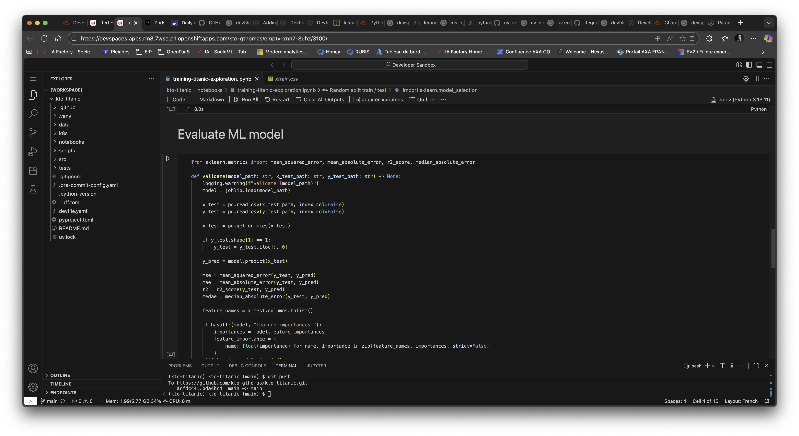

Vous pourrez maintenant constater de la performance de votre modèle !

### Pipeline d'entraînement

Dernière étape, nous allons orchestrer toutes les étapes précédentes dans une seule cellule.
- Dans la cellule de cette partie, insérez ce code : 
```python
local_path = load_data("all_titanic.csv")
xtrain_path, xtest_path, ytrain_path, ytest_path = split_train_test(local_path)
model_path = train(xtrain_path, ytrain_path, 100, 10, 42)
validate(model_path, xtest_path, ytest_path)
```
- Discutons rapidement de ce code
- Exécutons cette cellule

Votre notebook devrait ressembler à ceci :

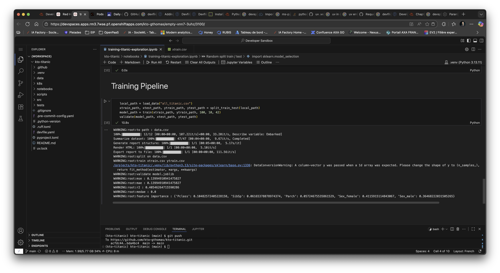

Et voilà ! Vous avez entraîné votre première IA avec un notebook et constatez ses performances. 

> ⚠️ Avant de passer à la suite, assurez-vous de bien supprimé toutes informations sensibles de votre notebook, notamment
les urls de connexion et mot de passe vers votre minio.

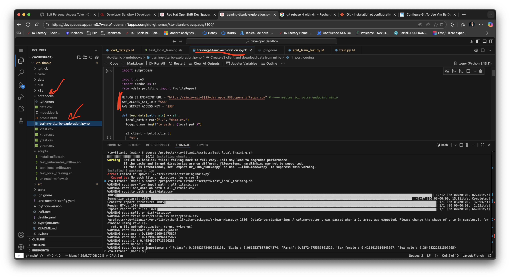
> ⚠️ **Évaluation** : **Veuillez commiter et pousser sur votre repository github vos modifications sur mail et surtout, prévenez
> le professeur par mail que vous avez terminé cette partie !**

> ⚠️ **Attention, pousser des informations sensibles sur votre repository git, donnera lieu à un malus.**


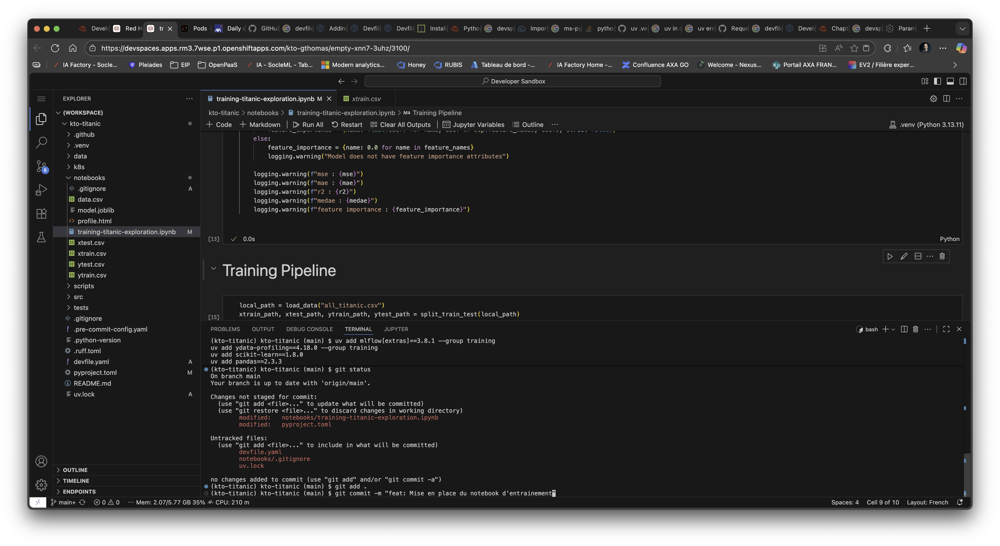

Vous pouvez également supprimer les fichiers générés dans le répertoire `notebooks` si vous le souhaitez.

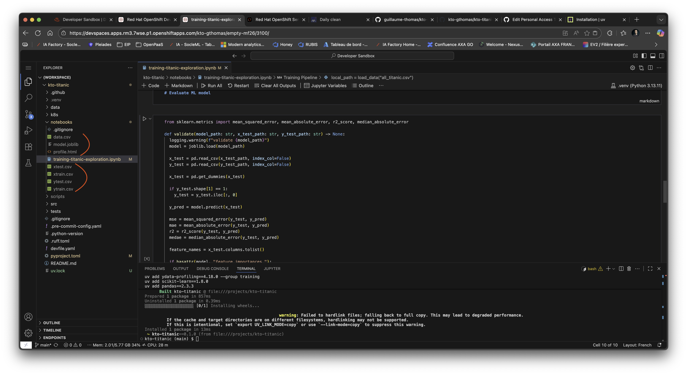
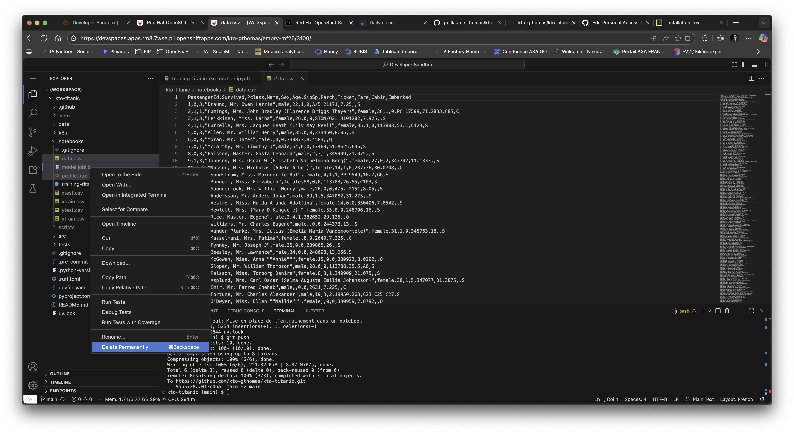
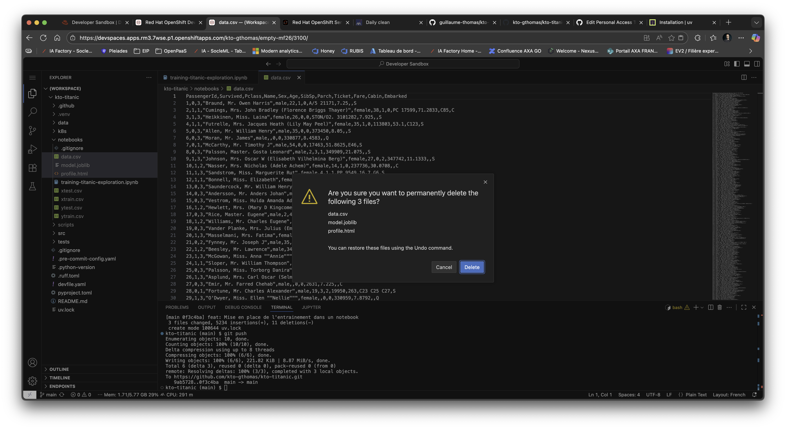
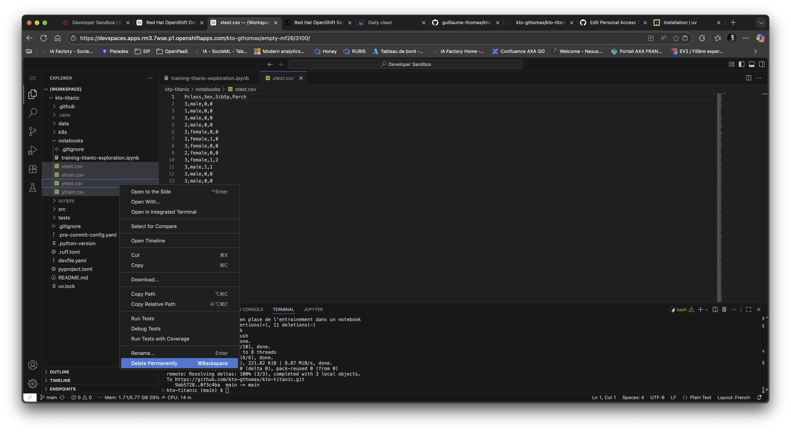
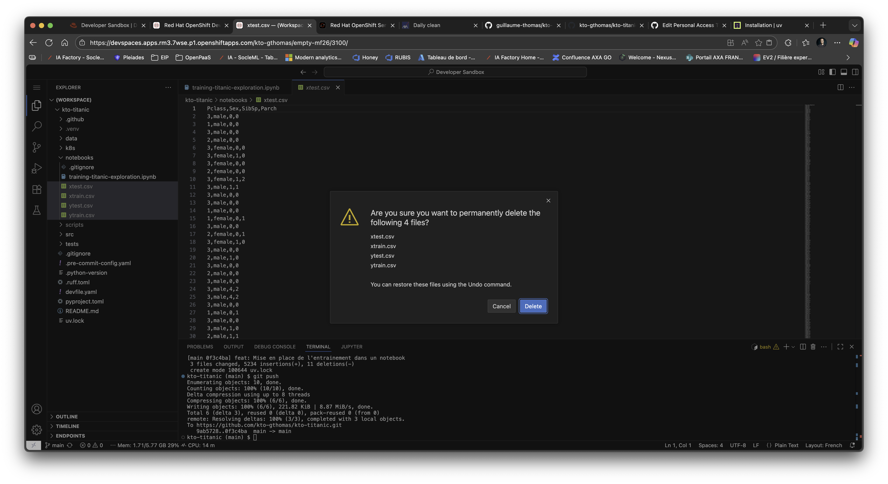

Maintenant, remettons un peu en cause cette démarche ...

## Les limites de la démarche

Les notebooks sont un outil populaire pour le développement de modèles de machine learning, mais ils ont également 
des **limites**. En voici quelques-unes des plus courantes :
- **Manque de contrôle de version** : Les notebooks sont souvent utilisés pour expérimenter et explorer les données, 
ce qui peut rendre difficile la gestion des versions de votre code et de vos données.
- **Manque de modularité** : Les notebooks ont tendance à encourager l’écriture de code non modulaire, ce qui peut rendre 
difficile la réutilisation de votre code pour d’autres projets.
- **Manque de performances** : Les notebooks ne sont pas conçus pour les charges de travail de production à grande 
échelle, ce qui peut entraîner des problèmes de performances lors de l’exécution de modèles de machine learning sur 
des ensembles de données volumineux.
- **Manque de sécurité** : Les notebooks peuvent contenir des informations sensibles telles que des clés d’API et des
informations d’identification, ce qui peut poser des problèmes de sécurité si les notebooks sont partagés ou stockés 
de manière incorrecte.
- **Manque de collaboration** : Les notebooks peuvent être difficiles à collaborer, surtout si plusieurs personnes
travaillent sur le même notebook en même temps.
- **Difficultés pour faire des tests unitaires automatisables** : Les notebooks sont souvent utilisés pour expérimenter 
et explorer les données, ce qui peut rendre difficile la création de tests unitaires automatisés 
pour votre code de machine learning. Les tests unitaires sont importants pour garantir que votre code fonctionne 
correctement et pour éviter les erreurs lors de la production de modèles de machine learning. Cependant, il existe des 
outils tels que `nbval` et `papermill` qui permettent d’automatiser les tests unitaires pour les notebooks de 
machine learning. C'est donc possible, mais plus difficile.

Maintenant que nous avons bien défini notre code dans un notebook, il pourrait être intéressant de le structurer dans le code
Python de notre projet. Prenons un peu de temps maintenant pour le faire :)

Pour conclure et schématiser : 

❌ Approche notebook (ce qu'on vient de faire)
Exploration → Notebook monolithique → ??? → Production

✅ Approche industrielle (ce qu'on va faire)
Exploration → Scripts modulaires → Tests → CI/CD → Production

## Proposition d'alternative à notre Notebook

Nous allons reporter ce code dans des scripts python. Tous les scripts ont déjà été créés pour vous par le cookiecutter.
Etant donné que nous avons plusieurs étapes, vous trouverez chacunes de ces étapes dans des scripts séparés. Nous y 
mettrons les fonctions que nous avons créées dans notre notebook !


Commençons déjà par identifier nos différents scripts. Ils se trouvent dans le répertoire `src/titanic/training` et dans
`src/titanic/training/steps`.

Vous devriez avoir votre espace de travail comme suit : 

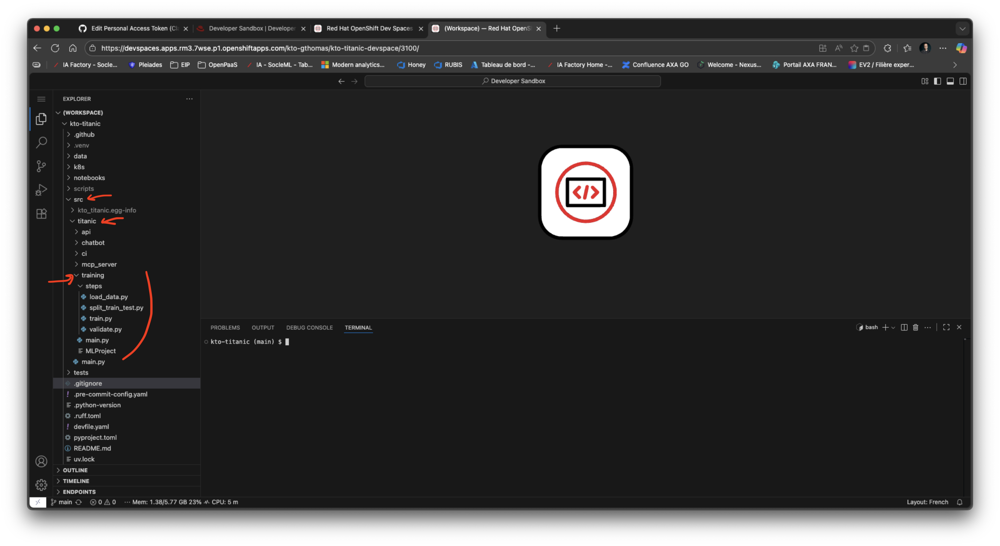

Commentons rapidement chaque script :
- `src/titanic/training/main.py` : C'est le script principal qui orchestre l'ensemble des étapes de notre pipeline de training
- `src/titanic/training/steps/load_data.py` : C'est ici que nous allons télcharger les données depuis minio
- `src/titanic/training/steps/split_train_test.py` : C'est ici que nous allons diviser notre dataset en deux parties (train et test)
- `src/titanic/training/steps/train.py` : C'est ici que nous allons entraîner notre modèle
- `src/titanic/training/steps/validate.py` : C'est ici que nous allons évaluer notre modèle

Maintenant, complétez chaque script avec le code que nous avons défini dans notre notebook.
Vous trouverez déjà dans chaque script, certains imports nécessaires ainsi que la définition de la fonction principale.
Vous trouverez également des commentaires `# TODO` vous indiquant où insérer le code.

Seule petite subtilité, dans chaque script, vous trouverez un commentaire `# TODO : Dans un second temps, ...`.
Cela indique que dans un second temps, nous allons améliorer notre code en y intégrant mlflow pour le suivi des expériences.
Cela sera fait dans une prochaine étape.

Dernière chose, afin d'éviter de créer les fichiers intermédiaires à la racine de notre projet, nous allons changer le répertoire
temporaire de ./ vers ./dist. Pour cela, dans chaque script, remplacez les occurrences de `Path("./", ...)` par `Path("./dist/", ...)`.

Voici donc les contenus de :
- `load_data.py`
```python
import logging
import os
from pathlib import Path
import tempfile
import subprocess

import boto3
import pandas as pd
from ydata_profiling import ProfileReport


ARTIFACT_PATH = "path_output"
PROFILING_PATH = "profiling_reports"

MLFLOW_S3_ENDPOINT_URL = "https://minio-api-blablabla-dev.apps.toto.openshiftapps.com" # <--- mettez ici votre endpoint minio
AWS_ACCESS_KEY_ID = "minio"
AWS_SECRET_ACCESS_KEY = "minio123"

def load_data(path: str) -> str:
  logging.warning(f"load_data on path : {path}")

  local_path = Path("./dist/", "data.csv")
  logging.warning(f"to path : {local_path}")

  s3_client = boto3.client(
    "s3",
    endpoint_url=MLFLOW_S3_ENDPOINT_URL,
    aws_access_key_id=AWS_ACCESS_KEY_ID,
    aws_secret_access_key=AWS_SECRET_ACCESS_KEY,
  )

  s3_client.download_file("kto-titanic", path, local_path)
  df = pd.read_csv(local_path)

  profile = ProfileReport(df, title=f"Profiling Report - {local_path.stem}")
  profile_path = Path("./dist/", "profile.html")
  profile.to_file(profile_path)

  return local_path
  # TODO : Dans un second temps, ajouter les logs mlflow, notamment les artifacts du profiling
  # Mais aussi logger l'artifact du fichier csv.


```
- `split_train_test.py`
```python
import logging
from pathlib import Path

import pandas as pd
import sklearn.model_selection

# TODO : Dans une second temps, récupérer le client mlflow nous permettant de télécharger les artifacts enregistrés à l'étape précédente

FEATURES = ["Pclass", "Sex", "SibSp", "Parch"]

TARGET = "Survived"


def split_train_test(data_path: str) -> tuple[str, str, str, str]:
  logging.warning(f"split on {data_path}")

  df = pd.read_csv(data_path, index_col=False)

  y = df[TARGET]
  x = df[FEATURES]
  x_train, x_test, y_train, y_test = sklearn.model_selection.train_test_split(x, y, test_size=0.3, random_state=42)

  datasets = [
    (x_train, "xtrain", "xtrain.csv"),
    (x_test, "xtest", "xtest.csv"),
    (y_train, "ytrain", "ytrain.csv"),
    (y_test, "ytest", "ytest.csv"),
  ]

  artifact_paths = []
  for data, artifact_path, filename in datasets:
    file_path = Path("./dist/", filename)
    data.to_csv(file_path, index=False)
    artifact_paths.append(file_path)

  return tuple(artifact_paths)
  # TODO : Dans un second temps, télécharger les artifacts depuis mlflow
  # TODO : Dans un second temps, ajouter les logs mlflow pour enregistrer les artifacts utiles pour la suite

```
- `train.py`
```python
import logging
from pathlib import Path

import joblib
import pandas as pd
from sklearn.ensemble import RandomForestClassifier

# TODO : Dans une second temps, récupérer le client mlflow nous permettant de télécharger les artifacts enregistrés à l'étape précédente

ARTIFACT_PATH = "model_trained"


def train(x_train_path: str, y_train_path: str, n_estimators: int, max_depth: int, random_state: int) -> str:
  logging.warning(f"train {x_train_path} {y_train_path}")
  x_train = pd.read_csv(x_train_path, index_col=False)
  y_train = pd.read_csv(y_train_path, index_col=False)

  x_train = pd.get_dummies(x_train)

  model = RandomForestClassifier(n_estimators=n_estimators, max_depth=max_depth, random_state=random_state)
  model.fit(x_train, y_train)

  model_filename = "model.joblib"

  model_path = Path("./dist/", model_filename)
  joblib.dump(model, model_path)


  return model_path
  # TODO : Dans un second temps, récupérer les données depuis mlflow

  # TODO : Dans un second temps, stocker le model en tant qu'artifact dans mlflow

```
- `validate.py`
```python
import logging

import joblib
import pandas as pd
from sklearn.metrics import mean_squared_error, mean_absolute_error, r2_score, median_absolute_error

# TODO : Dans une second temps, récupérer le client mlflow nous permettant de télécharger les artifacts enregistrés à l'étape précédente


def validate(model_path: str, x_test_path: str, y_test_path: str) -> None:
  logging.warning(f"validate {model_path}")
  model = joblib.load(model_path)

  x_test = pd.read_csv(x_test_path, index_col=False)
  y_test = pd.read_csv(y_test_path, index_col=False)

  x_test = pd.get_dummies(x_test)

  if y_test.shape[1] == 1:
    y_test = y_test.iloc[:, 0]

  y_pred = model.predict(x_test)

  mse = mean_squared_error(y_test, y_pred)
  mae = mean_absolute_error(y_test, y_pred)
  r2 = r2_score(y_test, y_pred)
  medae = median_absolute_error(y_test, y_pred)

  feature_names = x_test.columns.tolist()

  if hasattr(model, "feature_importances_"):
    importances = model.feature_importances_
    feature_importance = {
      name: float(importance) for name, importance in zip(feature_names, importances, strict=False)
    }
  elif hasattr(model, "coef_"):
    coefs = model.coef_
    if hasattr(coefs, "shape") and len(coefs.shape) > 1:
      coefs = coefs[0]
    feature_importance = {name: float(coef) for name, coef in zip(feature_names, coefs, strict=False)}
  else:
    feature_importance = {name: 0.0 for name in feature_names}
    logging.warning("Model does not have feature importance attributes")

  logging.warning(f"mse : {mse}")
  logging.warning(f"mae : {mae}")
  logging.warning(f"r2 : {r2}")
  logging.warning(f"medae : {medae}")
  logging.warning(f"feature importance : {feature_importance}")
  # TODO : Dans un second temps, récupérer le model depuis mlflow

  # TODO : Dans un second temps, enregistrer le model dans mlflow


```

Maintenant, occupons-nous de `main.py`. Nous devons ajouter tout le reste à part bien sûr, les installations des différentes
librairies. Cela devrait donner quelque chose comme ceci :
```python
import logging

import fire

from titanic.training.steps.load_data import load_data
from titanic.training.steps.validate import validate
from titanic.training.steps.split_train_test import split_train_test
from titanic.training.steps.train import train

def workflow(input_data_path: str, n_estimators: int, max_depth: int, random_state: int) -> None:
  logging.warning(f"workflow input path : {input_data_path}")
  local_path = load_data("all_titanic.csv")
  xtrain_path, xtest_path, ytrain_path, ytest_path = split_train_test(local_path)
  model_path = train(xtrain_path, ytrain_path, 100, 10, 42)
  validate(model_path, xtest_path, ytest_path)
  # TODO : Dans un second temps, démarrer le run mlflow au début de ce workflow


if __name__ == "__main__":
  fire.Fire(workflow)

```

Point important, comme vous pouvez le voir, nous faisons référence à des fonctions présentes dans d'autres scripts. 
Nous devons donc, pour que cela fonctionne, importer ces définitions dans notre script `main.py`. Vous pouvez le faire
à l'aide de votre IDE. Vous devriez obtenir quelque chose comme ceci (ces imports sont déjà présents dans le code ci-dessus) :
```python
from titanic.training.steps.load_data import load_data
from titanic.training.steps.validate import validate
from titanic.training.steps.split_train_test import split_train_test
from titanic.training.steps.train import train
```

Dernière chose à régler, comme vous pouvez le constater, nous utilisons `fire` pour exécuter notre script. 
Fire est une librairie Python qui permet de créer des interfaces en ligne de commande. 
Elle permet de transformer facilement des fonctions Python en commandes CLI (Command Line Interface). 
Cela nous permettra d'exécuter notre script avec des arguments en ligne de commande.

Constatez que la fonction `workflow` prend en argument le chemin vers les données d'entrée, ainsi que quelques hyperparamètres.
Ils ne sont pas encore utilisés dans les fonctions appelées et les valeurs sont en dur. Corrigeons cette partie. 
Modifiez les appels de fonctions dans `workflow` pour utiliser les arguments passés. Vous devriez obtenir ceci :
```python
import logging

import fire

from titanic.training.steps.load_data import load_data
from titanic.training.steps.validate import validate
from titanic.training.steps.split_train_test import split_train_test
from titanic.training.steps.train import train

def workflow(input_data_path: str, n_estimators: int, max_depth: int, random_state: int) -> None:
    logging.warning(f"workflow input path : {input_data_path}")
    local_path = load_data(input_data_path)
    xtrain_path, xtest_path, ytrain_path, ytest_path = split_train_test(local_path)
    model_path = train(xtrain_path, ytrain_path, n_estimators, max_depth, random_state)
    validate(model_path, xtest_path, ytest_path)
    # TODO : Dans un second temps, démarrer le run mlflow au début de ce workflow


if __name__ == "__main__":
    fire.Fire(workflow)
    
```

Avant de tester notre code, veillez à ce que votre environnement kto-mlflow soit bien démarré. Pour cela, utilisez
[Dailyclean](./04_scoping_data_prep_label.md#présentation-de-dailyclean-et-comment-démarrer-kto-mlflow). Si vous ne le faites pas,
vous obtiendrez des erreurs de connexion à minio.

Il faut également créer le répertoire `dist` à la racine de votre projet. Pour cela, dans votre terminal, exécutez la commande suivante :
```bash
mkdir /projects/kto-titanic/dist
```

Testons notre code avec les commandes suivantes : 
```bash
uv run ./src/titanic/training/main.py --input_data_path "all_titanic.csv" --n_estimators 100 --max_depth 10 --random_state 42
```

Constatez que le code fonctionne parfaitement ! Chouette ! 

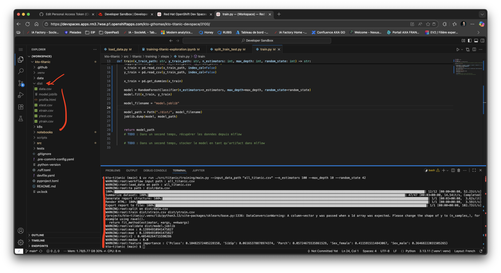

Il serait également mal venu de pousser sur votre repository git l'url, ainsi que les users et mots de passe de votre minio.
Nous allons donc faire mieux, en faisant en sorte d'aller chercher ces informations dans des variables d'environnement.
Vous rappelez-vous de ce que c'est ? :-)

Créez un fichier `test_local_training.sh` dans le répertoire `/projects/kto-titanic/scripts` avec le contenu suivant :

```bash
export MLFLOW_S3_ENDPOINT_URL=http://minio-api-balba-dev.apps.sandbox-m3.666.p1.openshiftapps.com # <--- mettez ici votre endpoint minio
export AWS_ACCESS_KEY_ID=minio
export AWS_SECRET_ACCESS_KEY=minio123
uv run ./src/titanic/training/main.py --input_data_path "all_titanic.csv" --n_estimators 100 --max_depth 10 --random_state 42
```

Maintenant, modifions nos scripts pour aller chercher les informations de connexion dans des variables d'environnement.
Pour aller chercher une variable d'environnement sur votre système, vous pouvez utiliser ce code : 
```python
import os
os.environ.get("MA_VARIABLE")
```

Cela donnerait donc quelque chose comme ceci : 
```python
import logging
import os
from pathlib import Path
import tempfile
import subprocess

import boto3
import pandas as pd
from ydata_profiling import ProfileReport


ARTIFACT_PATH = "path_output"
PROFILING_PATH = "profiling_reports"


def load_data(path: str) -> str:
  logging.warning(f"load_data on path : {path}")

  local_path = Path("./dist/", "data.csv")
  logging.warning(f"to path : {local_path}")

  s3_client = boto3.client(
    "s3",
    endpoint_url=os.environ.get("MLFLOW_S3_ENDPOINT_URL"),
    aws_access_key_id=os.environ.get("AWS_ACCESS_KEY_ID"),
    aws_secret_access_key=os.environ.get("AWS_SECRET_ACCESS_KEY"),
  )

  s3_client.download_file("kto-titanic", path, local_path)
  df = pd.read_csv(local_path)

  profile = ProfileReport(df, title=f"Profiling Report - {local_path.stem}")
  profile_path = Path("./dist/", "profile.html")
  profile.to_file(profile_path)

  return local_path
  # TODO : Dans un second temps, ajouter les logs mlflow, notamment les artifacts du profiling
  # Mais aussi logger l'artifact du fichier csv.

```

Enfin, testons une dernière fois notre projet de training. Donc, dans votre Terminal,
lancez les commandes suivantes : 

```bash
source /projects/kto-titanic/scripts/test_local_training.sh
```

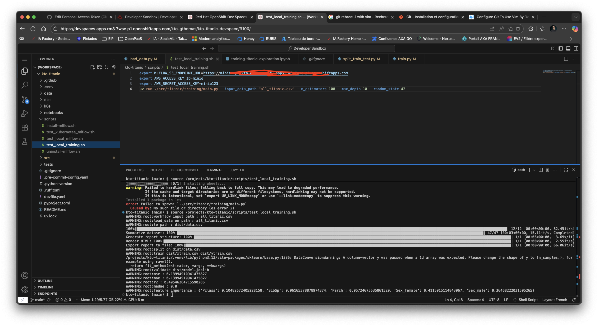

Et voilà ! C'est terminé !

Avant de passer à la suite, assurez-vous d'avoir bien supprimé toutes informations sensibles de votre notebook, notamment
les urls de connexion et mot de passe vers votre minio.


> ⚠️ **Évaluation** : **n'oubliez pas de commiter et pusher votre travail sur votre branche `main` et surtout, prévenez 
> le professeur par mail que vous avez terminé cette partie !**

> ⚠️ **Attention, pousser des informations sensibles sur votre repository git, donnera lieu à un malus.**

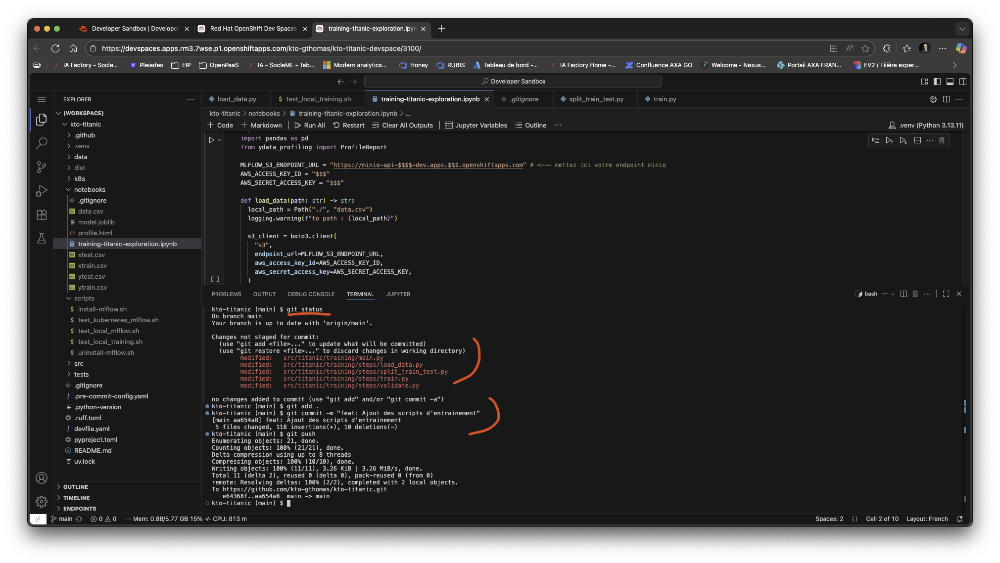

### Et les tests unitaires ?

Arf ... Non, ce n'est pas terminé ... Un des défauts des notebooks c'est qu'il est difficile de faire des tests unitaires.
Maintenant que nous avons redéfini notre code dans des scripts, il serait bienvenu de faire quelques tests non ? Allez, c'est parti !

Vous trouverez d'abord, un répertoire `tests`. C'est ici que tous les tests se trouvent. Il existe des sous-répertoires 
 par élément à tester : l'api, le training, etc. Nous allons nous concentrer sur les tests du training.

En l'occurence, pour ne pas faire trop long, nous allons nous concentrer sur un seul test : c'est celui de la pipeline d'entraînement. 
Il est relativement simple, il va utiliser les capacités offertes par unittest mock, afin de subtiliser les véritables fonctions par
des fonctions factices (mock). Ainsi, nous n'aurons pas à exécuter l'intégralité de la pipeline, mais seulement à 
vérifier que les différentes étapes sont bien appelées.

Un "Mock" (ou "Mock Object") est un objet fictif utilisé dans les tests unitaires pour simuler le comportement d'un
objet réel. Les mocks sont souvent utilisés pour tester des parties d'un système qui dépendent d'un système tiers,
comme une base de données ou un service Web, ce qui peut être le cas de S3 dans notre exemple de projet :)

En créant un mock, vous pouvez reproduire le comportement attendu de l'objet réel, sans avoir à le configurer
réellement ou à passer par des étapes compliquées pour le faire fonctionner. Cela vous permet de tester votre code de
manière isolée et de détecter les erreurs plus facilement.

Les mocks peuvent être créés à la main ou avec l'aide de bibliothèques de tests unitaires spécialisées qui offrent
des fonctionnalités de mock (c'est ce que l'on va faire ici).

#### Tests du workflow d'entraînement

Cela fait partie des tests les plus simples. Identifiez le script nommé `tests/training/test_main.py`.
Notez que le nom du script commence par `test_`, c'est une bonne pratique pour identifier les scripts de tests.

Notez également la structure du répertoire `tests/training`. Vous y trouverez un sous-répertoire `steps` qui contient
des tests unitaires pour chaque étape de notre pipeline de training. Nous n'allons pas les aborder ici, car ils sont déjà développés pour vous, 
mais vous pouvez les consulter si vous le souhaitez. Observez enfin les autres répertoires dans `tests`, vous en trouverez
un pour chaque partie du projet.

Avant toute autre chose, exécutez votre test unitaire avec la commande suivante :
```bash
uv run pytest /projects/kto-titanic/tests/training/test_main.py
```

Comme vous pouvez le constater, le test échoue. C'est normal, car le code n'est pas encore écrit.

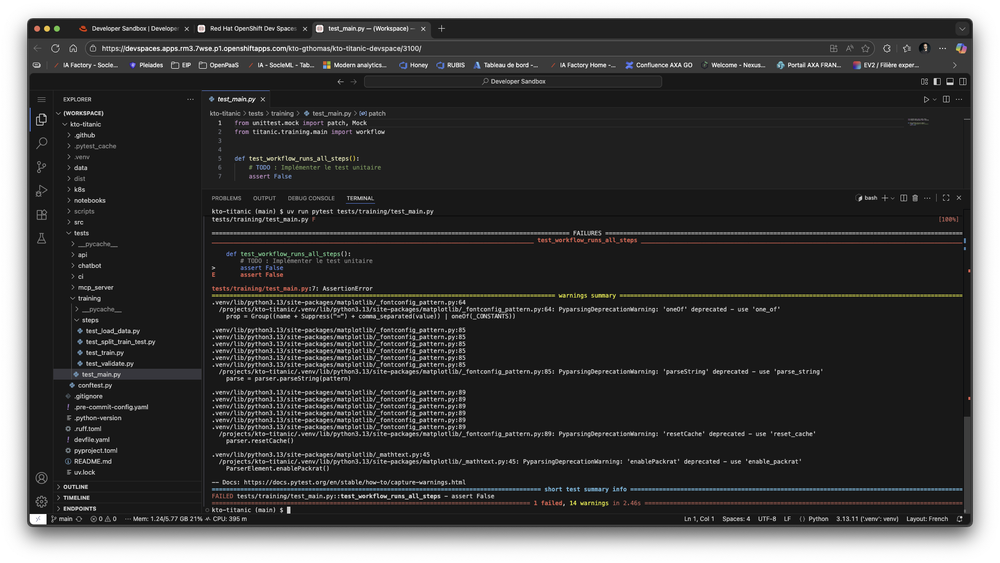

Dans le script de test, mettez le code suivant.
```python
from unittest.mock import patch, Mock
from titanic.training.main import workflow


def test_workflow_runs_all_steps():
    with (
        patch("titanic.training.main.load_data") as mock_load,
        patch("titanic.training.main.split_train_test") as mock_split,
        patch("titanic.training.main.train") as mock_train,
        patch("titanic.training.main.validate"),
    ):

        mock_load.return_value = "data.csv"
        mock_split.return_value = ("x_train.csv", "x_test.csv", "y_train.csv", "y_test.csv")
        mock_train.return_value = "model.joblib"

        workflow("input.csv", n_estimators=10, max_depth=5, random_state=42)

        mock_load.assert_called_once()
        mock_split.assert_called_once()
        mock_train.assert_called_once()

```

Prenons le temps de l'observer, puis exécutez le test de nouveau avec la commande suivante :
```bash
uv run pytest /projects/kto-titanic/tests/training/test_main.py
```

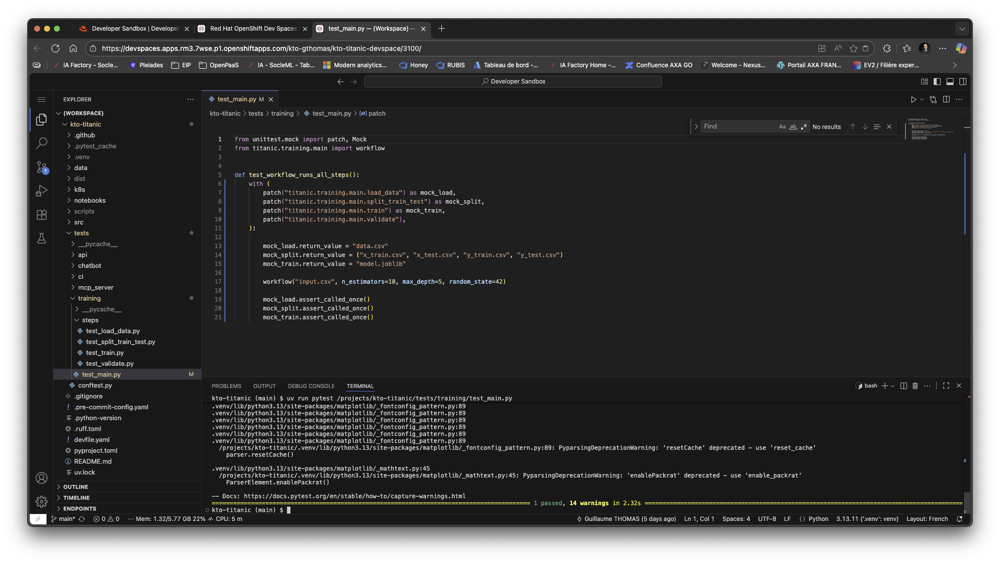


Comme vous pouvez le constater, le test passe parfaitement. Super !

## Conclusion

Prenez bien garde à la documentation du [Test Discovery de unittest](https://docs.python.org/3/library/unittest.html#unittest-test-discovery). 
Ce dernier permet de scanner votre projet pour détecter automatiquement les tests à lancer. Par défaut, vos scripts de test
doivent être nommés en respectant un pattern précis et doivent faire partie d'un module Python. C'est notre cas ici ;-)

> ⚠️ **Évaluation** : **Maintenant que vous avez fait vos tests, n'oubliez pas de commiter et de pusher vos modifications, toujours sur la 
même branche ! Je me ferai un plaisir de les relire ! :)**

Notez que nous n'avons pas testé toutes les étapes de notre pipeline. Les tests existent déjà et vous permettront d'évaluer
les évolutions de votre code dans le futur. 

Et voilà ! Cette partie entraînement de modèle est terminée ! Bravo ! Maintenant, voyons comment l'industrialiser un peu plus
avec les outils que le marché nous propose.