# 7. Continuous Integration

Dans ce chapitre, nous allons voir comment automatiser votre entrainement grâce à l'intégration continue et aux 
GitHub Actions.

Avant de commencer, vérifiez que vous n'avez aucune modification en
cours sur votre working directory avec `git status`.
Si c'est le cas, vérifiez que vous avez bien sauvegardé votre travail lors de l'étape précédente pour ne pas perdre
votre travail.
> ⚠️ **Attention** : En cas de doute, sollicitez le professeur, car il est possible que votre contrôle continue en soit affecté.

Pour rappel, les commandes utiles sont :
```bash
git add .
git commit -m "your message"
git push origin main
```

Dans la timeline MLOps, nous nous situons toujours dans la phase de **Modélisation**. Nous allons voir comment
industrialiser notre projet, afin de lui permettre d'utiliser les plateformes de ML dans le Cloud pour entraîner 
nos modèles de manière plus efficace, plus rapide et plus sûre.


## À quoi ça sert ?

L'intégration continue est une pratique de développement logiciel qui consiste à intégrer les modifications de 
code dans un projet de manière régulière et automatisée. Les avantages de l'intégration continue sont nombreux. 
Voici quelques-uns d'entre eux :

- **Détection précoce des erreurs** : L'intégration continue permet de détecter les erreurs plus tôt dans le processus 
de développement, ce qui facilite leur correction rapide.
- **Amélioration de la qualité du code** : Les tests automatisés effectués lors de l'intégration continue permettent 
de détecter les erreurs plus rapidement et de manière plus fiable, ce qui améliore la qualité du code.
- **Facilitation de la collaboration entre développeurs** : L'intégration continue permet aux développeurs de 
travailler sur le même code en temps réel, ce qui facilite la collaboration et la communication entre les membres de 
l'équipe.
- **Gain de temps dans la mise en production des applications** : L'intégration continue permet de réduire le temps 
nécessaire pour mettre en production une application, car les modifications sont intégrées au code source en continu.
- **Meilleure gestion des risques** : L'intégration continue permet de réduire les risques liés aux erreurs de code, 
car les modifications sont intégrées et testées en continu.

L'intégration continue consiste à :

- **Mettre en place des tests automatisés** : Cela permet de s'assurer que les modifications apportées au code ne
provoquent pas d'erreurs et que le code fonctionne correctement.
- **Choisir un outil d'intégration continue** : Il est nécessaire d'intégrer un outil d'intégration continue 
tel que Jenkins, Travis CI, CircleCI, GitHub action et bien d'autres, à votre projet. Ces outils permettent 
d'automatiser le processus d'intégration continue.
- **Configurer une pipeline d'intégration continue** : La pipeline d'intégration continue est une série 
d'étapes automatisées qui permettent de compiler, tester et déployer le code. Il est important de configurer 
cette pipeline en fonction des besoins du projet.

Il est important de noter que la mise en place de l'intégration continue peut varier en fonction des besoins du projet
et des outils utilisés.

Dans notre contexte d'entrainements de modèles de machine learning, l'intégration continue va nous permettre de :
- Lancer automatiquement des tests unitaires à chaque modification de code
- Lancer automatiquement des entraînements de modèles à chaque modification de code
- Déployer automatiquement des modèles entraînés dans un environnement de production
- Surveiller automatiquement les performances des modèles en production
- Mettre à jour automatiquement les modèles en fonction des nouvelles données disponibles
- Gérer automatiquement les versions des modèles et des données utilisées pour l'entraînement
- Faciliter la collaboration entre les membres de l'équipe de développement et les data scientists

Cela est une partie importante du MLOps et c'est un sujet très important dans le domaine du machine learning.
Nous parlons ici de Continuous Training (CT).

## Mise en place de nos github actions

GitHub Actions est un outil d'intégration continue qui permet d'automatiser le processus d'intégration continue.
Il est possible de configurer des workflows personnalisés pour votre projet en utilisant GitHub Actions.
Les workflows sont configurés en utilisant un fichier YAML qui décrit les étapes à suivre pour compiler, tester et
déployer du code.

Cet outil est complètement intégré dans GitHub ! Vous trouverez d'ailleurs vos GitHub actions ici, dans le menu Actions,
directement dans votre repository :

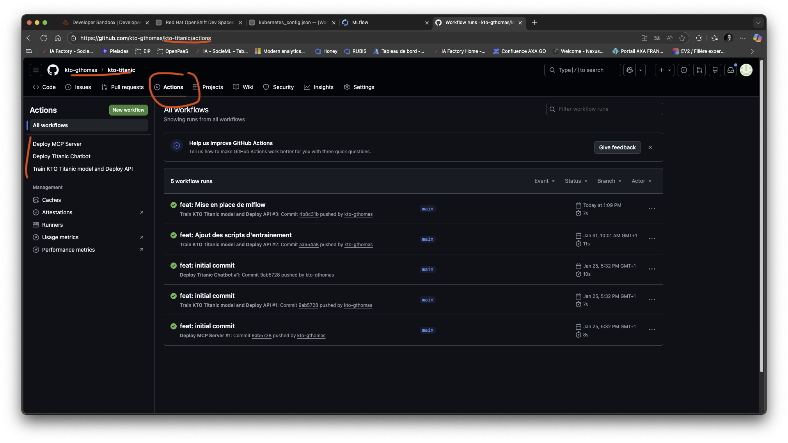

Comme vous pouvez le constater, plusieurs actions sont déjà présentes. En fait, toutes les actions nécessaires à la
mise en place de notre pipeline d'intégration continue ont été créées pour vous par le cookiecutter. Vous n'avez plus qu'à les
compléter. En effet, un avantage très appréciable des GitHub actions, c'est que leurs définitions se fait directement dans votre code !
Ainsi pour créer votre action qui permet d'automatiser le lancement de votre entraînement, vous devez créer un répertoire `.github`
à la racine de votre projet.

Identifiez le fichier de configuration de votre action de Continuous Training dans le répertoire `.github/workflows/`. Il s'agit du fichier
`ct-ci-cd.yaml`. Ouvrez-le. Vous devriez avoir quelque chose qui ressemble à ça :

```yaml
name: Train KTO Titanic model and Deploy API

on:
  push:
    branches:
      - main
    paths:
      - 'src/titanic/api/**'
      - 'src/titanic/training/**'
      - 'src/titanic/ci/**'
      - '/tests/api/**'
      - '/tests/training/**'
      - '/tests/ci/**'
      - 'k8s/experiment/**'
      - 'k8s/api/**'
      - '.github/workflows/ct-ci-cd.yaml'
  pull_request:
    branches:
      - main

env:
  EXPERIMENT_NAME: kto-titanic
  EXPERIMENT_IMAGE_NAME: quay.io/VOTRE_COMPTE/titanic/experiment # VOTRE_COMPTE doit déjà être correctement renseigné
  API_IMAGE_NAME: quay.io/VOTRE_COMPTE/titanic/api # VOTRE_COMPTE doit déjà être correctement renseigné
  API_ROUTE_NAME: titanic-api
  DAILYCLEAN_ROUTE_NAME: dailyclean
  MINIO_API_ROUTE_NAME: minio-api
  MLFLOW_TRACKING_ROUTE_NAME: mlflow

jobs:
  train:
    runs-on: ubuntu-latest
    steps:
      - uses: actions/checkout@v3
      - name: Set up Python 3.13
        uses: actions/setup-python@v3
        with:
          python-version: 3.13
      - name: Install dependencies
        run: |
          echo "To implement"

          # TODO: Saisir la suite de cette pipeline. Devrait apparaître : 
          # Install depencies, Launch unit tests, Resync only training group,
          # Configure docker and kubectl, Get Routes from Kubernetes and add them to env
          # Wake up dailyclean and mlflow, Build training image, Launch mlflow training in Openshift.
          # Une fois l'API développée, et sécurisée intégrer : 
          # Download model artifact, Build and push api image, Configure API manifest with OAuth2 domain
          # Deploy api to Openshift with OAuth2 protection, Get OAuth2 token for integration test
          # Test api with OAuth2 authentication, Asleep kto-mlflow with dailyclean
          
```

Comme vous pouvez le constater, ce fichier est déjà bien avancé. Nous allons le compléter ensemble en renseignant la partie TODO.
Commentons l'existant pour bien comprendre son fonctionnement.

Et pour commencer la mise en place de notre action, nous allons configurer un déclencheur (ou communément trigger). Il
y en a littéralement des tonnes sur GitHub Actions. Si le cœur vous en dit, en voici 
la [documentation complète](https://docs.github.com/en/actions/using-workflows/events-that-trigger-workflows) !

Nous avons ici défini un déclenchement à chaque push notre branche `main`. Notez également que nous avons limité le déclenchement
aux seuls fichiers liés à notre projet Titanic (code source, tests, k8s manifests et le fichier de définition de l'action). Ainsi, si
vous faites un push sur la branche `main` mais que vous ne touchez pas aux fichiers listés, l'action ne sera pas déclenchée.
Cela permet d'éviter de lancer des entraînements inutiles.

Ensuite, votre pipeline sera composé de `jobs` et de `steps`. Ces derniers permettent de structurer votre pipeline en 
étapes et sous-étapes. Un `job` est composé d'une liste de `steps`. Un step est une unité de travail qui peut être 
soit une action, soit un script shell. Vous pouvez utiliser des actions pré-construites ou créer vos propres 
actions personnalisées pour les steps.

Notez la présence d'un job `train` dans notre pipeline. Ce job s'exécute sur une machine virtuelle Linux (Ubuntu) et contient une liste
de steps. Le premier step utilise une action pré-construite `actions/checkout@v3` qui permet de récupérer le code source de votre repository
GitHub dans l'environnement d'exécution de votre job. Le second step utilise une autre action pré-construite `actions/setup-python@v3`
qui permet d'installer une version spécifique de Python dans l'environnement d'exécution de votre job. Nous serons donc en mesure d'exécuter
du code python dans notre pipeline ! Cela pourrait être utile pour, par exemple, exécuter des tests unitaires ;)

Pour que vos modifications soient prises en compte ici, il faut que vous les commitiez et poussez sur votre branche main ! 

Constatez la création et la bonne exécution de votre action de Continuous Training ! Il y a 
beaucoup d'informations intéressantes sur cette première exécution, comme le message du commit qui a déclenché l'action,
la branche sur laquelle il a été poussé, le nom du job `train`, de nos premières steps et surtout, les logs de cette
exécution ! Pour voir tout cela, vous pouvez cliquer sur l'instance de votre exécution et sur le job :

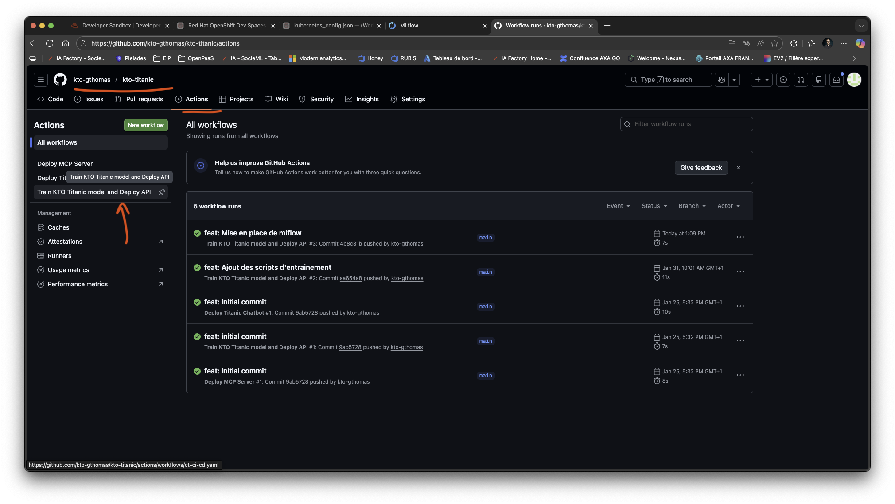
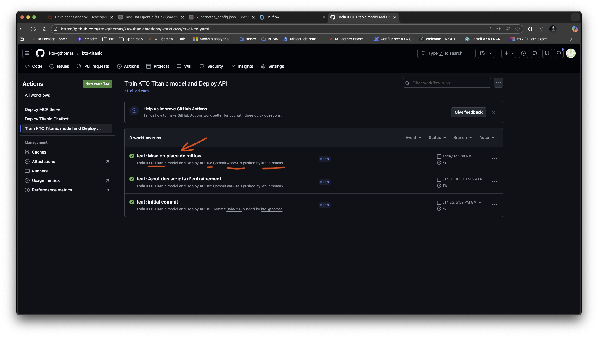
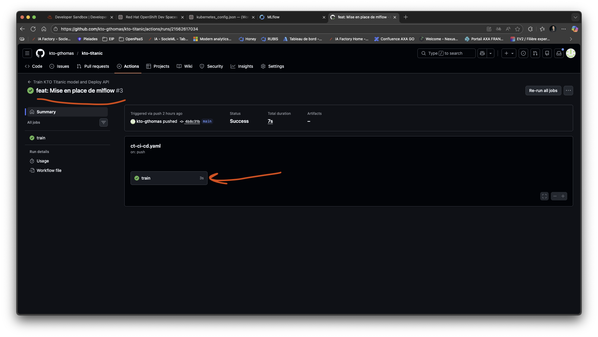
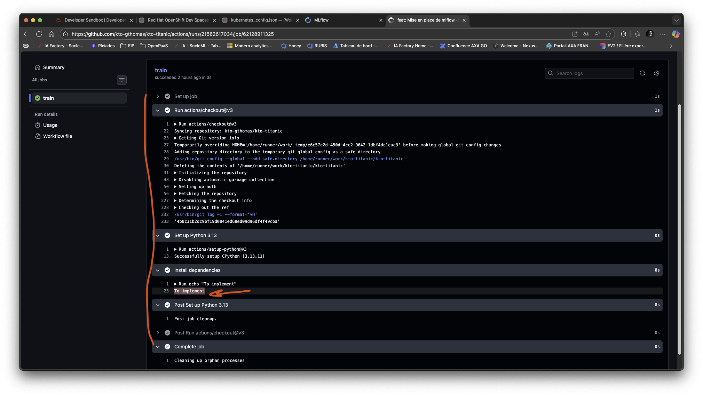

Maintenant, allons un peu plus loin dans notre automatisation en ajoutant des tests unitaires à notre pipeline !
Il est important de noter que les tests unitaires sont une partie essentielle de l'intégration continue. 
Ils permettent de s'assurer que les modifications apportées au code ne
provoquent pas d'erreurs et que le code fonctionne correctement. En ajoutant des tests unitaires à notre pipeline 
d'intégration continue, nous pouvons garantir que notre code est toujours fonctionnel et que les modifications 
apportées ne causent pas de régressions.

Pour cela, nous allons ajouter une étape dans notre job `train` pour installer les dépendances nécessaires et exécuter les tests unitaires.
Ajoutez donc la partie suivante dans le step `train`, juste après l'installation de Python :

```yaml
- name: Install dependencies
  run: |
    python -m pip install --upgrade pip
    pip install uv
    uv sync --group training --group dev
```

Enfin, ajoutons un step pour exécuter les tests unitaires. Ajoutez la partie suivante juste après l'installation des dépendances :

```yaml
- name: Launch unit tests
  run: |
    uv run pytest tests/ci tests/training
```

Votre fichier complet devrait ressembler à ceci :
```yaml
name: Train KTO Titanic model and Deploy API

on:
  push:
    branches:
      - main
    paths:
      - 'src/titanic/api/**'
      - 'src/titanic/training/**'
      - 'src/titanic/ci/**'
      - '/tests/api/**'
      - '/tests/training/**'
      - '/tests/ci/**'
      - 'k8s/experiment/**'
      - 'k8s/api/**'
      - '.github/workflows/ct-ci-cd.yaml'
  pull_request:
    branches:
      - main

env:
  EXPERIMENT_NAME: kto-titanic
  EXPERIMENT_IMAGE_NAME: quay.io/kto_gthomas/titanic/experiment
  API_IMAGE_NAME: quay.io/kto_gthomas/titanic/api
  API_ROUTE_NAME: titanic-api
  DAILYCLEAN_ROUTE_NAME: dailyclean
  MINIO_API_ROUTE_NAME: minio-api
  MLFLOW_TRACKING_ROUTE_NAME: mlflow

jobs:
  train:
    runs-on: ubuntu-latest
    steps:
      - uses: actions/checkout@v3
      - name: Set up Python 3.13
        uses: actions/setup-python@v3
        with:
          python-version: 3.13
      - name: Install dependencies
        run: |
          python -m pip install --upgrade pip
          pip install uv
          uv sync --group training --group dev
      - name: Launch unit tests
        run: |
          uv run pytest tests/ci tests/training
          
          # TODO: Saisir la suite de cette pipeline. Devrait apparaître : 
          # Install depencies, Launch unit tests, Resync only training group,
          # Configure docker and kubectl, Get Routes from Kubernetes and add them to env
          # Wake up dailyclean and mlflow, Build training image, Launch mlflow training in Openshift.
          # Une fois l'API développée, et sécurisée intégrer : 
          # Download model artifact, Build and push api image, Configure API manifest with OAuth2 domain
          # Deploy api to Openshift with OAuth2 protection, Get OAuth2 token for integration test
          # Test api with OAuth2 authentication, Asleep kto-mlflow with dailyclean

```

Pour prendre en compte cette modification, il va falloir commiter et pusher. Utilisez les commandes suivantes :
```bash
git add .
git commit -m "feat: Mise en place de la pipeline d'entraînement continue"
git push
```

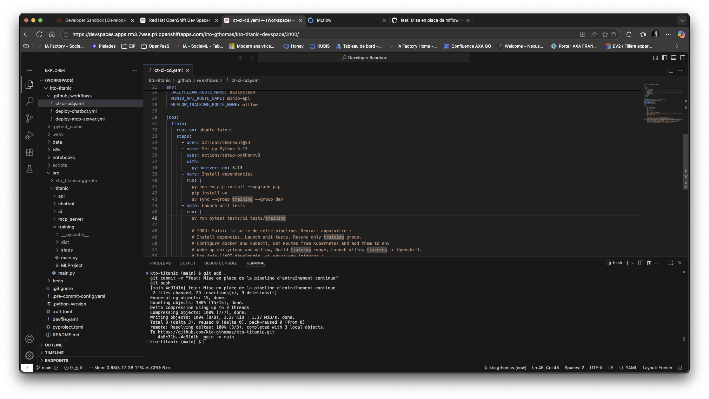

Comme vous pouvez le constater dans l'exécution automatique de votre action, vos tests ont été automatiquement lancés
et ils fonctionnent ! Bravo ! Vous venez de configurer vos tests automatisés ! C'est la première étape d'une intégration
continue réussie ! Vous venez de sécuriser votre code. A chaque fois que vous ferez une modification, vos tests seront
lancés tous seuls et valideront vos modifications ! C'est génial !

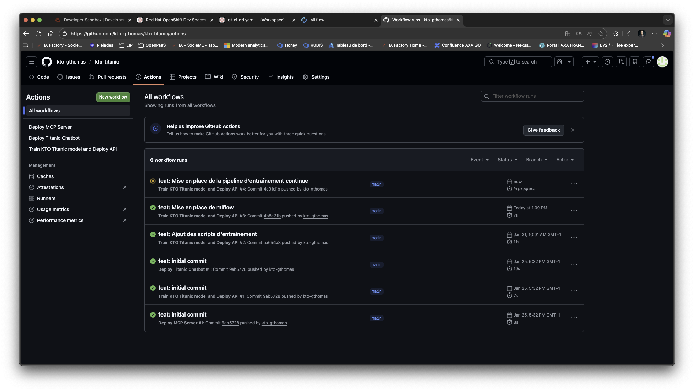
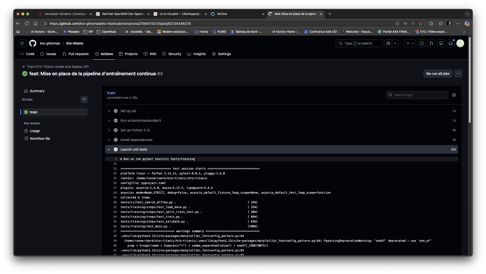

Passons maintenant à la suite, en se concentrant sur la mise en place de mlflow dans votre pipeline !

## Lancer une expérimentation de manière continue

### D'abord, un peu de théorie

Ici, nous allons directement lancer les entraînements de nos modèles, depuis notre pipeline d'intégration continue.
Nous allons avoir besoin de plusieurs choses et ces éléments vont vous rappeler des souvenirs :
- mlflow : le client mlflow nous permet de créer un run dans une expérience dans un Server Tracking distant
- docker : pour créer et pousser les images d'entraînements dans notre repository Quay
- kubectl : Client Kubernetes utilisé par mlflow pour créer vos jobs d'entraînement dans OpenShift
- toutes les informations permettant aux outils précédents de fonctionner (url/user/mdp de minio, url de mlflow dans kto-mlflow,
url/token du cluster OpenShift, user/mdp du compte robot de Quay).

Pour vous permettre d'y voir plus clair, reportez-vous au schéma suivant qui illustre le fonctionnement de notre pipeline d'intégration continue
avec mlflow, docker, kubectl, Quay et OpenShift :


Faisons un focus rapide sur chaque composant. Commençons par mlflow. Nous allons utiliser mlflow pour lancer nos entraînements de modèles dans OpenShift.
Pour cela, nous allons utiliser la fonctionnalité de mlflow qui permet d'exécuter des runs dans un backend kubernetes. 
Ainsi, mlflow va se charger de créer les jobs d'entraînement dans OpenShift
et de suivre leur avancement. Nous allons donc devoir configurer mlflow pour qu'il puisse se connecter à notre serveur 
mlflow distant (kto-mlflow), et à notre serveur S3 (minio) pour stocker les artifacts de nos modèles.

Pour fonctionner, mlflow a besoin de plusieurs variables d'environnement :
- KUBE_MLFLOW_TRACKING_URI : l'url de notre serveur mlflow (kto-mlflow)
- MLFLOW_TRACKING_URI : l'url de notre serveur mlflow (kto-mlflow)
- MLFLOW_S3_ENDPOINT_URL : l'url de notre serveur S3 (minio)
- AWS_ACCESS_KEY_ID : l'identifiant d'accès à minio
- AWS_SECRET_ACCESS_KEY : le mot de passe d'accès à minio

Nous allons donc utiliser la commande export pour définir ces variables d'environnement dans notre pipeline d'intégration continue :
```bash
export KUBE_MLFLOW_TRACKING_URI=http://mlflow-balba-dev.apps.sandbox-m3.666.p1.openshiftapps.com
export MLFLOW_TRACKING_URI=http://mlflow-balba-dev.apps.sandbox-m3.666.p1.openshiftapps.com
export MLFLOW_S3_ENDPOINT_URL=http://minio-api-balba-dev.apps.sandbox-m3.666.p1.openshiftapps.com
export AWS_ACCESS_KEY_ID=minio
export AWS_SECRET_ACCESS_KEY=minio123
```

Pour lancer une expérience, nous allons utiliser la commande mlflow run avec le backend kubernetes :
```bash
uv run mlflow run ./src/titanic/training -P path=all_titanic.csv --experiment-name kto-titanic --backend kubernetes --backend-config ./k8s/experiment/kubernetes_config.json
```

Pour que tout cela fonctionne, nous allons devoir configurer docker et kubectl dans notre pipeline d'intégration continue.
Docker va nous permettre de construire et de pousser nos images d'entraînement dans notre repository Quay. Kubectl va nous permettre
de nous connecter à notre cluster OpenShift et de gérer nos ressources Kubernetes. Pour cela, nous allons utiliser 
les commandes docker login et kubectl config set-cluster, set-credentials, set-context et use-context.

```bash
docker login -u="VOTRE_USER_ROBOT_QUAY" -p="VOTRE_MDP_ROBOT_QUAY" quay.io
kubectl config set-cluster openshift-cluster --server=METTEZ_ICI_LADRESSE_DE_VOTRE_OPENSHIFT
kubectl config set-credentials openshift-credentials --token=METTEZ_ICI_SON_JETON_DAUTHENTIFICATION
kubectl config set-context openshift-context --cluster=openshift-cluster --user=openshift-credentials --namespace=METTEZ_ICI_LE_NOM_DE_VOTRE_NAMESPACE
kubectl config use openshift-context
```

Grâce à ces commandes, mlflow sera en mesure de créer des jobs d'entraînement dans OpenShift et de pousser les images d'entraînement
dans Quay.

Il faudra néanmoins créer l'image docker de notre entraînement. Pour cela, nous allons utiliser la commande docker build :
```bash
docker build -f k8s/experiment/Dockerfile  -t quay.io/VOTRE_USER_QUAY/titanic/experiment:latest --build-arg MLFLOW_S3_ENDPOINT_URL=$MLFLOW_S3_ENDPOINT_URL --build-arg AWS_ACCESS_KEY_ID=minio --build-arg AWS_SECRET_ACCESS_KEY=minio123 .
```

Pas besoin de la pousser, mlflow s'en chargera pour nous !

Afin de rendre nos github actions plus sécurisées et plus propres, nous allons utiliser des variables d'environnement
et des secrets pour stocker les informations sensibles et les informations de configuration. Cela nous permettra de
ne pas avoir à mettre ces informations en dur dans notre fichier de configuration de l'action. Nous allons également 
utiliser notre client kubectl pour récupérer les routes de notre cluster OpenShift et les ajouter dynamiquement à nos 
variables d'environnement. Cela nous permettra de limiter les configurations manuelles à faire et de rendre notre pipeline
plus robuste. Par exemple, si l'url de notre serveur mlflow change, nous n'aurons pas à modifier notre configuration de l'action,
cela se fera tout seul.

### Passons à la pratique

Commençons d'abord justement par la configuration de ces variables d'environnement, ce sera fait ;) Vous avez la possibilité de configurer des 
variables d'environnement à destination de vos GitHub Actions directement dans votre repository GitHub. Rendez-vous dans
le menu Settings en haut de la page de votre repository, puis dans Secrets and varaibles, puis Actions :


Comme vous pouvez le constater, il y a une section Secrets et une autre Variables. Dans Secrets, nous mettrons les
mots de passe. Cet espace est chiffré et sécurisé. Nous mettrons tout le reste en clair, dans les variables.
Vous avez également deux niveaux d'accessibilité, à l'environnement et au repository. Par mesure de simplification,
nous allons utiliser exclusivement les variables et les secrets de type Repository. Voici ce que vous devriez avoir
au niveau des Secrets :

- **AWS_SECRET_ACCESS_KEY** : minio123
- **OPENSHIFT_TOKEN** : il s'agit du token d'authentification de votre OpenShift Sandbox. Pour le récupérer, suivez les instructions
  un peu plus bas dans ce chapitre.
- **QUAY_ROBOT_TOKEN** : il s'agit du mot de passe de votre compte robot Quay. Pour le récupérer, suivez les instructions
  un peu plus bas dans ce chapitre.


Et voici pour les variables :

- **AWS_ACCESS_KEY_ID** : minio
- **OPENSHIFT_SERVER** : l'url de votre OpenShift Sandbox. Pour la récupérer, suivez les instructions
  un peu plus bas dans ce chapitre.
- **OPENSHIFT_USERNAME** : votre nom d'utilisateur OpenShift Sandbox.
- **QUAY_ROBOT_USERNAME** : le nom d'utilisateur de votre compte robot Quay. Pour le récupérer, suivez les instructions
  un peu plus bas dans ce chapitre.

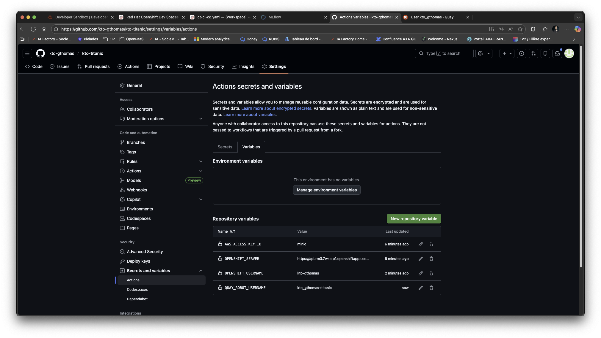

Pour récupérer les identifiants du robot quay, rendez-vous sur quay.io et utiliser vos identifiants
RedHat Developer pour vous connecter. Vous trouverez votre compte robot dans le menu Account Settings. Cliquez sur le 
robot et cliquez sur votre compte, cela ouvrira une popup. Sélectionnez Robot Account à gauche de cette fenêtre,
vous trouverez vos identifiants :

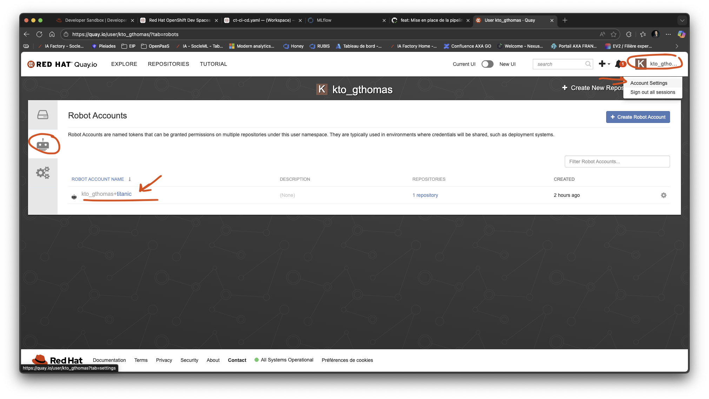
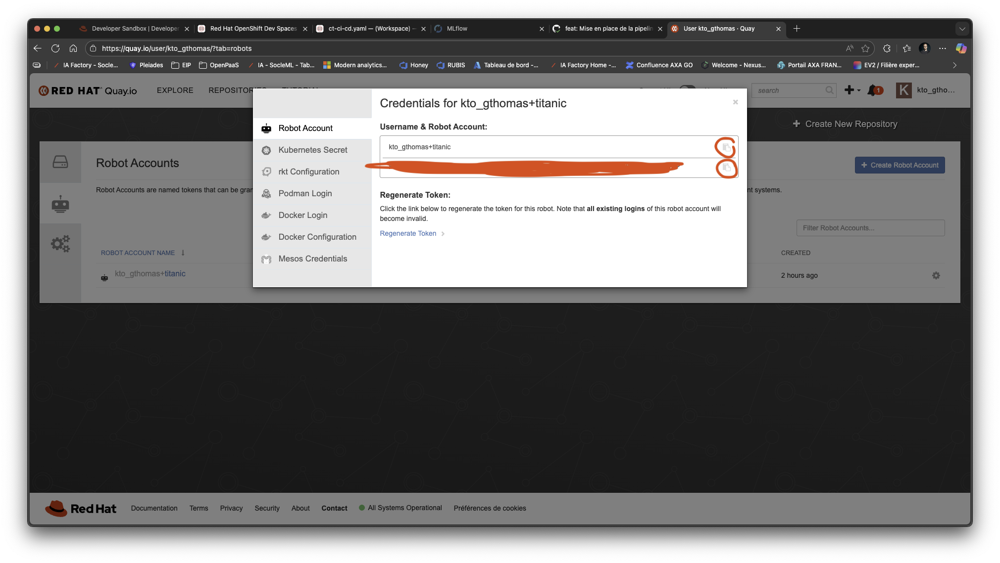

Créez donc le Secret Repository QUAY_ROBOT_TOKEN et renseignez le secret de votre compte et la variable Repository
QUAY_ROBOT_USERNAME avec le user de votre compte.

Poursuivons avec OpenShift. Rendez-vous dans votre [OpenShift Sandbox](https://sandbox.redhat.com), identifiez-vous si besoin
, lancez OpenShift et en haut à droite, cliquez sur votre identifiant OpenShift, puis sélectionnez en haut à droite Copy login command
en cliquant sur votre user :


Cliquez sur Display token et récupérez votre token que vous mettrez dans un Repository Secret nommé OPENSHIFT_TOKEN,
récupérez l'adresse du cluster que vous mettrez dans une Repository Variable nommée OPENSHIFT_SERVER. Ajoutez également
votre login (affiché en haut à droite dans l'image ci-dessus) dans une variable OPENSHIFT_USERNAME.

Ici en surligné, le nom de votre serveur OpenShift Sandbox :
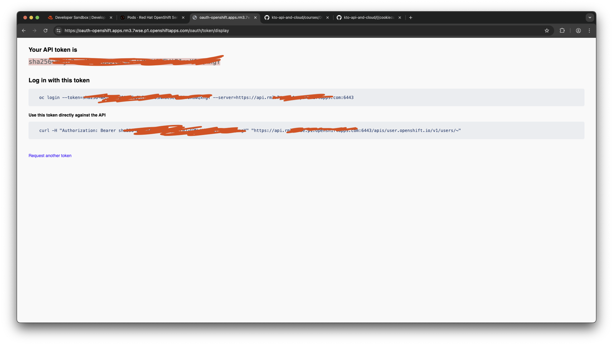

Ici, votre token d'authentification OpenShift Sandbox :
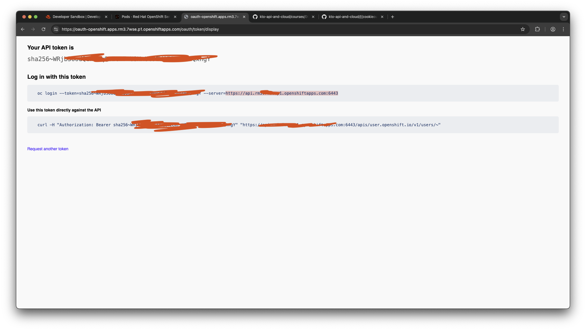


Terminons avec les secrets en créant AWS_SECRET_ACCESS_KEY dont la valeur est "minio123". Profitons-en maintenant
pour ajouter la variable AWS_ACCESS_KEY_ID dont la valeur est minio. 

Et voilà ! Vous avez terminé cette partie de configuration !

Maintenant, terminons notre github action. Ajoutons d'abord une étape pour retirer les dépendances de tests et ne garder que celles
nécessaires à l'entraînement. Ajoutez la partie suivante dans le step `train`, juste après l'exécution des tests unitaires :
```yaml
- name: Resync only training group
  run: |
    uv sync --group training
```
Maintenant, configurons notre client docker et notre client kubernetes pour qu'ils puissent se connecter sur Quay et 
OpenShift. Notez que docker et kubectl sont déjà installés et prêts à l'emploi dans nos GitHub Actions (et
ça, c'est super cool !) :
```yaml
      - name: Configure docker and kubectl
        run: |
          docker login -u="${{vars.QUAY_ROBOT_USERNAME}}" -p="${{secrets.QUAY_ROBOT_TOKEN}}" quay.io
          kubectl config set-cluster openshift-cluster --server=${{vars.OPENSHIFT_SERVER}}
          kubectl config set-credentials openshift-credentials --token=${{secrets.OPENSHIFT_TOKEN}}
          kubectl config set-context openshift-context --cluster=openshift-cluster --user=openshift-credentials --namespace=${{vars.OPENSHIFT_USERNAME}}-dev
          kubectl config use openshift-context
```
Ces commandes doivent vous rappeler des souvenirs ;) Notez l'usage des secrets et des variables d'environnement avec la syntaxe :
`${{secrets.NOM_DU_SECRET}}` et `${{vars.NOM_DE_LA_VARIABLE}}`.

Utilisons maintenant kubectl pour récupérer les routes de notre cluster OpenShift et les ajouter à nos variables
d'environnement. Ajoutez la partie suivante juste après la configuration de docker et kubectl :
```yaml
- name: Get Routes from Kubernetes and add them to env
  run: |
    DAILYCLEAN_ROUTE_URL=$(kubectl get route ${{env.DAILYCLEAN_ROUTE_NAME}} -o jsonpath='{.spec.host}')
    MINIO_API_ROUTE_URL=$(kubectl get route ${{env.MINIO_API_ROUTE_NAME}} -o jsonpath='{.spec.host}')
    MLFLOW_TRACKING_ROUTE_URL=$(kubectl get route ${{env.MLFLOW_TRACKING_ROUTE_NAME}} -o jsonpath='{.spec.host}')
    
    echo "DAILYCLEAN_ROUTE_URL=https://$DAILYCLEAN_ROUTE_URL" >> $GITHUB_ENV
    echo "MINIO_API_ROUTE_URL=https://$MINIO_API_ROUTE_URL" >> $GITHUB_ENV
    echo "MLFLOW_TRACKING_ROUTE_URL=https://$MLFLOW_TRACKING_ROUTE_URL" >> $GITHUB_ENV
```

Notez l'usage de la variable d'environnement spéciale `$GITHUB_ENV` qui permet d'ajouter des variables d'environnement
dynamiquement à nos GitHub Actions. Vous pourrez les retrouver dans les steps suivants en utilisant la syntaxe `${{vars.NOM_DE_LA_VARIABLE}}`.
Notez également l'usage de la commande kubectl get route pour récupérer les routes de notre cluster OpenShift.
Notez enfin l'usage des variables d'environnement définies au début de notre fichier YAML avec la syntaxe `${{env.NOM_DE_LA_VARIABLE}}`.
Cela nous permet de ne pas avoir à mettre en dur le nom des routes dans notre configuration, mais de les centraliser au début du fichier.
Un peu comme une magic constant en programmation ! ;)

Réveillons maintenant Dailyclean, patientons un peu pour lui laisser le temps de démarrer, et demandons-lui de réveiller
kto-mlflow !
```yaml
      - name: Wake up dailyclean and mlflow
        run: |
          kubectl scale --replicas=1 deployment/dailyclean-api
          sleep 30
          curl -X POST $DAILYCLEAN_ROUTE_URL/pods/start
```
Notez l'usage de la variable d'environnement `$DAILYCLEAN_ROUTE_URL` que nous avons définie dans le step précédent.

Construisons maintenant notre image docker pour le train de notre modèle. Faites attention à bien mettre dans cette commande
votre repository quay à vous !
```yaml
      - name: Build training image
        run: |
          docker build -f k8s/experiment/Dockerfile -t ${{ env.EXPERIMENT_IMAGE_NAME }}:latest --build-arg MLFLOW_S3_ENDPOINT_URL=$MINIO_API_ROUTE_URL --build-arg AWS_ACCESS_KEY_ID=${{vars.AWS_ACCESS_KEY_ID}} --build-arg AWS_SECRET_ACCESS_KEY=${{secrets.AWS_SECRET_ACCESS_KEY}} .
      
```
Notez l'usage des variables d'environnement `${{ env.EXPERIMENT_IMAGE_NAME }}`, `$MINIO_API_ROUTE_URL`,
`${{vars.AWS_ACCESS_KEY_ID}}` et `${{secrets.AWS_SECRET_ACCESS_KEY}}` pour rendre cette commande dynamique et
réutilisable.


Ajoutez maintenant la partie vous permettant d'exécuter votre entraînement en ligne : 
```yaml
      - name: Launch mlflow training in Openshift
        run: |
          export KUBE_MLFLOW_TRACKING_URI=$MLFLOW_TRACKING_ROUTE_URL
          export MLFLOW_TRACKING_URI=$MLFLOW_TRACKING_ROUTE_URL
          export MLFLOW_S3_ENDPOINT_URL=$MINIO_API_ROUTE_URL
          export AWS_ACCESS_KEY_ID="${{vars.AWS_ACCESS_KEY_ID}}" 
          export AWS_SECRET_ACCESS_KEY="${{secrets.AWS_SECRET_ACCESS_KEY}}"

          uv run mlflow run ./src/titanic/training -P path=all_titanic.csv --experiment-name ${{ env.EXPERIMENT_NAME }} --backend kubernetes --backend-config ./k8s/experiment/kubernetes_config.json
```
Notez l'usage de la variable d'environnement ${{ env.EXPERIMENT_NAME }}. Le nom de l'expérience est ainsi dynamique et réutilisable.


Mettez en sommeil kto-mlflow : 
```yaml
      - name: Asleep kto-mlflow with dailyclean
        run: |
          curl -X POST $DAILYCLEAN_ROUTE_URL/pods/stop
```

En complétant votre fichier, prenez garde à bien respecter l'indentation YAML, qui est très importante.


Votre fichier complet devrait ressembler à ceci :
```yaml
name: Train KTO Titanic model and Deploy API

on:
  push:
    branches:
      - main
    paths:
      - 'src/titanic/api/**'
      - 'src/titanic/training/**'
      - 'src/titanic/ci/**'
      - '/tests/api/**'
      - '/tests/training/**'
      - '/tests/ci/**'
      - 'k8s/experiment/**'
      - 'k8s/api/**'
      - '.github/workflows/ct-ci-cd.yaml'
  pull_request:
    branches:
      - main

env:
  EXPERIMENT_NAME: kto-titanic
  EXPERIMENT_IMAGE_NAME: quay.io/kto_gthomas/titanic/experiment
  API_IMAGE_NAME: quay.io/kto_gthomas/titanic/api
  API_ROUTE_NAME: titanic-api
  DAILYCLEAN_ROUTE_NAME: dailyclean
  MINIO_API_ROUTE_NAME: minio-api
  MLFLOW_TRACKING_ROUTE_NAME: mlflow

jobs:
  train:
    runs-on: ubuntu-latest
    steps:
      - uses: actions/checkout@v3
      - name: Set up Python 3.13
        uses: actions/setup-python@v3
        with:
          python-version: 3.13
      - name: Install dependencies
        run: |
          python -m pip install --upgrade pip
          pip install uv
          uv sync --group training --group dev
      - name: Launch unit tests
        run: |
          uv run pytest tests/ci tests/training
      - name: Resync only training group
        run: |
          uv sync --group training
      - name: Configure docker and kubectl
        run: |
          docker login -u="${{vars.QUAY_ROBOT_USERNAME}}" -p="${{secrets.QUAY_ROBOT_TOKEN}}" quay.io
          kubectl config set-cluster openshift-cluster --server=${{vars.OPENSHIFT_SERVER}}
          kubectl config set-credentials openshift-credentials --token=${{secrets.OPENSHIFT_TOKEN}}
          kubectl config set-context openshift-context --cluster=openshift-cluster --user=openshift-credentials --namespace=${{vars.OPENSHIFT_USERNAME}}-dev
          kubectl config use openshift-context
      - name: Get Routes from Kubernetes and add them to env
        run: |
          DAILYCLEAN_ROUTE_URL=$(kubectl get route ${{env.DAILYCLEAN_ROUTE_NAME}} -o jsonpath='{.spec.host}')
          MINIO_API_ROUTE_URL=$(kubectl get route ${{env.MINIO_API_ROUTE_NAME}} -o jsonpath='{.spec.host}')
          MLFLOW_TRACKING_ROUTE_URL=$(kubectl get route ${{env.MLFLOW_TRACKING_ROUTE_NAME}} -o jsonpath='{.spec.host}')

          echo "DAILYCLEAN_ROUTE_URL=https://$DAILYCLEAN_ROUTE_URL" >> $GITHUB_ENV
          echo "MINIO_API_ROUTE_URL=https://$MINIO_API_ROUTE_URL" >> $GITHUB_ENV
          echo "MLFLOW_TRACKING_ROUTE_URL=https://$MLFLOW_TRACKING_ROUTE_URL" >> $GITHUB_ENV
      - name: Wake up dailyclean and mlflow
        run: |
          kubectl scale --replicas=1 deployment/dailyclean-api
          sleep 30
          curl -X POST $DAILYCLEAN_ROUTE_URL/pods/start
      - name: Build training image
        run: |
          docker build -f k8s/experiment/Dockerfile -t ${{ env.EXPERIMENT_IMAGE_NAME }}:latest --build-arg MLFLOW_S3_ENDPOINT_URL=$MINIO_API_ROUTE_URL --build-arg AWS_ACCESS_KEY_ID=${{vars.AWS_ACCESS_KEY_ID}} --build-arg AWS_SECRET_ACCESS_KEY=${{secrets.AWS_SECRET_ACCESS_KEY}} .
      - name: Launch mlflow training in Openshift
        run: |
          export KUBE_MLFLOW_TRACKING_URI=$MLFLOW_TRACKING_ROUTE_URL
          export MLFLOW_TRACKING_URI=$MLFLOW_TRACKING_ROUTE_URL
          export MLFLOW_S3_ENDPOINT_URL=$MINIO_API_ROUTE_URL
          export AWS_ACCESS_KEY_ID="${{vars.AWS_ACCESS_KEY_ID}}" 
          export AWS_SECRET_ACCESS_KEY="${{secrets.AWS_SECRET_ACCESS_KEY}}"

          uv run mlflow run ./src/titanic/training -P path=all_titanic.csv --experiment-name ${{ env.EXPERIMENT_NAME }} --backend kubernetes --backend-config ./k8s/experiment/kubernetes_config.json
      - name: Asleep kto-mlflow with dailyclean
        run: |
          curl -X POST $DAILYCLEAN_ROUTE_URL/pods/stop

          # TODO: Saisir la suite de cette pipeline. Devrait apparaître : 
          # Install depencies, Launch unit tests, Resync only training group,
          # Configure docker and kubectl, Get Routes from Kubernetes and add them to env
          # Wake up dailyclean and mlflow, Build training image, Launch mlflow training in Openshift.
          # Une fois l'API développée, et sécurisée intégrer : 
          # Download model artifact, Build and push api image, Configure API manifest with OAuth2 domain
          # Deploy api to Openshift with OAuth2 protection, Get OAuth2 token for integration test
          # Test api with OAuth2 authentication, Asleep kto-mlflow with dailyclean

```
Pour prendre en compte vos modifications, il va falloir commiter et pusher. Afin d'éviter de polluer votre historique
git, je vous propose plutôt de modifier votre dernier commit avec les commandes suivantes :
```bash
git add .
git commit --amend --no-edit
git push -f
```

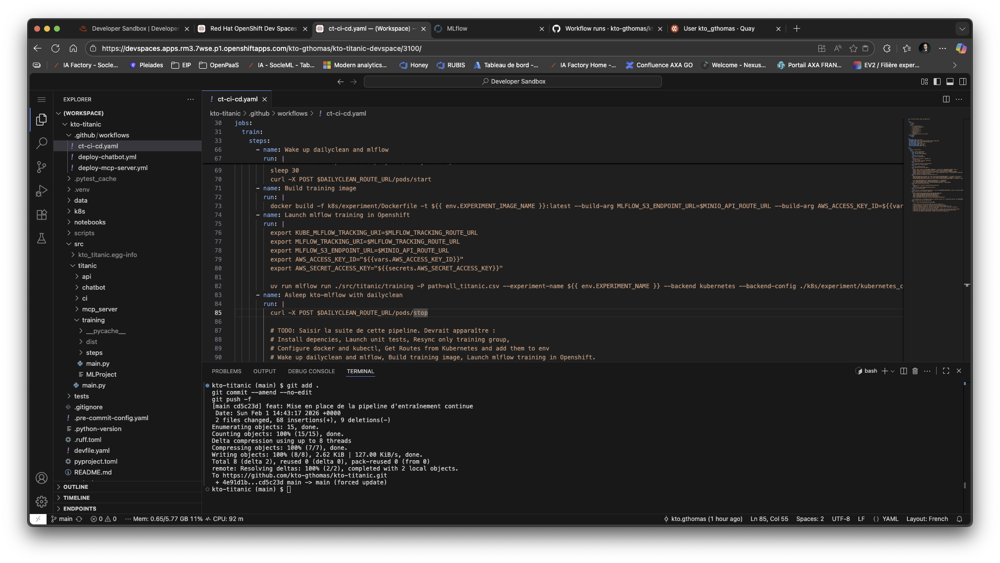

Suivez l'avancement de votre action dans le menu Actions de votre repository GitHub.

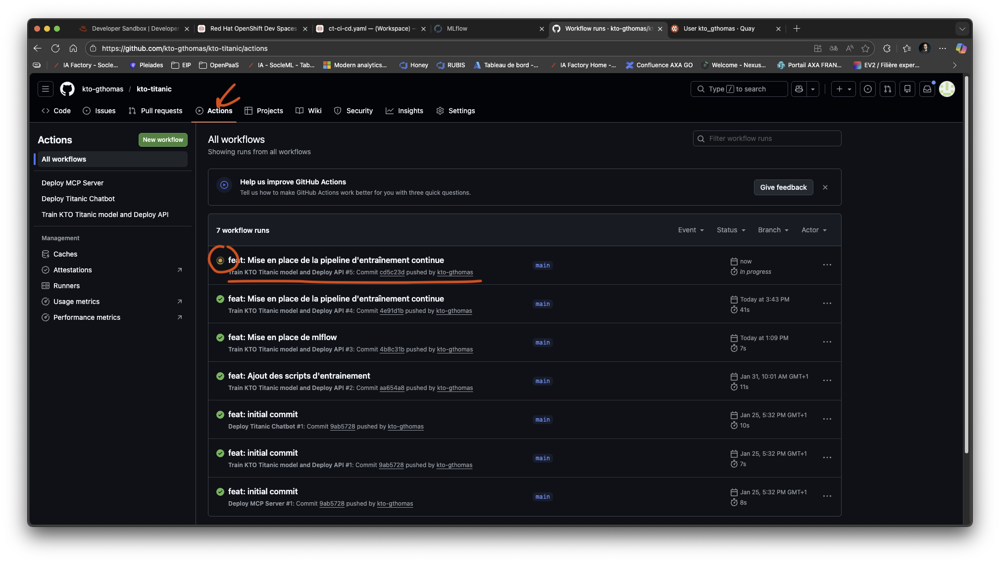
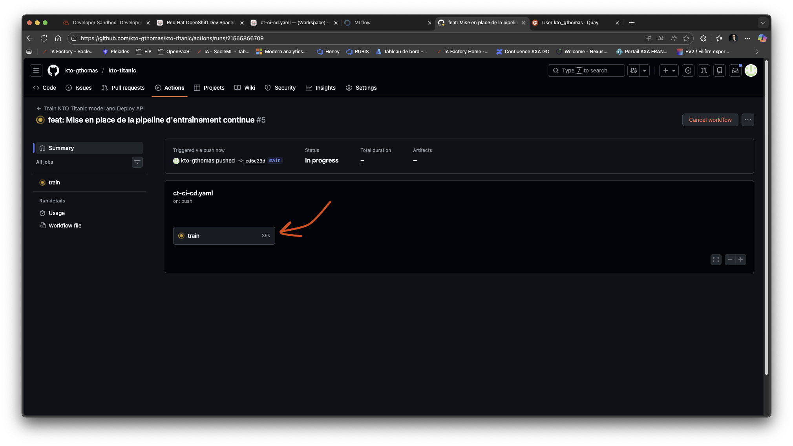
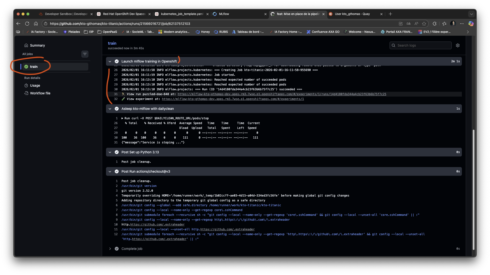

Maintenant, rendez-vous dans votre mlflow en ligne, et constatez que votre modèle a bien été entraîné et que le model
est bien stocké en artifact ! Il faudra d'abord redémarrer mlflow avec [Dailyclean](./04_scoping_data_prep_label.md#présentation-de-dailyclean-et-comment-démarrer-kto-mlflow) manuellement.
Notez cette troisième ligne dans la capture d'écran, qui correspond à notre entraînement automatique lancé depuis notre
GitHub Action ! Notez également cette deuxième version du modèle, qui correspond à notre entraînement automatique !

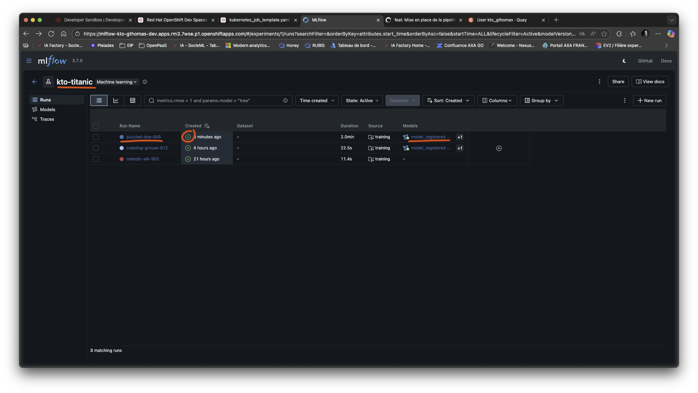


BRAVO ! Vous venez de finir quelque chose d'important ! Désormais, toutes vos modifications donneront lieu au ré-entraînement
automatique de votre modèle et à l'exécution de vos tests en automatique !

Maintenant, passons aux parties API, Cloud, Docker et Kubernetes ! Je vais passer un peu plus de temps pour vous expliquer 
tout ça !