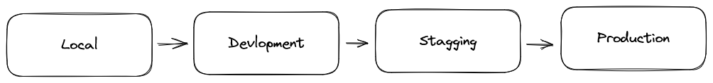
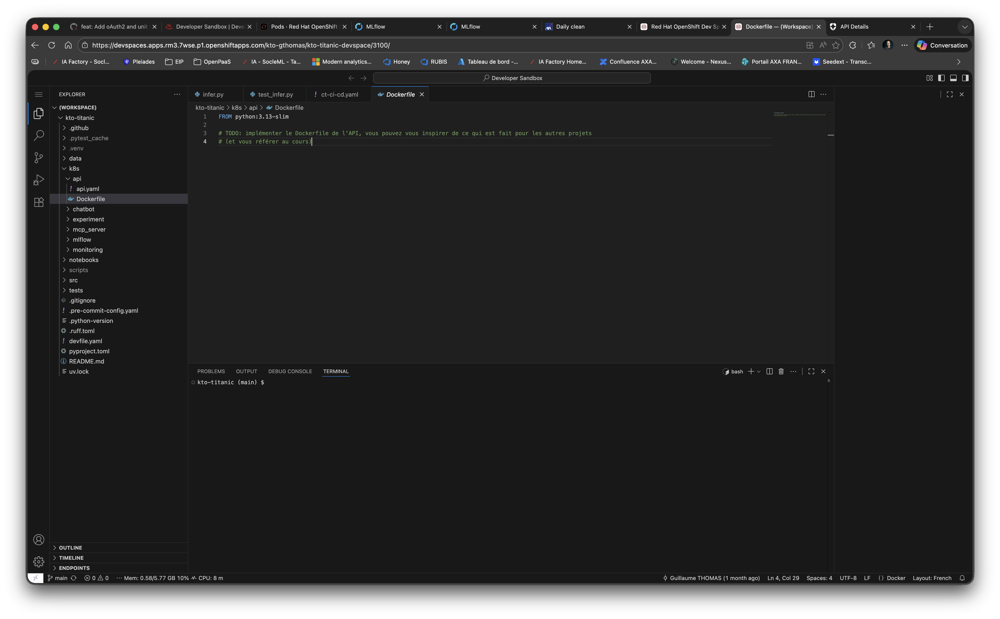
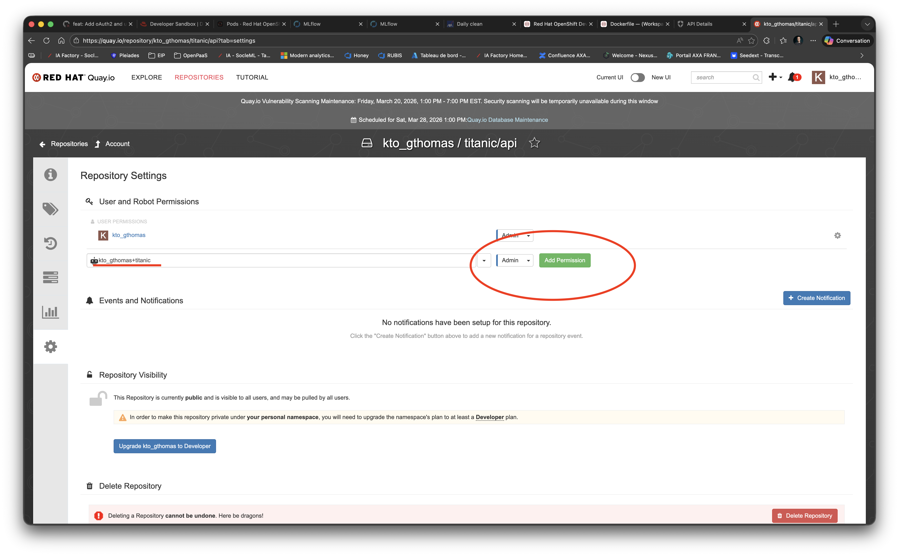
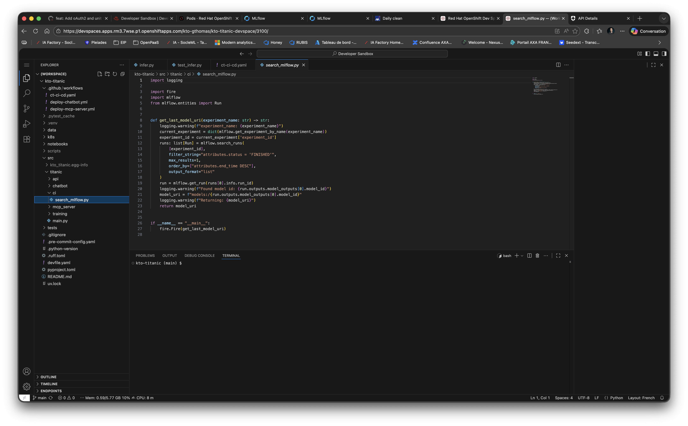
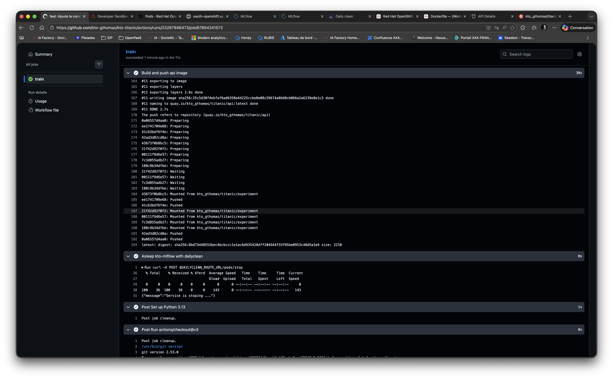
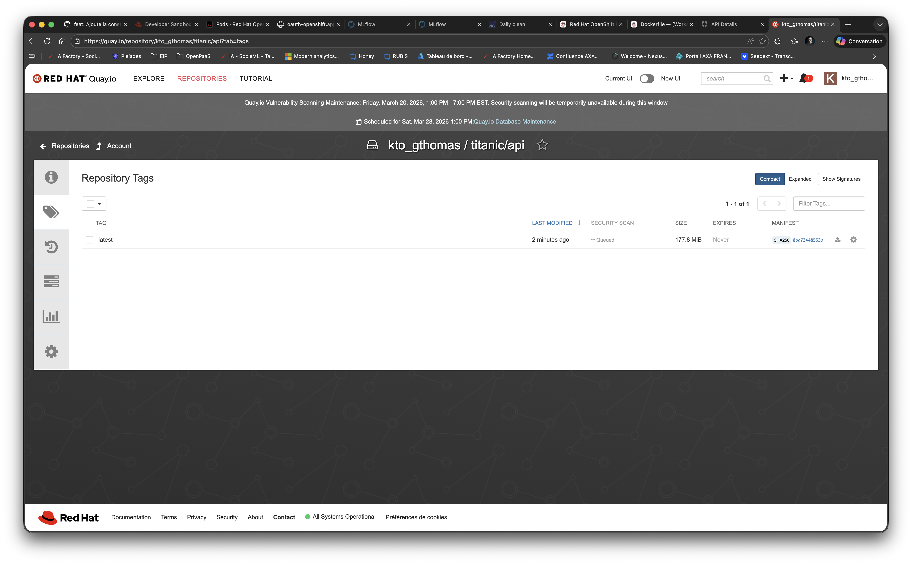

# 9. Docker

Dans ce chapitre, nous allons voir comment déployer votre API sous forme de conteneur Docker. Nous allons expliquer
de quoi il s'agit, comment cela fonctionne.

Avant de commencer, afin que tout le monde parte du même point, vérifiez que vous n'avez aucune modification en
cours sur votre working directory avec `git status`.
Si c'est le cas, vérifiez que vous avez bien sauvegardé votre travail lors de l'étape précédente pour ne pas perdre
votre travail.
Sollicitez le professeur, car il est possible que votre contrôle continue en soit affecté.

> ⚠️ **Attention** : En cas de doute, sollicitez le professeur, car il est possible que votre contrôle continue en soit affecté.

Pour rappel, les commandes utiles sont :
```bash
git add .
git commit -m "your message"
git push origin main
```

## Qu'est ce que c'est ?

Docker est un logiciel de conteneurisation open source qui permet d'empaqueter une application et ses dépendances dans un conteneur isolé. C'est l'outil le plus populaire pour créer et gérer des conteneurs.

## A quoi ça sert ?

Docker sert à :
- Garantir que votre application fonctionne de la même façon sur votre machine, en production et chez vos collègues
- Isoler les applications entre elles (chaque conteneur a son propre environnement)
- Faciliter le déploiement (une seule commande pour lancer votre application)
- Économiser des ressources par rapport aux machines virtuelles

## Comment ça fonctionne ?

Docker fonctionne avec 3 concepts clés :
- **Dockerfile** : fichier texte contenant les instructions pour construire votre image
- **Image** : template immuable contenant votre application et ses dépendances (comme une photo figée)
- **Conteneur** : instance en exécution d'une image (comme un processus vivant)

Le moteur Docker (daemon) gère la création et l'exécution des conteneurs sur votre machine.

## Manipulation de Docker

Dans ce chapitre, vous allez apprendre à :
- Écrire un Dockerfile pour votre API Titanic
- Construire une image Docker
- Pousser cette image sur un registre (Quay.io)
- Automatiser tout cela dans votre pipeline GitHub Actions

# Deploy

## Introduction

### Résumé

Pourquoi déployer notre modèle en production ? Pourquoi le déployer dans le Cloud ?

Déployer notre service en production signifie rendre notre application disponible au plus grand nombre en
assurant à nos clients un environnement technique qui est :

- stable : notre webservice répond à nos clients de manière cohérente, les nouvelles versions de notre service
  sont validées et testées avant d'être déployées sur notre environnement de production (mises à jour)
- robuste : la production doit répondre aussi rapidement que possible, aussi bien que possible, tout en supportant la charge que nous
  lui imposons (capacité à répondre à autant de clients que possible en même temps). La production doit être scalable.
- sécurisé

Dans le cycle de vie d'un projet, notre application sera exécutée sur plusieurs types d'environnements :



- local : Votre propre environnement de développement, votre machine locale ou votre Codespace. Permet de valider vos développements directement.
- développement : premier environnement sur lequel vous déployez votre service. Cet environnement sera mis à jour
  très souvent et permet de valider que techniquement, votre nouvelle version du service fonctionne bien sur un environnement technique
  cohérent avec votre production. Cet environnement est généralement moins puissant que l'environnement de production
- préproduction (staging) : L'étape finale avant la production, cet environnement est traditionnellement façonné comme la production.
  Permet de valider les bonnes performances de votre service dans un environnement proche de votre production.
  Souvent utilisé par la Q&A ou les Product Owners pour confirmer définitivement que le service répond à ses exigences.
- production

Ces environnements nous permettent de sécuriser, tester, valider notre application avant de la déployer et d'impacter nos utilisateurs

Au fait, qu'est-ce qu'un Cloud ? À quoi ça sert ?


### Dans le Cloud, différents types de plateformes

Quels sont les fournisseurs Cloud les plus célèbres au monde ?

Offres ? Services ? Tarifs ?

Quels types de plateformes ?

- **IaaS** : Infrastructure As A Service
- **PaaS** : Platform As A Service
- **SaaS** : Service As A Service
- **CaaS** : Container As A Service

Que signifient-ils ? Quelles sont les différences entre eux ?


CaaS signifie que nous allons utiliser des conteneurs. Mais qu'est-ce que c'est ?

## 3 - Conteneurs avec Docker

### a - Qu'est-ce qu'un conteneur ? Quelles sont les différences avec la virtualisation ?


### b - Pourquoi devrions-nous les utiliser pour le ML ?


Quelques arguments :
- Ils sont plus légers
- Cette solution est plus scalable
- Cette solution est plus flexible (nous choisissons la version de python par exemple)
- Nous pouvons installer des bibliothèques sur le système d'exploitation hôte facilement
- Vous pouvez exécuter votre artefact localement comme il pourrait s'exécuter à distance, dans le Cloud

### c - Qu'est-ce que Docker ? Comment ça fonctionne ?

Docker est un logiciel de conteneurisation. C'est l'un des plus utilisés sur le marché. Les conteneurs s'exécutent dans le daemon Docker.
Une interface en ligne de commande permet d'interagir avec le daemon Docker.

Un conteneur repose sur une image. Une image est créée avec un fichier Dockerfile. Cette image est comme un template.

Voici un résumé sur le moteur Docker :


Une image utilise des instructions pour créer les couches du template.

Lorsque vous construisez une image, vous pouvez la pousser vers un registre de conteneurs. Il existe de nombreux registres de conteneurs différents sur le marché. Le plus populaire
est Docker Hub : https://hub.docker.com/

Maintenant, jouons avec docker !

D'abord, nous allons lancer un système Debian dessus. Pour ce faire, nous le recherchons sur google. Nous pouvons atteindre une page depuis Docker Hub : https://hub.docker.com/_/debian

Nous utiliserons le tag bullseye. Vous pouvez trouver tous les tags depuis la section Tags de cette page.

```bash
docker run -it debian:bullseye bash
```

Cette commande va récupérer l'image depuis le registre docker, créer un conteneur depuis cette image et lancer un prompt bash dessus.

Comme vous pouvez le voir, nous sommes actuellement root :


Comme vous pouvez le voir, le conteneur que vous exécutez actuellement est un debian rudimentaire. Depuis votre prompt si vous voulez lancer l'interpréteur python, ça ne fonctionnera pas !


C'est parce que ce système n'a pas python installé dessus. Essayons d'exécuter un script en python.

```bash
apt update
apt install python
apt install vim

mkdir /opt/app-root
cd /opt/app-root
touch my_script.py

vim my_script.py
```

Dans ce script, écrivez ce code :

```python
import platform 
print("Coucou ! On tourne sur " + platform.platform())
```

Maintenant nous pouvons lancer ce script depuis l'interpréteur python :

```bash
python my_script.py
```

Maintenant nous quittons le prompt de commande de notre conteneur :

```bash
exit
```

En quittant le prompt, le conteneur s'arrêtera. Pour le voir, utilisez cette commande :

```bash
docker ps -a
```

ps liste tous les conteneurs actifs. Vous pouvez ajouter l'option -a pour les lister tous, y compris ceux qui sont fermés.

Maintenant nettoyons notre espace de travail en supprimant ce conteneur fermé :

```bash
docker rm <id of the container>
```

Notez que l'image docker récupérée depuis le registre est toujours en cache dans votre moteur docker local. Pour les lister, vous pouvez utiliser la commande :

```bash
docker images
```

Pour supprimer correctement l'image, vous pouvez utiliser la commande :


```bash
docker rmi <id of the image>
```

Comme vous pouvez le voir, il peut être difficile de créer un environnement d'exécution prêt à l'emploi si nous devions lancer des commandes linux pour installer python, pousser notre code dessus, etc.

Mais nous pouvons créer nos propres images !!!

En écrivant un Dockerfile, nous allons utiliser des instructions pour construire notre image. Maintenant, écrivons notre premier Dockerfile.

### d - Écrire notre premier Dockerfile

Dans cette section, nous allons essayer de faire la même chose que nous avons faite dans le terrain de jeu précédent, mais directement depuis 
une image Docker personnalisée.

D'abord, identifiez ce fichier : `./k8s/api/Dockerfile`



Nous utiliserons une image python officielle de Docker comme base de notre image. Et nous allons construire des couches personnalisées dessus.

Si nous naviguons sur le site web Docker hub, nous pouvons trouver cette page : https://hub.docker.com/_/python

Elle nous donne toutes les images python créées par la communauté. L'une d'entre elles est une image bullseye avec python déjà installé dessus.

Nous commencerons notre construction avec cette image. Pour ce faire, dans notre Dockerfile, nous ajoutons cette instruction :

```dockerfile
FROM python:3.13-slim
```

Cette instruction indique que nous construisons notre image DEPUIS FROM python:3.13-slim comme base.

D'accord ! C'est un bon début ! Maintenant, si nous construisons cette image et créons un conteneur depuis celle-ci !

```bash
docker build -t mlopspython/first-image .

docker run -it mlopspython/first-image
```

> ⚠️ **Attention** : Depuis Devspaces, travailler avec Docker peut être compliqué. Si vous avez des problèmes 
pour construire votre image, essayez de le faire depuis un github Codespace. Sinon, suivez les explications du professeur.

Lorsque vous lancez la commande docker run, comme vous pouvez le voir, elle ouvre l'interpréteur python dans notre conteneur.
C'est parce que l'image est construite comme ça.

Si vous regardez à la fin du Dockerfile de cette image 
(https://github.com/docker-library/python/blob/2bcce464bea3a9c7449a2fe217bf4c24e38e0a47/3.11/bullseye/Dockerfile), 
une commande "python3" est lancée.

Pour ce faire, l'instruction CMD est utilisée. Vous pouvez creuser ce sujet en consultant cette 
page : https://medium.com/ci-cd-devops/dockerfile-run-vs-cmd-vs-entrypoint-ae0d32ffe2b4

Comme vous devriez le voir, une instruction CMD finale peut être remplacée. Donc si nous lançons notre conteneur avec cette commande :

```bash
docker run -it mlopspython/first-image bash
```

Cela lancera le conteneur et nous donnera un prompt de commande root comme avant ! Quittez d'abord votre conteneur avec l'instruction python exit() et essayons !

Ok ! Maintenant, nous voulons créer notre répertoire /opt/app-root et notre script python.

Dans notre Dockerfile :

```dockerfile
FROM python:3.11.2-bullseye

RUN mkdir /opt/app-root

WORKDIR /opt/app-root

RUN echo "import platform\nprint(\"Coucou ! On tourne sur \" + platform.platform())" > myscript.py
```

Maintenant, construisons notre image et lançons à nouveau notre conteneur !

```bash
docker build -t mlopspython/first-image .

docker run -it mlopspython/first-image bash
```

Comme vous pouvez le voir, cette fois, l'image python n'a pas été téléchargée à nouveau. C'est parce que l'image est enregistrée dans le cache Docker local !


Maintenant, depuis votre conteneur, si vous lancez cette commande :

```bash
python /opt/app-root/myscript.py
```

Maintenant, nous quittons le conteneur et nous allons essayer d'aller plus loin.

```bash
exit
```

Mais d'abord, nettoyez correctement vos conteneurs morts.

Maintenant nous voulons dire à notre image d'exécuter le script par elle-même et d'imprimer le résultat, sans exécuter et ouvrir le conteneur nous-mêmes.

Pour ce faire, nous utiliserons l'instruction ENTRYPOINT :

```dockerfile
FROM python:3.11.2-bullseye

RUN mkdir /opt/app-root

WORKDIR /opt/app-root

RUN echo "import platform\nprint(\"Coucou ! On tourne sur \" + platform.platform())" > myscript.py

ENTRYPOINT ["python", "myscript.py"]
```

Maintenant, construisons l'image et lançons-la !

```bash
docker build -t mlopspython/first-image .
```

Comme vous pouvez le voir, lorsque vous lancez ce build, les lignes qui existent déjà sont mises en cache et ne sont pas relancées !


```bash
docker run mlopspython/first-image
```

Notez que cette fois, nous lançons le conteneur sans l'option -it. C'est parce que nous ne voulons pas ouvrir un prompt dans le conteneur, mais juste le laisser exécuter son code.

Normalement, vous devriez voir quelque chose comme ceci :


Maintenant, il est temps de construire notre image docker qui contiendra et exécutera notre API !

### e - Le Dockerfile de notre WebService

Mais avant d'écrire notre Dockerfile, concentrons-nous sur quelques nouvelles instructions. Vous pouvez trouver ces définitions provenant de la documentation de référence Docker : https://docs.docker.com/engine/reference/builder/

- **ENV**: Définir une variable d'environnement.
- **WORKDIR**: L'instruction WORKDIR définit le répertoire de travail pour toute instruction RUN, CMD, ENTRYPOINT, COPY et ADD qui la suit dans le Dockerfile.
- **COPY**: L'instruction COPY copie de nouveaux fichiers ou répertoires depuis <src> et les ajoute au système de fichiers du conteneur au chemin <dest>.
- **EXPOSE**: L'instruction EXPOSE informe Docker que le conteneur écoute sur les ports réseau spécifiés au moment de l'exécution.
- **ENTRYPOINT**: Un ENTRYPOINT vous permet de configurer un conteneur qui s'exécutera comme un exécutable.

Maintenant, essayons de créer votre image Docker. Vous pouvez regarder le Makefile pour savoir comment construire votre projet avec pip.

N'oubliez pas d'EXPOSER le port de votre Webservice (petit rappel, nous l'avons défini sur 8080), et de définir un ENTRYPOINT final.

N'oubliez pas qu'il faut télécharger le modèle depuis MLflow. Nous aurons donc encore besoin
de MLflow. Pour ne pas polluer l'image finale, nous pouvons utiliser la fonctionnalité de multi-staging de docker.

Le **multi-stage build** est une fonctionnalité de Docker qui permet de construire des images Docker plus efficaces 
et plus légères. Il est utile pour quiconque a du mal à optimiser les Dockerfiles tout en les gardant faciles à lire et à maintenir¹.

Avec les **multi-stage builds**, vous utilisez plusieurs instructions `FROM` dans votre Dockerfile. 
Chaque instruction `FROM` peut utiliser une base différente, et chacune d'entre elles commence une nouvelle étape 
de la construction. Vous pouvez copier sélectivement des artefacts d'une étape à une autre, en laissant derrière 
vous tout ce que vous ne voulez pas dans l'image finale (le dernier FROM).


Voici un exemple :

```dockerfile
ARG MLFLOW_RUN_ID
ARG MLFLOW_TRACKING_URI
ARG MLFLOW_S3_ENDPOINT_URL
ARG AWS_ACCESS_KEY_ID
ARG AWS_SECRET_ACCESS_KEY

FROM python:3.11.2-bullseye as mlflow

ARG MLFLOW_RUN_ID
ARG MLFLOW_TRACKING_URI
ARG MLFLOW_S3_ENDPOINT_URL
ARG AWS_ACCESS_KEY_ID
ARG AWS_SECRET_ACCESS_KEY

ENV MLFLOW_TRACKING_URI=${MLFLOW_TRACKING_URI}
ENV MLFLOW_S3_ENDPOINT_URL=${MLFLOW_S3_ENDPOINT_URL}
ENV AWS_ACCESS_KEY_ID=${AWS_ACCESS_KEY_ID}
ENV AWS_SECRET_ACCESS_KEY=${AWS_SECRET_ACCESS_KEY}

ENV APP_ROOT=/opt/app-root

WORKDIR ${APP_ROOT}

COPY --chown=${USER} cats_dogs_other/api ./cats_dogs_other/api

RUN pip install mlflow[extras]

RUN mlflow artifacts download -u runs:/${MLFLOW_RUN_ID}/model/data/model.keras -d ./cats_dogs_other/api/resources
RUN mv ./cats_dogs_other/api/resources/model.keras ./cats_dogs_other/api/resources/final_model.keras 

FROM python:3.11.2-bullseye as runtime

ENV APP_ROOT=/opt/app-root

WORKDIR ${APP_ROOT}

COPY --chown=${USER} boot.py ./boot.py
COPY --chown=${USER} packages ./packages
COPY --chown=${USER} init_packages.sh ./init_packages.sh
COPY --chown=${USER} --from=mlflow ${APP_ROOT}/cats_dogs_other/api ./cats_dogs_other/api

RUN chmod 777 ./init_packages.sh
RUN ./init_packages.sh
RUN pip install -r ./cats_dogs_other/api/requirements.txt

EXPOSE 8080

ENTRYPOINT ["python3", "boot.py"]
```

Commentons cet exemple.

Mais pour notre WS du titanic, nous allons faire un peu plus simple. Nous allons construire une image qui contient 
notre API et qui contiendra notre modèle téléchargé depuis MLflow par la pipeline CI/CD.

Cela donne donc une image plus légère, plus rapide à construire, et qui ne contient que ce dont nous avons besoin pour exécuter notre API.

```dockerfile
FROM python:3.13-slim

WORKDIR /app

RUN pip install --no-cache-dir uv
COPY pyproject.toml uv.lock .python-version ./
COPY ./src/titanic/api ./src/titanic/api

RUN uv sync -n --group api

EXPOSE 8080

ENTRYPOINT ["uv", "-n", "run", "--no-sync", "api"]

```

Maintenant, nous pourrions construire et exécuter notre image. Je vous laisse ici des instructions pour le faire 
manuellement en exemple, mais nous allons automatiser tout cela dans la section suivante.

Voici les commandes permettant de construire et d'exécuter l'image d'exemple de tout à l'heure (chat et chien) :
```bash
docker build -t local/mlops_python_2023_2024 --build-arg MLFLOW_RUN_ID=$MLFLOW_RUN_ID --build-arg MLFLOW_TRACKING_URI=$MLFLOW_TRACKING_URI --build-arg MLFLOW_S3_ENDPOINT_URL=$MLFLOW_S3_ENDPOINT_URL --build-arg AWS_ACCESS_KEY_ID=$AWS_ACCESS_KEY_ID --build-arg AWS_SECRET_ACCESS_KEY=$AWS_SECRET_ACCESS_KEY .

docker run -d -p 8080:8080 -e OAUTH2_ISSUER="your issuer" -e OAUTH2_AUDIENCE="your audience" -e OAUTH2_JWKS_URI="the uri" local/mlops_python_2023_2024
```

Notez l'option -d dans notre commande docker run. Elle signifie "detached". Elle exécutera le conteneur en mode détaché.

L'option -p nous permet de lier le port 8080 du conteneur au port 8080 de l'hôte.

-e Vous permet d'ajouter des variables d'environnement. Elles sont utilisées ici pour configurer votre validateur de token oAuth2.

Voici un exemple complet :

```bash
docker run -d -p 8080:8080 -e OAUTH2_ISSUER="https://dev-ujjk4qhv7rn48y6w.eu.auth0.com/" -e OAUTH2_AUDIENCE="https://gthomas-cats-dogs.com" -e OAUTH2_JWKS_URI=".well-known/jwks.json" mlops_python_2022_2023:1.0.0
```

Pour finir ce chapitre, nous devons publier notre image dans un registre et automatiser tout ça dans notre github action.

### f - Pousser l'image vers le registre

Comme registre, nous utiliserons Quay, de RedHat. D'abord, nous devons créer un compte sur le site web https://developers.redhat.com/.

Ensuite, nous devons créer un dépôt Public sur Quay pour pousser notre image dessus. Pour ce faire, connectez-vous sur quay.io et cliquez sur Repositories puis sur Create New Repository :


Maintenant nous créons un nouveau dépôt public nommé titanic/api :


Comme vous pouvez le voir, cela crée un dépôt vide nommé quay.io/yourid/titanic/api :


Maintenant nous pourrions pousser notre image vers ce nouveau dépôt.

Réutilisez le compte robot que vous avez déjà créé. Attention, vous devez lui donner les droits d'admin à votre
nouveau repository !!!



Nous pourrions créer de nouveaux tags pour notre image :

```bash
docker tag <id of your image> quay.io/yourquayaccount/titanic/api:latest
```

Et maintenant, nous pourrions pousser avec :

```bash
docker push quay.io/yourquayaccount/titanic/api:latest
```

Vous devriez voir ces tags dans votre dépôt :


Mais ce n'est pas fini. Nous n'allons pas pousser nos images à la main ! 
Vous l'avez demandé, nous allons utiliser github actions !!!! Hourra !

Si vous avez manipulé depuis Codespaces, n'oubliez pas d'éteindre votre conteneur docker et de supprimer les images de votre codespace : 
```bash
docker rm -vf $(docker ps -aq)
docker rmi -f $(docker images -aq)
docker image prune -f
```

### g - Construire automatiquement avec github actions

Nous allons créer une github action pour construire et pousser automatiquement nos nouvelles images !

Vous devez ajouter à votre fichier `.github/workflows/ct-ci-cd.yaml`, de quoi builder votre nouvelle image.

Attention, il y a une petite complexité ici. En effet, si l'on veut télécharger le dernier modèle généré, il faut que l'on
soit en mesure de récupérer le model du dernier run depuis votre kto-mlflow.

Je vous propose d'utiliser un script Python pour faire cette recherche. En effet, MLflow dispose d'une API de recherche
qui permet de récupérer certaines informations. Donc le lien de téléchargement d'un modèle.

Dans `./src/titanic/ci`, vous trouverez un script qui vous permet de le faire, `search_mlflow.py` : 
```python
import logging

import fire
import mlflow
from mlflow.entities import Run


def get_last_model_uri(experiment_name: str) -> str:
  logging.warning(f"experiment_name: {experiment_name}")
  current_experiment = dict(mlflow.get_experiment_by_name(experiment_name))
  experiment_id = current_experiment['experiment_id']
  runs: list[Run] = mlflow.search_runs(
    [experiment_id],
    filter_string="attributes.status = 'FINISHED'",
    max_results=1,
    order_by=["attributes.end_time DESC"],
    output_format="list"
  )
  run = mlflow.get_run(runs[0].info.run_id)
  logging.warning(f"Found model id: {run.outputs.model_outputs[0].model_id}")
  model_uri = f"models:/{run.outputs.model_outputs[0].model_id}"
  logging.warning(f"Returning: {model_uri}")
  return model_uri


if __name__ == "__main__":
  fire.Fire(get_last_model_uri)


```



Ce script permet de récupérer l'url du modèle du dernier run d'une expérience donnée. Nous allons donc l'utiliser pour
télécharger notre modèle. Ajoutez l'étape suivante, avant celle d'extinction de kto-mlflow, dans votre github action : 
suivantes :
```yaml
- name: Download model artifact
  run: |
    export MLFLOW_TRACKING_URI=$MLFLOW_TRACKING_ROUTE_URL
    export MLFLOW_S3_ENDPOINT_URL=$MINIO_API_ROUTE_URL
    export AWS_ACCESS_KEY_ID="${{vars.AWS_ACCESS_KEY_ID}}"
    export AWS_SECRET_ACCESS_KEY="${{secrets.AWS_SECRET_ACCESS_KEY}}"
    export ARTIFACT_URI=$(uv run -m titanic.ci.search_mlflow --experiment-name ${{ env.EXPERIMENT_NAME }})

    echo "ARTIFACT_URI=$ARTIFACT_URI"
    uv run mlflow artifacts download --artifact-uri $ARTIFACT_URI -d ./src/titanic/api/resources/

    # could be : uv run mlflow artifacts download -r $MLFLOW_RUN_ID -a model.pkl -d ./src/titanic/api/resources/
```

Cela donne donc le fichier suivant :
```yaml
name: Train KTO Titanic model and Deploy API

on:
  push:
    branches:
      - main
    paths:
      - 'src/titanic/api/**'
      - 'src/titanic/training/**'
      - 'src/titanic/ci/**'
      - '/tests/api/**'
      - '/tests/training/**'
      - '/tests/ci/**'
      - 'k8s/experiment/**'
      - 'k8s/api/**'
      - '.github/workflows/ct-ci-cd.yaml'
  pull_request:
    branches:
      - main

env:
  EXPERIMENT_NAME: kto-titanic
  EXPERIMENT_IMAGE_NAME: quay.io/kto_gthomas/titanic/experiment
  API_IMAGE_NAME: quay.io/kto_gthomas/titanic/api
  API_ROUTE_NAME: titanic-api
  DAILYCLEAN_ROUTE_NAME: dailyclean
  MINIO_API_ROUTE_NAME: minio-api
  MLFLOW_TRACKING_ROUTE_NAME: mlflow

jobs:
  train:
    runs-on: ubuntu-latest
    steps:
      - uses: actions/checkout@v3
      - name: Set up Python 3.13
        uses: actions/setup-python@v3
        with:
          python-version: 3.13
      - name: Install dependencies
        run: |
          python -m pip install --upgrade pip
          pip install uv
          uv sync --group training --group dev
      - name: Launch unit tests
        run: |
          uv run pytest tests/ci tests/training tests/api
      - name: Resync only training group
        run: |
          uv sync --group training
      - name: Configure docker and kubectl
        run: |
          docker login -u="${{vars.QUAY_ROBOT_USERNAME}}" -p="${{secrets.QUAY_ROBOT_TOKEN}}" quay.io
          kubectl config set-cluster openshift-cluster --server=${{vars.OPENSHIFT_SERVER}}
          kubectl config set-credentials openshift-credentials --token=${{secrets.OPENSHIFT_TOKEN}}
          kubectl config set-context openshift-context --cluster=openshift-cluster --user=openshift-credentials --namespace=${{vars.OPENSHIFT_USERNAME}}-dev
          kubectl config use openshift-context
      - name: Get Routes from Kubernetes and add them to env
        run: |
          DAILYCLEAN_ROUTE_URL=$(kubectl get route ${{env.DAILYCLEAN_ROUTE_NAME}} -o jsonpath='{.spec.host}')
          MINIO_API_ROUTE_URL=$(kubectl get route ${{env.MINIO_API_ROUTE_NAME}} -o jsonpath='{.spec.host}')
          MLFLOW_TRACKING_ROUTE_URL=$(kubectl get route ${{env.MLFLOW_TRACKING_ROUTE_NAME}} -o jsonpath='{.spec.host}')

          echo "DAILYCLEAN_ROUTE_URL=https://$DAILYCLEAN_ROUTE_URL" >> $GITHUB_ENV
          echo "MINIO_API_ROUTE_URL=https://$MINIO_API_ROUTE_URL" >> $GITHUB_ENV
          echo "MLFLOW_TRACKING_ROUTE_URL=https://$MLFLOW_TRACKING_ROUTE_URL" >> $GITHUB_ENV
      - name: Wake up dailyclean and mlflow
        run: |
          kubectl scale --replicas=1 deployment/dailyclean-api
          sleep 30
          curl -X POST $DAILYCLEAN_ROUTE_URL/pods/start
      - name: Build training image
        run: |
          docker build -f k8s/experiment/Dockerfile -t ${{ env.EXPERIMENT_IMAGE_NAME }}:latest --build-arg MLFLOW_S3_ENDPOINT_URL=$MINIO_API_ROUTE_URL --build-arg AWS_ACCESS_KEY_ID=${{vars.AWS_ACCESS_KEY_ID}} --build-arg AWS_SECRET_ACCESS_KEY=${{secrets.AWS_SECRET_ACCESS_KEY}} .
      - name: Launch mlflow training in Openshift
        run: |
          export KUBE_MLFLOW_TRACKING_URI=$MLFLOW_TRACKING_ROUTE_URL
          export MLFLOW_TRACKING_URI=$MLFLOW_TRACKING_ROUTE_URL
          export MLFLOW_S3_ENDPOINT_URL=$MINIO_API_ROUTE_URL
          export AWS_ACCESS_KEY_ID="${{vars.AWS_ACCESS_KEY_ID}}" 
          export AWS_SECRET_ACCESS_KEY="${{secrets.AWS_SECRET_ACCESS_KEY}}"

          uv run mlflow run ./src/titanic/training -P path=all_titanic.csv --experiment-name ${{ env.EXPERIMENT_NAME }} --backend kubernetes --backend-config ./k8s/experiment/kubernetes_config.json
      - name: Download model artifact
        run: |
          export MLFLOW_TRACKING_URI=$MLFLOW_TRACKING_ROUTE_URL
          export MLFLOW_S3_ENDPOINT_URL=$MINIO_API_ROUTE_URL
          export AWS_ACCESS_KEY_ID="${{vars.AWS_ACCESS_KEY_ID}}"
          export AWS_SECRET_ACCESS_KEY="${{secrets.AWS_SECRET_ACCESS_KEY}}"
          export ARTIFACT_URI=$(uv run -m titanic.ci.search_mlflow --experiment-name ${{ env.EXPERIMENT_NAME }})

          echo "ARTIFACT_URI=$ARTIFACT_URI"
          uv run mlflow artifacts download --artifact-uri $ARTIFACT_URI -d ./src/titanic/api/resources/

          # could be : uv run mlflow artifacts download -r $MLFLOW_RUN_ID -a model.pkl -d ./src/titanic/api/resources/
      - name: Asleep kto-mlflow with dailyclean
        run: |
          curl -X POST $DAILYCLEAN_ROUTE_URL/pods/stop

          # TODO: Saisir la suite de cette pipeline. Devrait apparaître : 
          # Install depencies, Launch unit tests, Resync only training group,
          # Configure docker and kubectl, Get Routes from Kubernetes and add them to env
          # Wake up dailyclean and mlflow, Build training image, Launch mlflow training in Openshift.
          # Une fois l'API développée, et sécurisée intégrer : 
          # Download model artifact, Build and push api image, Configure API manifest with OAuth2 domain
          # Deploy api to Openshift with OAuth2 protection, Get OAuth2 token for integration test
          # Test api with OAuth2 authentication, Asleep kto-mlflow with dailyclean

```

Maintenant, ajoutez de quoi builder et pousser sur Quay votre image : 
```yaml
- name: Build and push api image
  run: |
    docker build -f k8s/api/Dockerfile -t ${{ env.API_IMAGE_NAME }}:latest .
    docker push ${{ env.API_IMAGE_NAME }}:latest
```

Mettez ce bloc, juste avant l'extinction de kto-mlflow : 
```yaml
name: Train KTO Titanic model and Deploy API

on:
  push:
    branches:
      - main
    paths:
      - 'src/titanic/api/**'
      - 'src/titanic/training/**'
      - 'src/titanic/ci/**'
      - '/tests/api/**'
      - '/tests/training/**'
      - '/tests/ci/**'
      - 'k8s/experiment/**'
      - 'k8s/api/**'
      - '.github/workflows/ct-ci-cd.yaml'
  pull_request:
    branches:
      - main

env:
  EXPERIMENT_NAME: kto-titanic
  EXPERIMENT_IMAGE_NAME: quay.io/kto_gthomas/titanic/experiment
  API_IMAGE_NAME: quay.io/kto_gthomas/titanic/api
  API_ROUTE_NAME: titanic-api
  DAILYCLEAN_ROUTE_NAME: dailyclean
  MINIO_API_ROUTE_NAME: minio-api
  MLFLOW_TRACKING_ROUTE_NAME: mlflow

jobs:
  train:
    runs-on: ubuntu-latest
    steps:
      - uses: actions/checkout@v3
      - name: Set up Python 3.13
        uses: actions/setup-python@v3
        with:
          python-version: 3.13
      - name: Install dependencies
        run: |
          python -m pip install --upgrade pip
          pip install uv
          uv sync --group training --group dev
      - name: Launch unit tests
        run: |
          uv run pytest tests/ci tests/training tests/api
      - name: Resync only training group
        run: |
          uv sync --group training
      - name: Configure docker and kubectl
        run: |
          docker login -u="${{vars.QUAY_ROBOT_USERNAME}}" -p="${{secrets.QUAY_ROBOT_TOKEN}}" quay.io
          kubectl config set-cluster openshift-cluster --server=${{vars.OPENSHIFT_SERVER}}
          kubectl config set-credentials openshift-credentials --token=${{secrets.OPENSHIFT_TOKEN}}
          kubectl config set-context openshift-context --cluster=openshift-cluster --user=openshift-credentials --namespace=${{vars.OPENSHIFT_USERNAME}}-dev
          kubectl config use openshift-context
      - name: Get Routes from Kubernetes and add them to env
        run: |
          DAILYCLEAN_ROUTE_URL=$(kubectl get route ${{env.DAILYCLEAN_ROUTE_NAME}} -o jsonpath='{.spec.host}')
          MINIO_API_ROUTE_URL=$(kubectl get route ${{env.MINIO_API_ROUTE_NAME}} -o jsonpath='{.spec.host}')
          MLFLOW_TRACKING_ROUTE_URL=$(kubectl get route ${{env.MLFLOW_TRACKING_ROUTE_NAME}} -o jsonpath='{.spec.host}')

          echo "DAILYCLEAN_ROUTE_URL=https://$DAILYCLEAN_ROUTE_URL" >> $GITHUB_ENV
          echo "MINIO_API_ROUTE_URL=https://$MINIO_API_ROUTE_URL" >> $GITHUB_ENV
          echo "MLFLOW_TRACKING_ROUTE_URL=https://$MLFLOW_TRACKING_ROUTE_URL" >> $GITHUB_ENV
      - name: Wake up dailyclean and mlflow
        run: |
          kubectl scale --replicas=1 deployment/dailyclean-api
          sleep 30
          curl -X POST $DAILYCLEAN_ROUTE_URL/pods/start
      - name: Build training image
        run: |
          docker build -f k8s/experiment/Dockerfile -t ${{ env.EXPERIMENT_IMAGE_NAME }}:latest --build-arg MLFLOW_S3_ENDPOINT_URL=$MINIO_API_ROUTE_URL --build-arg AWS_ACCESS_KEY_ID=${{vars.AWS_ACCESS_KEY_ID}} --build-arg AWS_SECRET_ACCESS_KEY=${{secrets.AWS_SECRET_ACCESS_KEY}} .
      - name: Launch mlflow training in Openshift
        run: |
          export KUBE_MLFLOW_TRACKING_URI=$MLFLOW_TRACKING_ROUTE_URL
          export MLFLOW_TRACKING_URI=$MLFLOW_TRACKING_ROUTE_URL
          export MLFLOW_S3_ENDPOINT_URL=$MINIO_API_ROUTE_URL
          export AWS_ACCESS_KEY_ID="${{vars.AWS_ACCESS_KEY_ID}}" 
          export AWS_SECRET_ACCESS_KEY="${{secrets.AWS_SECRET_ACCESS_KEY}}"

          uv run mlflow run ./src/titanic/training -P path=all_titanic.csv --experiment-name ${{ env.EXPERIMENT_NAME }} --backend kubernetes --backend-config ./k8s/experiment/kubernetes_config.json
      - name: Download model artifact
        run: |
          export MLFLOW_TRACKING_URI=$MLFLOW_TRACKING_ROUTE_URL
          export MLFLOW_S3_ENDPOINT_URL=$MINIO_API_ROUTE_URL
          export AWS_ACCESS_KEY_ID="${{vars.AWS_ACCESS_KEY_ID}}"
          export AWS_SECRET_ACCESS_KEY="${{secrets.AWS_SECRET_ACCESS_KEY}}"
          export ARTIFACT_URI=$(uv run -m titanic.ci.search_mlflow --experiment-name ${{ env.EXPERIMENT_NAME }})

          echo "ARTIFACT_URI=$ARTIFACT_URI"
          uv run mlflow artifacts download --artifact-uri $ARTIFACT_URI -d ./src/titanic/api/resources/

          # could be : uv run mlflow artifacts download -r $MLFLOW_RUN_ID -a model.pkl -d ./src/titanic/api/resources/
      - name: Build and push api image
        run: |
          docker build -f k8s/api/Dockerfile -t ${{ env.API_IMAGE_NAME }}:latest .
          docker push ${{ env.API_IMAGE_NAME }}:latest
      - name: Asleep kto-mlflow with dailyclean
        run: |
          curl -X POST $DAILYCLEAN_ROUTE_URL/pods/stop

          # TODO: Saisir la suite de cette pipeline. Devrait apparaître : 
          # Install depencies, Launch unit tests, Resync only training group,
          # Configure docker and kubectl, Get Routes from Kubernetes and add them to env
          # Wake up dailyclean and mlflow, Build training image, Launch mlflow training in Openshift.
          # Une fois l'API développée, et sécurisée intégrer : 
          # Download model artifact, Build and push api image, Configure API manifest with OAuth2 domain
          # Deploy api to Openshift with OAuth2 protection, Get OAuth2 token for integration test
          # Test api with OAuth2 authentication, Asleep kto-mlflow with dailyclean

```

Ce chapitre touche à sa fin ! Maintenant nous allons déployer cette image dans le Cloud !!!

**Bravo ! Vous avez terminé cette partie.**

> ⚠️ **Évaluation** : N'oubliez pas de commiter et pusher votre avancement. Cela devrait lancer votre github action.
Vérifiez que votre image est bien construite et poussée sur Quay.io. Si c'est le cas, vous avez réussi ce chapitre !
Veuillez me communiquer le lien vers votre image dans Quay.io par mail. 


