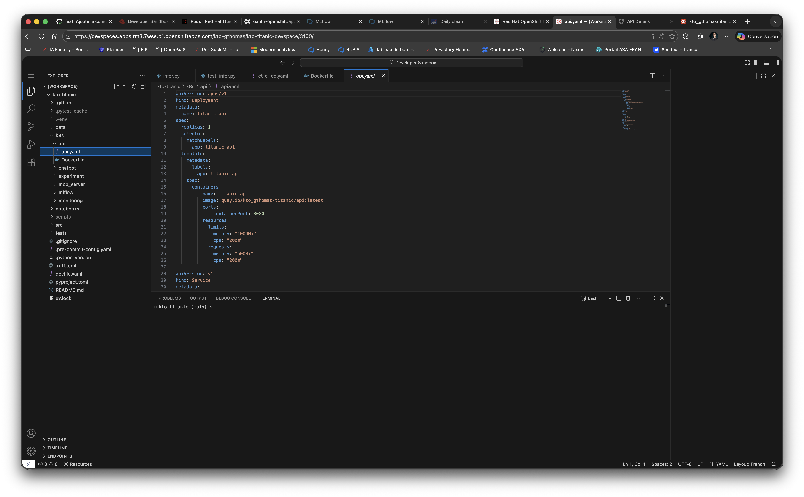

# 10. Kubernetes

Dans ce chapitre, nous allons voir comment déployer votre API sous forme de conteneur Docker, directement dans openshift.

Avant de commencer, afin que tout le monde parte du même point, vérifiez que vous n'avez aucune modification en
cours sur votre working directory avec `git status`.
Si c'est le cas, vérifiez que vous avez bien sauvegardé votre travail lors de l'étape précédente pour ne pas perdre
votre travail.
Sollicitez le professeur, car il est possible que votre contrôle continue en soit affecté.

> ⚠️ **Attention** : En cas de doute, sollicitez le professeur, car il est possible que votre contrôle continue en soit affecté.

Pour rappel, les commandes utiles sont :
```bash
git add .
git commit -m "your message"
git push origin main
```

## 1 - Qu'est-ce que c'est ?

Kubernetes est un orchestrateur de conteneurs open source créé par Google. OpenShift est une distribution Kubernetes développée par RedHat avec des fonctionnalités supplémentaires (interface web, gestion des routes, sécurité renforcée...).

## 2 - À quoi ça sert ?

Kubernetes permet de :
- Déployer vos applications conteneurisées automatiquement
- Gérer la haute disponibilité (si un conteneur tombe, il redémarre automatiquement)
- Scaler vos applications (augmenter/diminuer le nombre de réplicas selon la charge)
- Gérer le réseau et l'exposition de vos services

## 3 - Comment ça fonctionne ?

Kubernetes utilise une architecture déclarative basée sur des manifestes YAML :
- **Pod** : votre conteneur en exécution (plus petite unité déployable)
- **Deployment** : définit votre application (image, replicas, ressources...)
- **Service** : expose votre application sur le réseau interne du cluster
- **Route** (OpenShift) : crée une URL publique pour accéder à votre service depuis l'extérieur

## 4 - Manipulation sur OpenShift

Dans ce cours, vous utiliserez votre sandbox OpenShift pour déployer vos applications. Les commandes `kubectl` et `oc` permettent d'interagir avec le cluster. Nous verrons comment déployer automatiquement via GitHub Actions au chapitre suivant.

## 5 - Cloud act, cloud souverain et réversibilité

Le **Cloud Act** (2018) permet au gouvernement américain d'accéder aux données stockées par des entreprises américaines, même si elles sont hébergées en Europe. Pour contourner ce problème, certaines organisations optent pour un **cloud souverain** (fournisseurs européens, données en Europe). La **réversibilité** garantit que vous pouvez récupérer vos données et migrer vers un autre provider sans être enfermé technologiquement (éviter le vendor lock-in).


## 6 - Orchestrer nos conteneurs avec Kubernetes

Pourquoi devrions-nous orchestrer nos conteneurs ?

Vous pouvez consulter la documentation ici : https://www.redhat.com/en/topics/containers/what-is-container-orchestration

Pour orchestrer nos conteneurs, nous pouvons utiliser Kubernetes. Cet outil est majeur sur le marché. Kubernetes a été initialement créé
par Google, développé en Go. Kubernetes est open source. Dans ce cours, nous utiliserons Openshift, qui est un Kubernetes avec
plus de fonctionnalités. Openshift est également open source et développé par RedHat.

Documentation sur Kubernetes ici : https://www.redhat.com/en/topics/containers/what-is-kubernetes

Votre environnement d'exécution de conteneurs est nommé Pod dans Kubernetes.
Kubernetes est un cluster. La réplication des Pods sur plusieurs nœuds est possible.

Pour déployer vos Pods, vous pouvez utiliser une ressource Kubernetes nommée Deployment. Dans cet objet, vous pouvez spécifier les images des conteneurs
qui composent votre Pod, les ressources pour chacun d'entre eux, les volumes, les replicas, les variables d'environnement...

Les replicas vous permettent d'augmenter le nombre de vos pods afin de traiter plus de requêtes en même temps.

Pour rendre votre service disponible sur le réseau, vous devez créer une autre ressource Kubernetes qui est nommée Service. Avec
elle, vous pouvez indiquer que votre service sera sollicité en http, vous pouvez lier le port de vos webservices, etc...

Enfin, vous pouvez créer une Route (spécifique à Openshift) afin de créer une URL appropriée pour votre webservice.

Pour créer ces ressources, nous pouvons les décrire dans des manifestes. Ils sont déjà écrits en YAML pour vous dans 
le dossier `./k8s/api/api.yaml`. 



Voici une proposition de manifeste. Discutons-en :

```yaml
apiVersion: apps/v1
kind: Deployment
metadata:
  name: titanic-api
spec:
  replicas: 1
  selector:
    matchLabels:
      app: titanic-api
  template:
    metadata:
      labels:
        app: titanic-api
    spec:
      containers:
        - name: titanic-api
          image: quay.io/kto_gthomas/titanic/api:latest
          ports:
            - containerPort: 8080
          resources:
            limits:
              memory: "1000Mi"
              cpu: "200m"
            requests:
              memory: "500Mi"
              cpu: "200m"
---
apiVersion: v1
kind: Service
metadata:
  name: titanic-api-service
spec:
  selector:
    app: titanic-api
  ports:
    - port: 8080
      name: http-port
      targetPort: 8080
---
kind: Route
apiVersion: route.openshift.io/v1
metadata:
  name: titanic-api
spec:
  to:
    kind: Service
    name: titanic-api-service
    weight: 100
  port:
    targetPort: http-port
  tls:
    termination: edge
    insecureEdgeTerminationPolicy: None
  wildcardPolicy: None
```

Maintenant, nous allons utiliser notre manifeste afin de déployer notre application dans le Cloud. 
Pour ce faire, nous avons besoin d'un Kubernetes disponible dans le Cloud.

RedHat offre à tous les développeurs un bac à sable OpenShift de développement gratuit, disponible dans le Cloud. 
Ce bac à sable est disponible 30 jours et est supprimé automatiquement.

Oui, vous l'aviez bien compris, il s'agit de votre sandbox avec laquelle vous travaillez depuis le début du cours. 

Nous allons utiliser ce cluster pour déployer notre application.

Dans le chapitre suivant, nous allons déployer votre application dans votre cluster OpenShift mais directement depuis 
votre github action.

> ⚠️ **Attention** : N'oubliez pas de sauvegarder votre travail avant de continuer, car vous allez devoir faire un 
`git push` pour que votre application soit déployée dans le cluster OpenShift.