# 11. Continuous deployment

Dans ce chapitre, nous allons automatiser le déploiement de votre API depuis notre github action, en automatique.

Avant de commencer, afin que tout le monde parte du même point, vérifiez que vous n'avez aucune modification en
cours sur votre working directory avec `git status`.
Si c'est le cas, vérifiez que vous avez bien sauvegardé votre travail lors de l'étape précédente pour ne pas perdre
votre travail.
Sollicitez le professeur, car il est possible que votre contrôle continue en soit affecté.

> ⚠️ **Attention** : En cas de doute, sollicitez le professeur, car il est possible que votre contrôle continue en soit affecté.

Pour rappel, les commandes utiles sont :
```bash
git add .
git commit -m "your message"
git push origin main
```

## Les principes

Le déploiement continu est une pratique de développement logiciel qui consiste à automatiser le processus 
de déploiement d’une application. Il permet de livrer rapidement et fréquemment des mises à jour de l’application 
en production, tout en minimisant les risques d’erreurs et en améliorant la qualité du code. Le déploiement 
continu est souvent associé à l’intégration continue

## Mise en place simple pour notre projet

Si l'on veut que cela fonctionne avec oAuth2, il faut que l'on ajoute d'abord nos secrets et variables d'environnement 
dans notre repository github.

- OAUTH2_DOMAIN (environnement) : le domaine de votre provider oAuth2 (ex: dev-1234567.eu.auth0.com)
- OAUTH2_CLIENT_ID (secret) : le client id de votre application oAuth2
- OAUTH2_CLIENT_SECRET (secret) : le secret de votre application oAuth2

Vous trouvez ces informations dans votre provider oAuth2 (ex: Auth0) dans la section "Applications".

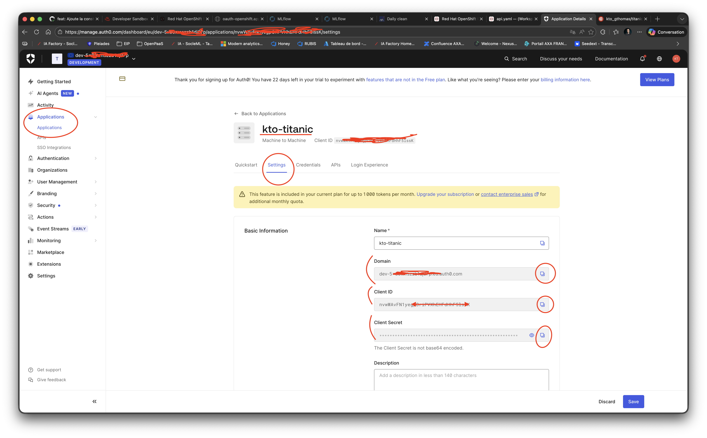
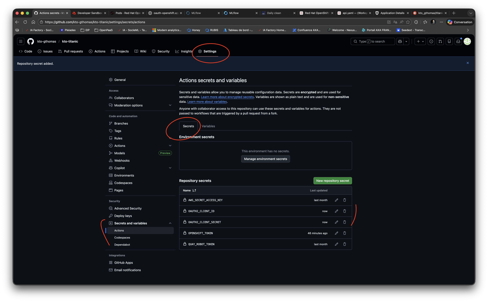
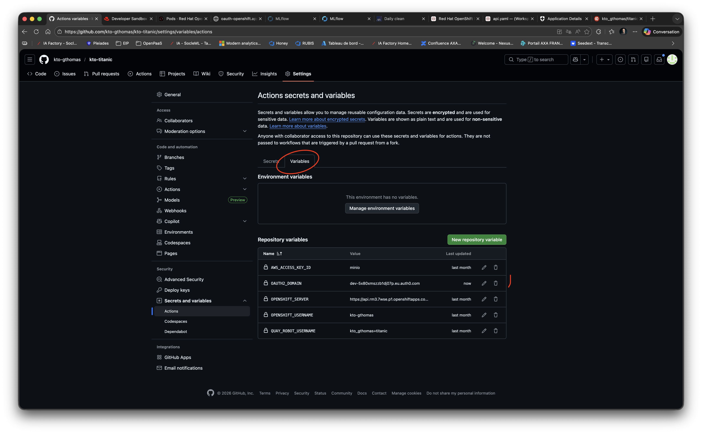


Il faut également modifier notre manifeste de déploiement afin de pouvoir injecter les variables d'environnement 
nécessaires au bon fonctionnement de notre API avec oAuth2.
```yaml
  env:
    - name: OAUTH2_DOMAIN
      value: "PLACEHOLDER_OAUTH2_DOMAIN"
    - name: OAUTH2_JWT_AUDIENCE
      value: "titanic-api"
```

Cela donne le manifeste de déploiement suivant : 
```yaml
apiVersion: apps/v1
kind: Deployment
metadata:
  name: titanic-api
spec:
  replicas: 1
  selector:
    matchLabels:
      app: titanic-api
  template:
    metadata:
      labels:
        app: titanic-api
    spec:
      containers:
        - name: titanic-api
          image: quay.io/kto_gthomas/titanic/api:latest
          env:
            - name: OAUTH2_DOMAIN
              value: "PLACEHOLDER_OAUTH2_DOMAIN"
            - name: OAUTH2_JWT_AUDIENCE
              value: "titanic-api"
          ports:
            - containerPort: 8080
          resources:
            limits:
              memory: "1000Mi"
              cpu: "200m"
            requests:
              memory: "500Mi"
              cpu: "200m"
---
apiVersion: v1
kind: Service
metadata:
  name: titanic-api-service
spec:
  selector:
    app: titanic-api
  ports:
    - port: 8080
      name: http-port
      targetPort: 8080
---
kind: Route
apiVersion: route.openshift.io/v1
metadata:
  name: titanic-api
spec:
  to:
    kind: Service
    name: titanic-api-service
    weight: 100
  port:
    targetPort: http-port
  tls:
    termination: edge
    insecureEdgeTerminationPolicy: None
  wildcardPolicy: None
```

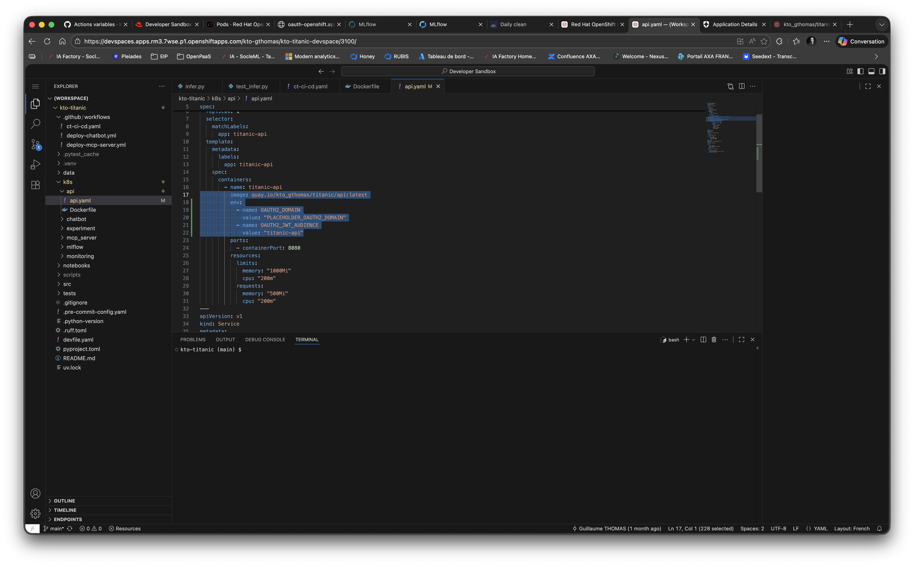

Afin, on ajoute une étape dans notre github action pour se connecter à notre cluster openshift et déployer notre API.

Dans notre fichier de github action, ajoutez le bloc suivant : 
```yaml
- name: Configure API manifest with OAuth2 domain
  run: |
    sed -i 's|PLACEHOLDER_OAUTH2_DOMAIN|${{ vars.OAUTH2_DOMAIN }}|g' k8s/api/api.yaml
    echo "✅ OAuth2 domain configured: ${{ vars.OAUTH2_DOMAIN }}"
- name: Deploy api to Openshift with OAuth2 protection
  run: |
    kubectl apply -f k8s/api/api.yaml
    echo "✅ Deployment updated with OAuth2 protection"
    API_ROUTE_URL=$(kubectl get route ${{ env.API_ROUTE_NAME }} -o jsonpath='{.spec.host}')
    echo "API_ROUTE_URL=https://$API_ROUTE_URL" >> "$GITHUB_ENV"
    echo "🚀 API deployed at: ${API_ROUTE_URL}"
```

Commentons ce code ensemble.

Ajoutez-le juste au-dessus de l'extinction de kto-mlflow :

```yaml
name: Train KTO Titanic model and Deploy API

on:
  push:
    branches:
      - main
    paths:
      - 'src/titanic/api/**'
      - 'src/titanic/training/**'
      - 'src/titanic/ci/**'
      - '/tests/api/**'
      - '/tests/training/**'
      - '/tests/ci/**'
      - 'k8s/experiment/**'
      - 'k8s/api/**'
      - '.github/workflows/ct-ci-cd.yaml'
  pull_request:
    branches:
      - main

env:
  EXPERIMENT_NAME: kto-titanic
  EXPERIMENT_IMAGE_NAME: quay.io/kto_gthomas/titanic/experiment
  API_IMAGE_NAME: quay.io/kto_gthomas/titanic/api
  API_ROUTE_NAME: titanic-api
  DAILYCLEAN_ROUTE_NAME: dailyclean
  MINIO_API_ROUTE_NAME: minio-api
  MLFLOW_TRACKING_ROUTE_NAME: mlflow

jobs:
  train:
    runs-on: ubuntu-latest
    steps:
      - uses: actions/checkout@v3
      - name: Set up Python 3.13
        uses: actions/setup-python@v3
        with:
          python-version: 3.13
      - name: Install dependencies
        run: |
          python -m pip install --upgrade pip
          pip install uv
          uv sync --group training --group dev
      - name: Launch unit tests
        run: |
          uv run pytest tests/ci tests/training tests/api
      - name: Resync only training group
        run: |
          uv sync --group training
      - name: Configure docker and kubectl
        run: |
          docker login -u="${{vars.QUAY_ROBOT_USERNAME}}" -p="${{secrets.QUAY_ROBOT_TOKEN}}" quay.io
          kubectl config set-cluster openshift-cluster --server=${{vars.OPENSHIFT_SERVER}}
          kubectl config set-credentials openshift-credentials --token=${{secrets.OPENSHIFT_TOKEN}}
          kubectl config set-context openshift-context --cluster=openshift-cluster --user=openshift-credentials --namespace=${{vars.OPENSHIFT_USERNAME}}-dev
          kubectl config use openshift-context
      - name: Get Routes from Kubernetes and add them to env
        run: |
          DAILYCLEAN_ROUTE_URL=$(kubectl get route ${{env.DAILYCLEAN_ROUTE_NAME}} -o jsonpath='{.spec.host}')
          MINIO_API_ROUTE_URL=$(kubectl get route ${{env.MINIO_API_ROUTE_NAME}} -o jsonpath='{.spec.host}')
          MLFLOW_TRACKING_ROUTE_URL=$(kubectl get route ${{env.MLFLOW_TRACKING_ROUTE_NAME}} -o jsonpath='{.spec.host}')
          
          echo "DAILYCLEAN_ROUTE_URL=https://$DAILYCLEAN_ROUTE_URL" >> $GITHUB_ENV
          echo "MINIO_API_ROUTE_URL=https://$MINIO_API_ROUTE_URL" >> $GITHUB_ENV
          echo "MLFLOW_TRACKING_ROUTE_URL=https://$MLFLOW_TRACKING_ROUTE_URL" >> $GITHUB_ENV
      - name: Wake up dailyclean and mlflow
        run: |
          kubectl scale --replicas=1 deployment/dailyclean-api
          sleep 30
          curl -X POST $DAILYCLEAN_ROUTE_URL/pods/start
      - name: Build training image
        run: |
          docker build -f k8s/experiment/Dockerfile -t ${{ env.EXPERIMENT_IMAGE_NAME }}:latest --build-arg MLFLOW_S3_ENDPOINT_URL=$MINIO_API_ROUTE_URL --build-arg AWS_ACCESS_KEY_ID=${{vars.AWS_ACCESS_KEY_ID}} --build-arg AWS_SECRET_ACCESS_KEY=${{secrets.AWS_SECRET_ACCESS_KEY}} .
      - name: Launch mlflow training in Openshift
        run: |
          export KUBE_MLFLOW_TRACKING_URI=$MLFLOW_TRACKING_ROUTE_URL
          export MLFLOW_TRACKING_URI=$MLFLOW_TRACKING_ROUTE_URL
          export MLFLOW_S3_ENDPOINT_URL=$MINIO_API_ROUTE_URL
          export AWS_ACCESS_KEY_ID="${{vars.AWS_ACCESS_KEY_ID}}" 
          export AWS_SECRET_ACCESS_KEY="${{secrets.AWS_SECRET_ACCESS_KEY}}"

          uv run mlflow run ./src/titanic/training -P path=all_titanic.csv --experiment-name ${{ env.EXPERIMENT_NAME }} --backend kubernetes --backend-config ./k8s/experiment/kubernetes_config.json
      - name: Download model artifact
        run: |
          export MLFLOW_TRACKING_URI=$MLFLOW_TRACKING_ROUTE_URL
          export MLFLOW_S3_ENDPOINT_URL=$MINIO_API_ROUTE_URL
          export AWS_ACCESS_KEY_ID="${{vars.AWS_ACCESS_KEY_ID}}"
          export AWS_SECRET_ACCESS_KEY="${{secrets.AWS_SECRET_ACCESS_KEY}}"
          export ARTIFACT_URI=$(uv run -m titanic.ci.search_mlflow --experiment-name ${{ env.EXPERIMENT_NAME }})

          echo "ARTIFACT_URI=$ARTIFACT_URI"
          uv run mlflow artifacts download --artifact-uri $ARTIFACT_URI -d ./src/titanic/api/resources/

          # could be : uv run mlflow artifacts download -r $MLFLOW_RUN_ID -a model.pkl -d ./src/titanic/api/resources/
      - name: Build and push api image
        run: |
          docker build -f k8s/api/Dockerfile -t ${{ env.API_IMAGE_NAME }}:latest .
          docker push ${{ env.API_IMAGE_NAME }}:latest
      - name: Configure API manifest with OAuth2 domain
        run: |
          sed -i 's|PLACEHOLDER_OAUTH2_DOMAIN|${{ vars.OAUTH2_DOMAIN }}|g' k8s/api/api.yaml
          echo "✅ OAuth2 domain configured: ${{ vars.OAUTH2_DOMAIN }}"
      - name: Deploy api to Openshift with OAuth2 protection
        run: |
          kubectl apply -f k8s/api/api.yaml
          echo "✅ Deployment updated with OAuth2 protection"
          API_ROUTE_URL=$(kubectl get route ${{ env.API_ROUTE_NAME }} -o jsonpath='{.spec.host}')
          echo "API_ROUTE_URL=https://$API_ROUTE_URL" >> "$GITHUB_ENV"
          echo "🚀 API deployed at: ${API_ROUTE_URL}"
      - name: Asleep kto-mlflow with dailyclean
        run: |
          curl -X POST $DAILYCLEAN_ROUTE_URL/pods/stop
          
          # TODO: Saisir la suite de cette pipeline. Devrait apparaître : 
          # Install depencies, Launch unit tests, Resync only training group,
          # Configure docker and kubectl, Get Routes from Kubernetes and add them to env
          # Wake up dailyclean and mlflow, Build training image, Launch mlflow training in Openshift.
          # Une fois l'API développée, et sécurisée intégrer : 
          # Download model artifact, Build and push api image, Configure API manifest with OAuth2 domain
          # Deploy api to Openshift with OAuth2 protection, Get OAuth2 token for integration test
          # Test api with OAuth2 authentication, Asleep kto-mlflow with dailyclean
          

```

**Bravo ! Votre dispositif est super bien rodé maintenant !**

> ⚠️ **Évaluations** : Testez votre API déployée avec la protection oAuth2 et envoyez la capture d'écran avec votre test sur Swagger
à votre professeur. Il faut préalablement commiter et pousser votre code pour que votre API soit déployée.

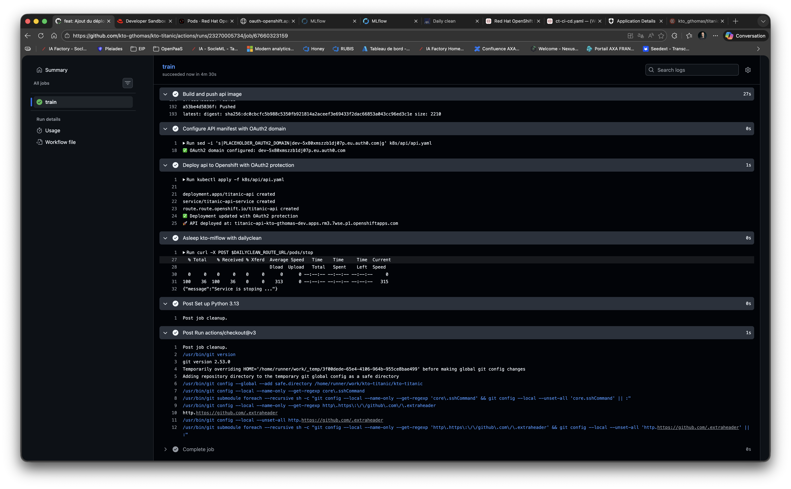
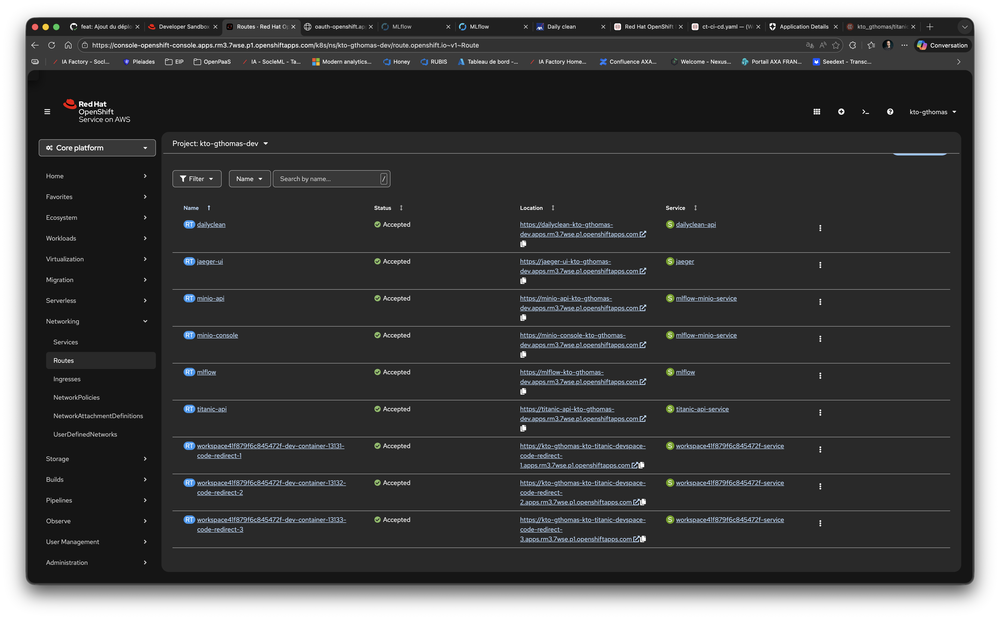
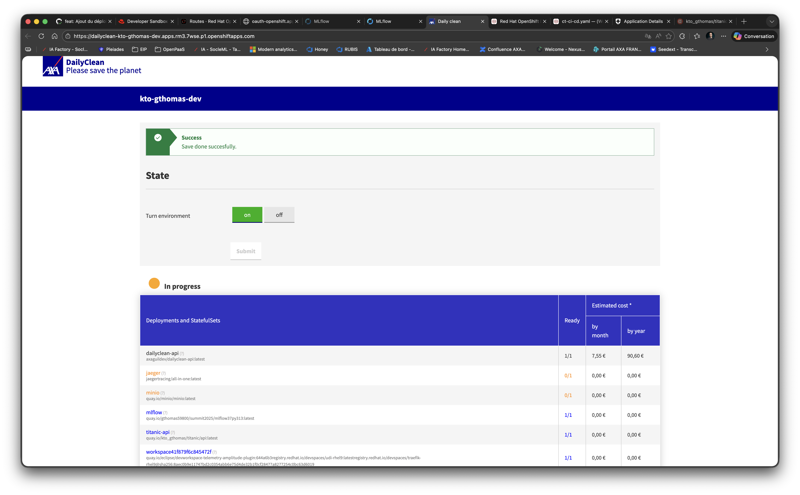
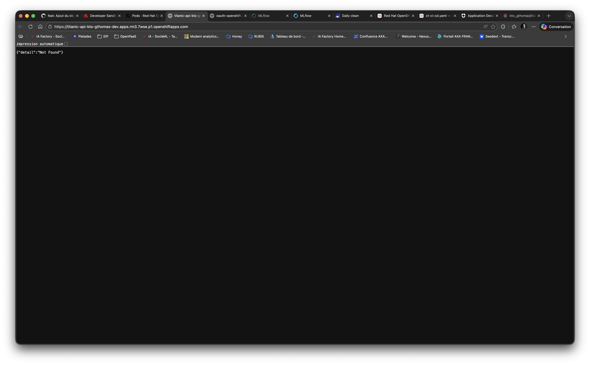
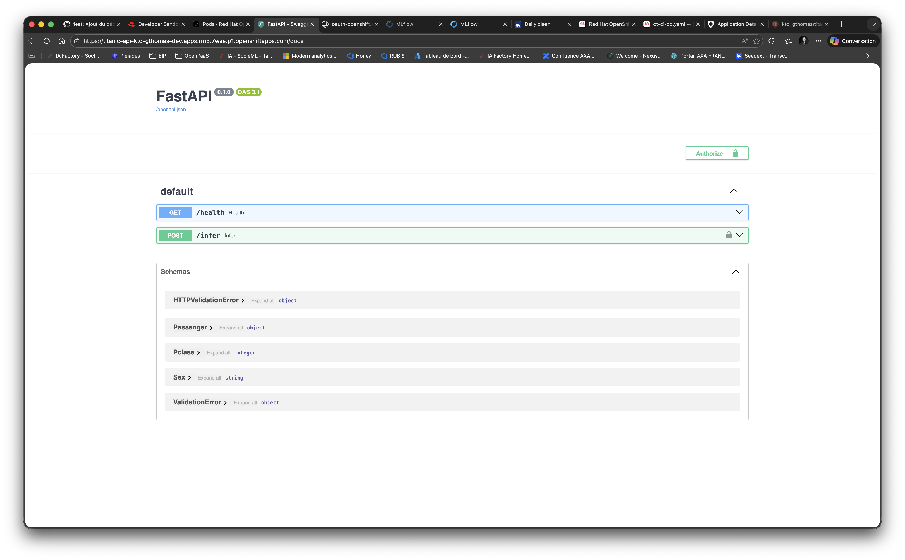
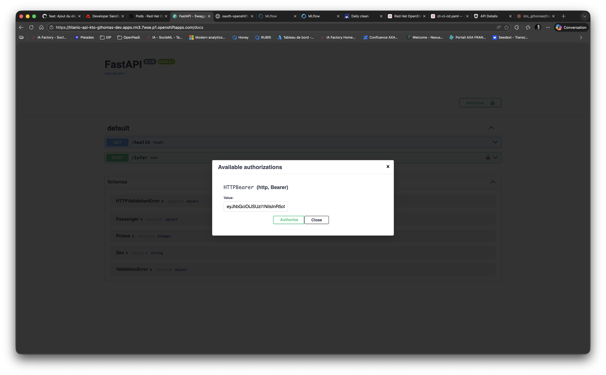
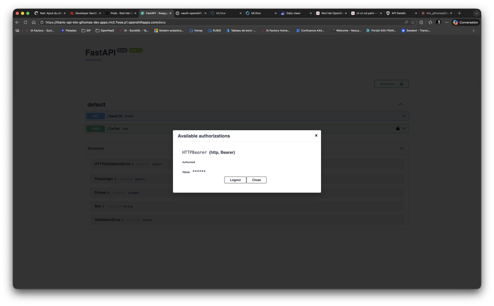
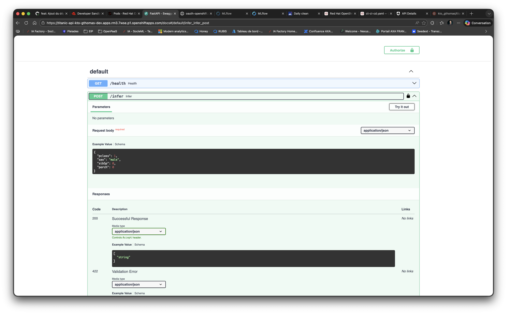
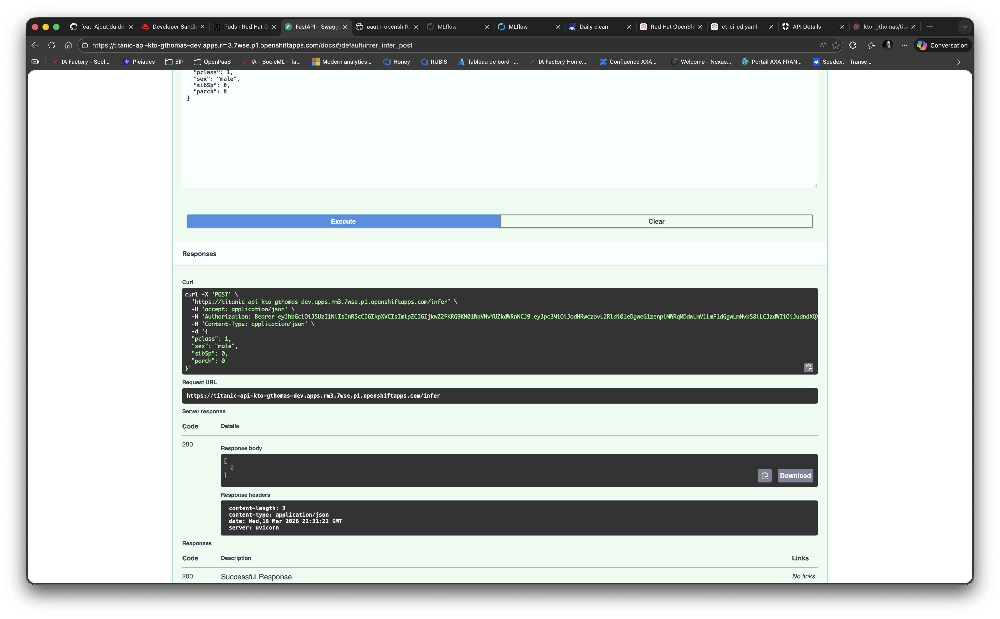
