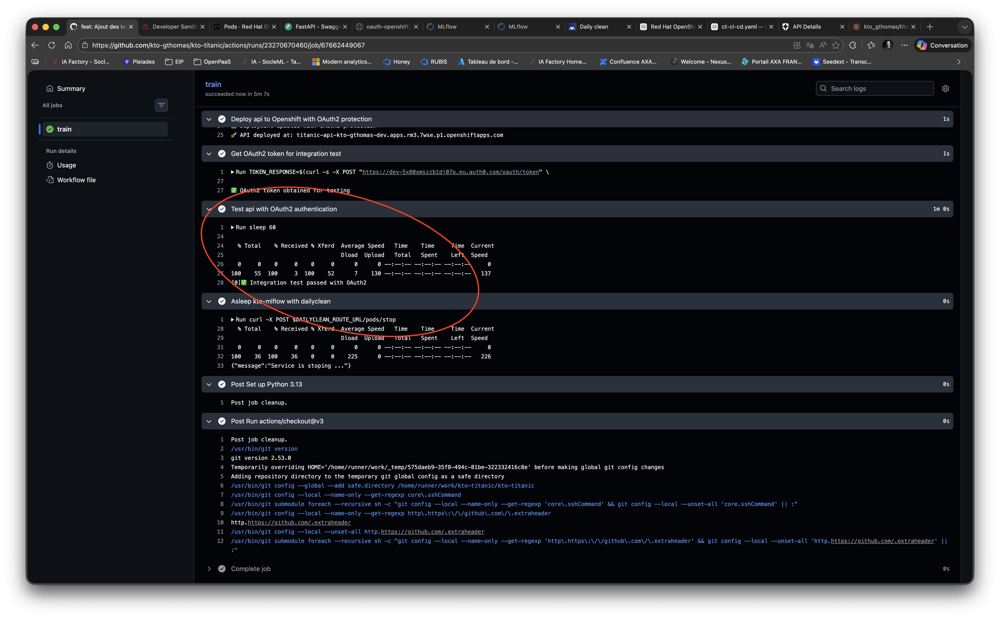

# 12. Tests d'intégration

Dans ce chapitre, nous allons ajouter des tests d'intégration à notre pipeline CI/CD pour vérifier que notre API fonctionne correctement une fois déployée sur OpenShift avec l'authentification OAuth2.

Avant de commencer, afin que tout le monde parte du même point, vérifiez que vous n'avez aucune modification en cours sur votre working directory avec `git status`.
Si c'est le cas, vérifiez que vous avez bien sauvegardé votre travail lors de l'étape précédente pour ne pas perdre votre travail.
Sollicitez le professeur, car il est possible que votre contrôle continu en soit affecté.

> ⚠️ **Attention** : En cas de doute, sollicitez le professeur, car il est possible que votre contrôle continu en soit affecté.

Pour rappel, les commandes utiles sont :
```bash
git add .
git commit -m "your message"
git push origin main
```

## Les principes

Les tests d'intégration vérifient que les différents composants de votre système fonctionnent correctement ensemble. Contrairement aux tests unitaires qui testent des fonctions isolées, les tests d'intégration testent votre application dans un environnement proche de la production.

Dans notre cas, nous allons tester :
- Que notre API est bien déployée et accessible sur OpenShift
- Que l'authentification OAuth2 fonctionne correctement
- Que notre endpoint `/infer` répond correctement avec un token valide

Ces tests s'exécutent automatiquement après le déploiement dans notre GitHub Action, garantissant que chaque mise en production fonctionne correctement.

## Ajout des tests d'intégration dans la pipeline

Les tests d'intégration se placent à la fin de notre pipeline CI/CD, juste après le déploiement de l'API. Voici les deux nouvelles étapes à ajouter :

### Étape 1 : Obtenir un token OAuth2 pour le test

Cette étape va utiliser vos credentials OAuth2 (stockés dans les secrets GitHub) pour obtenir un token d'accès valide, exactement comme le ferait un client de votre API.

```yaml
- name: Get OAuth2 token for integration test
  run: |
    TOKEN_RESPONSE=$(curl -s -X POST "https://${{ vars.OAUTH2_DOMAIN }}/oauth/token" \
      -H "Content-Type: application/x-www-form-urlencoded" \
      -d "grant_type=client_credentials" \
      -d "client_id=${{ secrets.OAUTH2_CLIENT_ID }}" \
      -d "client_secret=${{ secrets.OAUTH2_CLIENT_SECRET }}" \
      -d "audience=titanic-api" \
      -d "scope=api:read")
    ACCESS_TOKEN=$(echo $TOKEN_RESPONSE | jq -r '.access_token')
    echo "ACCESS_TOKEN=$ACCESS_TOKEN" >> "$GITHUB_ENV"
    echo "✅ OAuth2 token obtained for testing"
```

**Explication** :
- On envoie une requête POST au provider OAuth2 avec nos credentials
- On extrait le token d'accès avec `jq` (utilitaire JSON)
- On stocke le token dans une variable d'environnement pour l'étape suivante

### Étape 2 : Tester l'API avec le token OAuth2

Cette étape va effectuer un appel réel à votre API déployée pour vérifier qu'elle fonctionne.

```yaml
- name: Test api with OAuth2 authentication
  run: |
    sleep 60
    curl -X POST $API_ROUTE_URL/infer \
      -H "Content-Type: application/json" \
      -H "Authorization: Bearer $ACCESS_TOKEN" \
      -d '{"pclass": 3, "sex": "male", "sibSp": 0, "parch": 0}'
    echo "✅ Integration test passed with OAuth2"
```

**Explication** :
- On attend 60 secondes pour laisser le temps au déploiement de se stabiliser
- On envoie une requête de prédiction avec le token OAuth2 dans le header `Authorization`
- Si la commande réussit (code 200), le test passe
- Si elle échoue, la GitHub Action s'arrête en erreur

## Pipeline complète

Voici à quoi ressemble votre fichier `.github/workflows/ct-ci-cd.yaml` final avec tous les composants que nous avons construits depuis le début du cours :

```yaml
name: Train KTO Titanic model and Deploy API

on:
  push:
    branches:
      - main
    paths:
      - 'src/titanic/api/**'
      - 'src/titanic/training/**'
      - 'src/titanic/ci/**'
      - '/tests/api/**'
      - '/tests/training/**'
      - '/tests/ci/**'
      - 'k8s/experiment/**'
      - 'k8s/api/**'
      - '.github/workflows/ct-ci-cd.yaml'
  pull_request:
    branches:
      - main

env:
  EXPERIMENT_NAME: kto-titanic
  EXPERIMENT_IMAGE_NAME: quay.io/kto_gthomas/titanic/experiment
  API_IMAGE_NAME: quay.io/kto_gthomas/titanic/api
  API_ROUTE_NAME: titanic-api
  DAILYCLEAN_ROUTE_NAME: dailyclean
  MINIO_API_ROUTE_NAME: minio-api
  MLFLOW_TRACKING_ROUTE_NAME: mlflow

jobs:
  train:
    runs-on: ubuntu-latest
    steps:
      - uses: actions/checkout@v3
      - name: Set up Python 3.13
        uses: actions/setup-python@v3
        with:
          python-version: 3.13
      - name: Install dependencies
        run: |
          python -m pip install --upgrade pip
          pip install uv
          uv sync --group training --group dev
      - name: Launch unit tests
        run: |
          uv run pytest tests/ci tests/training tests/api
      - name: Resync only training group
        run: |
          uv sync --group training
      - name: Configure docker and kubectl
        run: |
          docker login -u="${{vars.QUAY_ROBOT_USERNAME}}" -p="${{secrets.QUAY_ROBOT_TOKEN}}" quay.io
          kubectl config set-cluster openshift-cluster --server=${{vars.OPENSHIFT_SERVER}}
          kubectl config set-credentials openshift-credentials --token=${{secrets.OPENSHIFT_TOKEN}}
          kubectl config set-context openshift-context --cluster=openshift-cluster --user=openshift-credentials --namespace=${{vars.OPENSHIFT_USERNAME}}-dev
          kubectl config use openshift-context
      - name: Get Routes from Kubernetes and add them to env
        run: |
          DAILYCLEAN_ROUTE_URL=$(kubectl get route ${{env.DAILYCLEAN_ROUTE_NAME}} -o jsonpath='{.spec.host}')
          MINIO_API_ROUTE_URL=$(kubectl get route ${{env.MINIO_API_ROUTE_NAME}} -o jsonpath='{.spec.host}')
          MLFLOW_TRACKING_ROUTE_URL=$(kubectl get route ${{env.MLFLOW_TRACKING_ROUTE_NAME}} -o jsonpath='{.spec.host}')
          
          echo "DAILYCLEAN_ROUTE_URL=https://$DAILYCLEAN_ROUTE_URL" >> $GITHUB_ENV
          echo "MINIO_API_ROUTE_URL=https://$MINIO_API_ROUTE_URL" >> $GITHUB_ENV
          echo "MLFLOW_TRACKING_ROUTE_URL=https://$MLFLOW_TRACKING_ROUTE_URL" >> $GITHUB_ENV
      - name: Wake up dailyclean and mlflow
        run: |
          kubectl scale --replicas=1 deployment/dailyclean-api
          sleep 30
          curl -X POST $DAILYCLEAN_ROUTE_URL/pods/start
      - name: Build training image
        run: |
          docker build -f k8s/experiment/Dockerfile -t ${{ env.EXPERIMENT_IMAGE_NAME }}:latest --build-arg MLFLOW_S3_ENDPOINT_URL=$MINIO_API_ROUTE_URL --build-arg AWS_ACCESS_KEY_ID=${{vars.AWS_ACCESS_KEY_ID}} --build-arg AWS_SECRET_ACCESS_KEY=${{secrets.AWS_SECRET_ACCESS_KEY}} .
      - name: Launch mlflow training in Openshift
        run: |
          export KUBE_MLFLOW_TRACKING_URI=$MLFLOW_TRACKING_ROUTE_URL
          export MLFLOW_TRACKING_URI=$MLFLOW_TRACKING_ROUTE_URL
          export MLFLOW_S3_ENDPOINT_URL=$MINIO_API_ROUTE_URL
          export AWS_ACCESS_KEY_ID="${{vars.AWS_ACCESS_KEY_ID}}" 
          export AWS_SECRET_ACCESS_KEY="${{secrets.AWS_SECRET_ACCESS_KEY}}"

          uv run mlflow run ./src/titanic/training -P path=all_titanic.csv --experiment-name ${{ env.EXPERIMENT_NAME }} --backend kubernetes --backend-config ./k8s/experiment/kubernetes_config.json
      - name: Download model artifact
        run: |
          export MLFLOW_TRACKING_URI=$MLFLOW_TRACKING_ROUTE_URL
          export MLFLOW_S3_ENDPOINT_URL=$MINIO_API_ROUTE_URL
          export AWS_ACCESS_KEY_ID="${{vars.AWS_ACCESS_KEY_ID}}"
          export AWS_SECRET_ACCESS_KEY="${{secrets.AWS_SECRET_ACCESS_KEY}}"
          export ARTIFACT_URI=$(uv run -m titanic.ci.search_mlflow --experiment-name ${{ env.EXPERIMENT_NAME }})

          echo "ARTIFACT_URI=$ARTIFACT_URI"
          uv run mlflow artifacts download --artifact-uri $ARTIFACT_URI -d ./src/titanic/api/resources/

          # could be : uv run mlflow artifacts download -r $MLFLOW_RUN_ID -a model.pkl -d ./src/titanic/api/resources/
      - name: Build and push api image
        run: |
          docker build -f k8s/api/Dockerfile -t ${{ env.API_IMAGE_NAME }}:latest .
          docker push ${{ env.API_IMAGE_NAME }}:latest
      - name: Configure API manifest with OAuth2 domain
        run: |
          sed -i 's|PLACEHOLDER_OAUTH2_DOMAIN|${{ vars.OAUTH2_DOMAIN }}|g' k8s/api/api.yaml
          echo "✅ OAuth2 domain configured: ${{ vars.OAUTH2_DOMAIN }}"
      - name: Deploy api to Openshift with OAuth2 protection
        run: |
          kubectl apply -f k8s/api/api.yaml
          echo "✅ Deployment updated with OAuth2 protection"
          API_ROUTE_URL=$(kubectl get route ${{ env.API_ROUTE_NAME }} -o jsonpath='{.spec.host}')
          echo "API_ROUTE_URL=https://$API_ROUTE_URL" >> "$GITHUB_ENV"
          echo "🚀 API deployed at: ${API_ROUTE_URL}"
      - name: Get OAuth2 token for integration test
        run: |
          TOKEN_RESPONSE=$(curl -s -X POST "https://${{ vars.OAUTH2_DOMAIN }}/oauth/token" \
            -H "Content-Type: application/x-www-form-urlencoded" \
            -d "grant_type=client_credentials" \
            -d "client_id=${{ secrets.OAUTH2_CLIENT_ID }}" \
            -d "client_secret=${{ secrets.OAUTH2_CLIENT_SECRET }}" \
            -d "audience=titanic-api" \
            -d "scope=api:read")
          ACCESS_TOKEN=$(echo $TOKEN_RESPONSE | jq -r '.access_token')
          echo "ACCESS_TOKEN=$ACCESS_TOKEN" >> "$GITHUB_ENV"
          echo "✅ OAuth2 token obtained for testing"
      - name: Test api with OAuth2 authentication
        run: |
          sleep 60
          curl -X POST $API_ROUTE_URL/infer \
            -H "Content-Type: application/json" \
            -H "Authorization: Bearer $ACCESS_TOKEN" \
            -d '{"pclass": 3, "sex": "male", "sibSp": 0, "parch": 0}'
          echo "✅ Integration test passed with OAuth2"
      - name: Asleep kto-mlflow with dailyclean
        run: |
          curl -X POST $DAILYCLEAN_ROUTE_URL/pods/stop

          # TODO: Saisir la suite de cette pipeline. Devrait apparaître :
          # Install depencies, Launch unit tests, Resync only training group,
          # Configure docker and kubectl, Get Routes from Kubernetes and add them to env
          # Wake up dailyclean and mlflow, Build training image, Launch mlflow training in Openshift.
          # Une fois l'API développée, et sécurisée intégrer :
          # Download model artifact, Build and push api image, Configure API manifest with OAuth2 domain
          # Deploy api to Openshift with OAuth2 protection, Get OAuth2 token for integration test
          # Test api with OAuth2 authentication, Asleep kto-mlflow with dailyclean

```

> ⚠️ **Évaluations** : Commitez et poussez vos modifications sur la branche `main` pour déclencher la pipeline CI/CD. 
Vérifiez que toutes les étapes passent correctement, en particulier les tests d'intégration à la fin.

