# 13. Mesure de la performance de l'inférence avec OTEL

Dans ce chapitre, nous allons instrumenter notre API pour mesurer ses performances en production avec OpenTelemetry (OTEL) et Jaeger. Cela nous permettra de suivre les temps de réponse, identifier les goulots d'étranglement et optimiser notre service.

Avant de commencer, afin que tout le monde parte du même point, vérifiez que vous n'avez aucune modification en cours sur votre working directory avec `git status`.
Si c'est le cas, vérifiez que vous avez bien sauvegardé votre travail lors de l'étape précédente pour ne pas perdre votre travail.
Sollicitez le professeur, car il est possible que votre contrôle continu en soit affecté.

> ⚠️ **Attention** : En cas de doute, sollicitez le professeur, car il est possible que votre contrôle continu en soit affecté.

Pour rappel, les commandes utiles sont :
```bash
git add .
git commit -m "your message"
git push origin main
```

## Pourquoi mesurer la performance en production ?

En Machine Learning, la qualité d'un modèle ne se limite pas à sa précision (accuracy, F1-score...). En production, vous devez aussi garantir :

- **Temps de réponse** : Votre API doit répondre rapidement (< 200ms en général pour une bonne UX)
- **Détection des anomalies** : Un ralentissement peut indiquer un problème (surcharge, bug, données corrompues...)
- **Optimisation** : Identifier quelle partie du code ralentit (chargement du modèle, preprocessing, inférence...)
- **SLA (Service Level Agreement)** : Prouver à vos clients que vous respectez les engagements de performance

Sans observabilité, vous êtes aveugle en production. Vous ne savez pas si votre API tient la charge ni où sont les problèmes.

## Qu'est-ce qu'OpenTelemetry (OTEL) ?

**OpenTelemetry** est un standard open source pour l'observabilité des applications. Il permet de collecter trois types de données :

1. **Traces** : Suivi du parcours d'une requête à travers vos différents services (utile en microservices)
2. **Metrics** : Compteurs, temps de réponse, utilisation CPU/RAM...
3. **Logs** : Messages textuels avec contexte pour le debugging

OTEL est **vendor-neutral** : vous pouvez changer d'outil de visualisation (Jaeger, Prometheus, Grafana...) sans changer votre code.

**Avantages** :
- Standard industriel (supporté par tous les grands cloud providers)
- Multi-langage (Python, Java, Go, Node.js...)
- Faible overhead de performance
- Permet de corréler traces, métriques et logs

## Qu'est-ce que Jaeger ?

**Jaeger** est un outil open source de **distributed tracing** créé par Uber. Il permet de :

- Visualiser le parcours complet d'une requête (timeline, dépendances entre services)
- Identifier les opérations les plus lentes (spans)
- Comparer les performances entre différentes versions de votre code
- Analyser les erreurs avec leur contexte complet

**Concepts clés** :
- **Trace** : Représente une requête complète du début à la fin
- **Span** : Une opération dans la trace (exemple : "chargement du modèle", "preprocessing", "inférence")
- **Tags** : Métadonnées sur un span (exemple : model_version, input_size...)

Dans notre cas, Jaeger va nous montrer combien de temps prend chaque étape de notre endpoint `/infer`.

## Architecture de monitoring

Voici comment fonctionne notre stack d'observabilité :

```
┌─────────────┐
│  Votre API  │  ← Instrumentée avec OTEL SDK
└──────┬──────┘
       │ (envoie des traces)
       ▼
┌─────────────┐
│   Jaeger    │  ← Stocke et visualise les traces
└─────────────┘
```

Dans ce TP, nous avons déployé Jaeger sur votre namespace OpenShift et allons configurer votre API pour lui envoyer des traces.

## Déploiement de Jaeger sur OpenShift

Nous avons déjà déployé Jaeger All-in-One (version simple qui inclut collector, storage et UI dans un seul conteneur).

### Création du manifeste Kubernetes pour Jaeger

Consultez le fichier `k8s/monitoring/jaeger.yaml` avec le contenu suivant :

```yaml
apiVersion: apps/v1
kind: Deployment
metadata:
  name: jaeger
spec:
  replicas: 1
  selector:
    matchLabels:
      app: jaeger
  template:
    metadata:
      labels:
        app: jaeger
    spec:
      containers:
        - name: jaeger
          image: jaegertracing/all-in-one:latest
          ports:
            - containerPort: 16686  # UI
              name: ui
            - containerPort: 4317   # OTLP gRPC
              name: otlp-grpc
            - containerPort: 4318   # OTLP HTTP
              name: otlp-http
          env:
            - name: COLLECTOR_OTLP_ENABLED
              value: "true"
          resources:
            limits:
              memory: "500Mi"
              cpu: "500m"
            requests:
              memory: "256Mi"
              cpu: "200m"
---
apiVersion: v1
kind: Service
metadata:
  name: jaeger-service
spec:
  selector:
    app: jaeger
  ports:
    - port: 16686
      name: ui
      targetPort: 16686
    - port: 4317
      name: otlp-grpc
      targetPort: 4317
    - port: 4318
      name: otlp-http
      targetPort: 4318
---
kind: Route
apiVersion: route.openshift.io/v1
metadata:
  name: jaeger
spec:
  to:
    kind: Service
    name: jaeger-service
  port:
    targetPort: ui
  tls:
    termination: edge
    insecureEdgeTerminationPolicy: Redirect
```


## Instrumentation de l'API avec OpenTelemetry

Maintenant, nous allons modifier notre code pour envoyer des traces à Jaeger.

### Installation des dépendances OTEL

Les dépendances ont déjà été ajouté à votre toml.

### Modification du fichier infer.py

Voici les imports à ajouter dans infer.py.
```python
from opentelemetry import trace
from opentelemetry.sdk.trace import TracerProvider
from opentelemetry.sdk.trace.export import BatchSpanProcessor
from opentelemetry.exporter.otlp.proto.http.trace_exporter import OTLPSpanExporter as HTTPSpanExporter
from opentelemetry.instrumentation.fastapi import FastAPIInstrumentor
from opentelemetry.sdk.resources import Resource
```

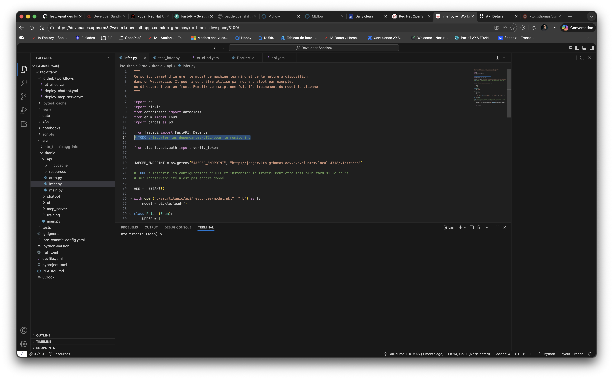
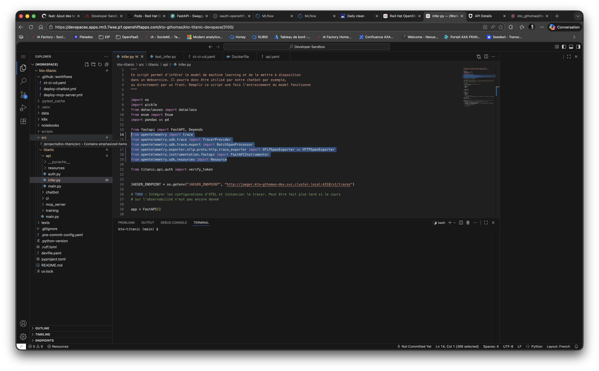

```python
JAEGER_ENDPOINT = os.getenv("JAEGER_ENDPOINT", "http://jaeger.gthomas59800-dev.svc.cluster.local:4318/v1/traces")

resource = Resource(attributes={"service.name": "titanic-inference-api"})

provider = TracerProvider(resource=resource)
processor = BatchSpanProcessor(HTTPSpanExporter(endpoint=JAEGER_ENDPOINT))
provider.add_span_processor(processor)
trace.set_tracer_provider(provider)

tracer = trace.get_tracer(__name__)

app = FastAPI()
FastAPIInstrumentor.instrument_app(app)
```

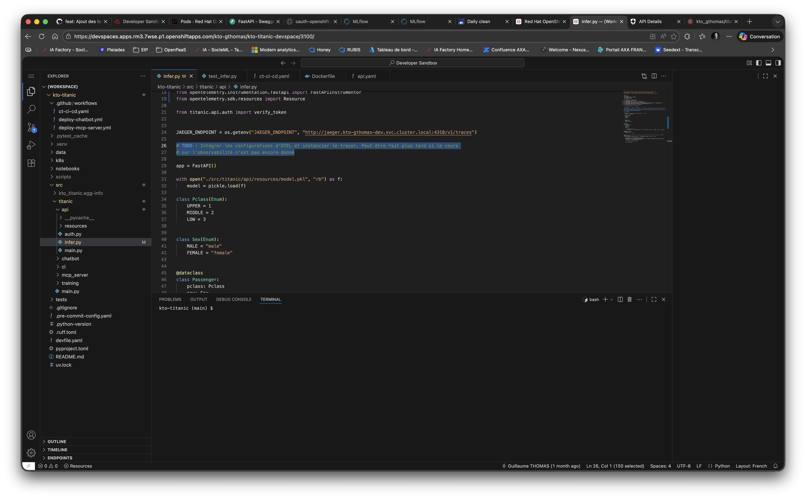
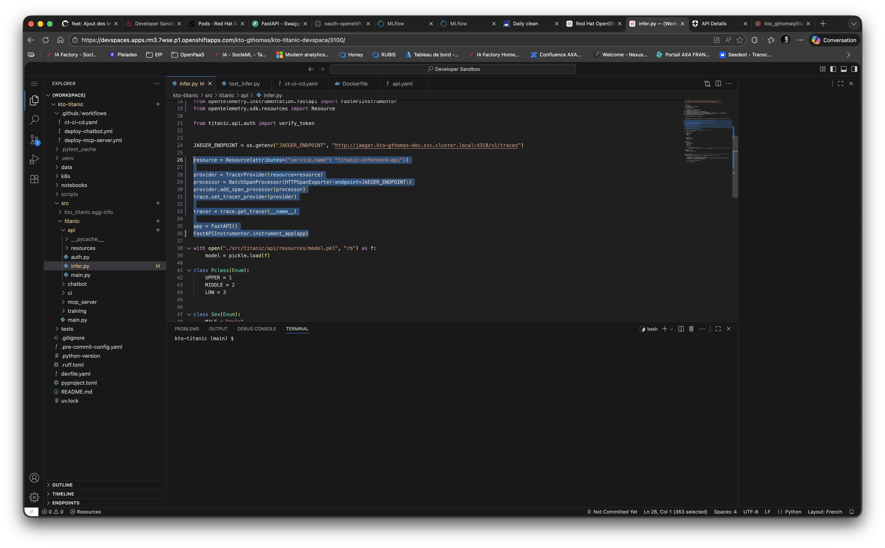

Voici un exemple de code à ajouter dans la route d'inférence pour tracer les différentes étapes.
```python
@app.post("/infer")
def infer(passenger: Passenger, token: str = Depends(verify_token("api:read"))) -> list:
    with tracer.start_as_current_span("model_inference") as span:
        span.set_attribute("passenger.pclass", passenger.pclass.value)
        span.set_attribute("passenger.sex", passenger.sex.value)
        span.set_attribute("passenger.sibsp", passenger.sibSp)
        span.set_attribute("passenger.parch", passenger.parch)

        df_passenger = pd.DataFrame([passenger.to_dict()])
        df_passenger["Sex"] = pd.Categorical(df_passenger["Sex"], categories=[Sex.FEMALE.value, Sex.MALE.value])
        df_to_predict = pd.get_dummies(df_passenger)

        res = model.predict(df_to_predict)

        span.set_attribute("prediction.result", int(res[0]))
        span.add_event("prediction_completed", {"result": int(res[0])})

        return res.tolist()
    
```

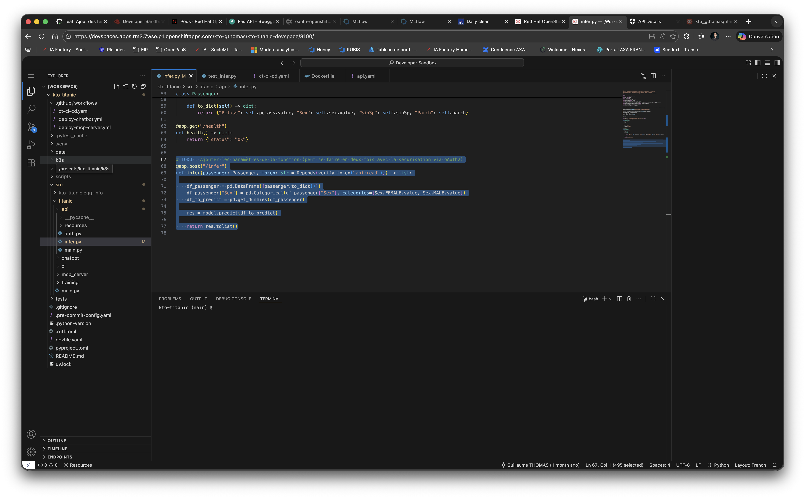
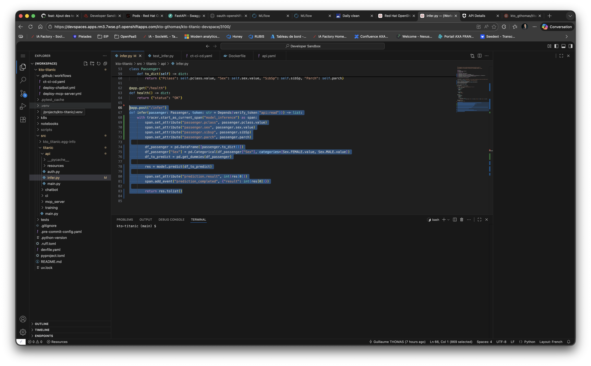

Voici le script complet de infer.py après ajout du code de tracing.
```python
"""
Ce script permet d'inférer le model de machine learning et de le mettre à disposition
dans un Webservice. Il pourra donc être utilisé par notre chatbot par exemple,
ou directement par un front. Remplir ce script une fois l'entrainement du model fonctionne
"""

import os
import pickle
from dataclasses import dataclass
from enum import Enum
import pandas as pd

from fastapi import FastAPI, Depends
from opentelemetry import trace
from opentelemetry.sdk.trace import TracerProvider
from opentelemetry.sdk.trace.export import BatchSpanProcessor
from opentelemetry.exporter.otlp.proto.http.trace_exporter import OTLPSpanExporter as HTTPSpanExporter
from opentelemetry.instrumentation.fastapi import FastAPIInstrumentor
from opentelemetry.sdk.resources import Resource

from titanic.api.auth import verify_token


JAEGER_ENDPOINT = os.getenv("JAEGER_ENDPOINT", "http://jaeger.kto-gthomas-dev.svc.cluster.local:4318/v1/traces")

resource = Resource(attributes={"service.name": "titanic-inference-api"})

provider = TracerProvider(resource=resource)
processor = BatchSpanProcessor(HTTPSpanExporter(endpoint=JAEGER_ENDPOINT))
provider.add_span_processor(processor)
trace.set_tracer_provider(provider)

tracer = trace.get_tracer(__name__)

app = FastAPI()
FastAPIInstrumentor.instrument_app(app)

with open("./src/titanic/api/resources/model.pkl", "rb") as f:
    model = pickle.load(f)

class Pclass(Enum):
    UPPER = 1
    MIDDLE = 2
    LOW = 3


class Sex(Enum):
    MALE = "male"
    FEMALE = "female"


@dataclass
class Passenger:
    pclass: Pclass
    sex: Sex
    sibSp: int
    parch: int

    def to_dict(self) -> dict:
        return {"Pclass": self.pclass.value, "Sex": self.sex.value, "SibSp": self.sibSp, "Parch": self.parch}

@app.get("/health")
def health() -> dict:
    return {"status": "OK"}

@app.post("/infer")
def infer(passenger: Passenger, token: str = Depends(verify_token("api:read"))) -> list:
    with tracer.start_as_current_span("model_inference") as span:
        span.set_attribute("passenger.pclass", passenger.pclass.value)
        span.set_attribute("passenger.sex", passenger.sex.value)
        span.set_attribute("passenger.sibsp", passenger.sibSp)
        span.set_attribute("passenger.parch", passenger.parch)

        df_passenger = pd.DataFrame([passenger.to_dict()])
        df_passenger["Sex"] = pd.Categorical(df_passenger["Sex"], categories=[Sex.FEMALE.value, Sex.MALE.value])
        df_to_predict = pd.get_dummies(df_passenger)

        res = model.predict(df_to_predict)

        span.set_attribute("prediction.result", int(res[0]))
        span.add_event("prediction_completed", {"result": int(res[0])})

        return res.tolist()

```

Ajouter enfin dans le manifeste Kubernetes de l'api le endpoint interne de Jaeger en variable d'environnement pour que l'api puisse envoyer les traces à Jaeger.
```yaml
  env:
    - name: JAEGER_ENDPOINT
      value: "http://jaeger.gthomas59800-dev.svc.cluster.local:4318/v1/traces"
```

Pour le trouver, vous pouvez aller dans votre cluster OpenShift, puis dans la section Networking > Service > Jaeger. 
Cliquez ensuite sur le nom de votre instance Jaeger. Vous y trouverez le endpoint HTTP pour l'ingestion des traces, qui ressemble à celui indiqué ci-dessus.

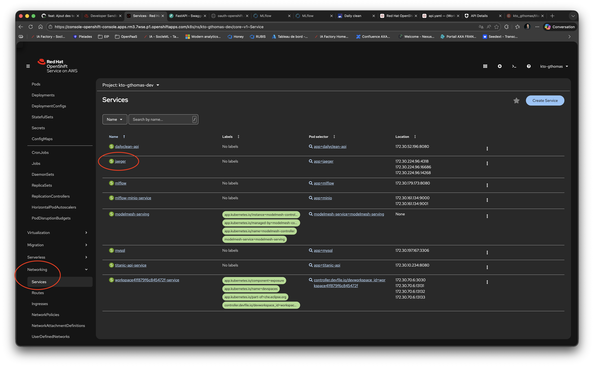
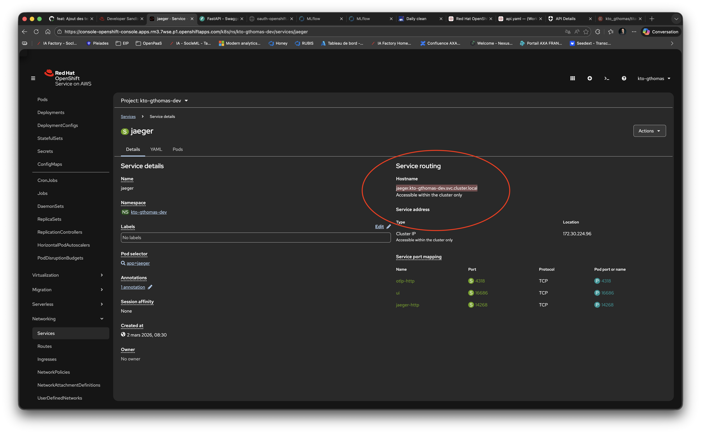
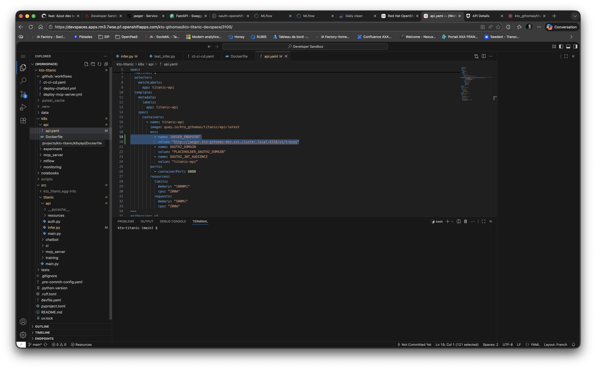

```yaml
apiVersion: apps/v1
kind: Deployment
metadata:
  name: titanic-api
spec:
  replicas: 1
  selector:
    matchLabels:
      app: titanic-api
  template:
    metadata:
      labels:
        app: titanic-api
    spec:
      containers:
        - name: titanic-api
          image: quay.io/kto_gthomas/titanic/api:latest
          env:
            - name: JAEGER_ENDPOINT
              value: "http://jaeger.kto-gthomas-dev.svc.cluster.local:4318/v1/traces"
            - name: OAUTH2_DOMAIN
              value: "PLACEHOLDER_OAUTH2_DOMAIN"
            - name: OAUTH2_JWT_AUDIENCE
              value: "titanic-api"
          ports:
            - containerPort: 8080
          resources:
            limits:
              memory: "1000Mi"
              cpu: "200m"
            requests:
              memory: "500Mi"
              cpu: "200m"
---
apiVersion: v1
kind: Service
metadata:
  name: titanic-api-service
spec:
  selector:
    app: titanic-api
  ports:
    - port: 8080
      name: http-port
      targetPort: 8080
---
kind: Route
apiVersion: route.openshift.io/v1
metadata:
  name: titanic-api
spec:
  to:
    kind: Service
    name: titanic-api-service
    weight: 100
  port:
    targetPort: http-port
  tls:
    termination: edge
    insecureEdgeTerminationPolicy: None
  wildcardPolicy: None
```

> ⚠️ **Évaluations** : Commitez et poussez vos modifications sur la branche `main` pour prendre en compte vos modifications et
déclencher la pipeline CI/CD.
Vos tests d'intégration doivent avoir créé des métriques et vérifiez que vos métriques s'affichent bien dans Jaeger
, prenez une capture d'écran et envoyez la par mail à votre professeur.

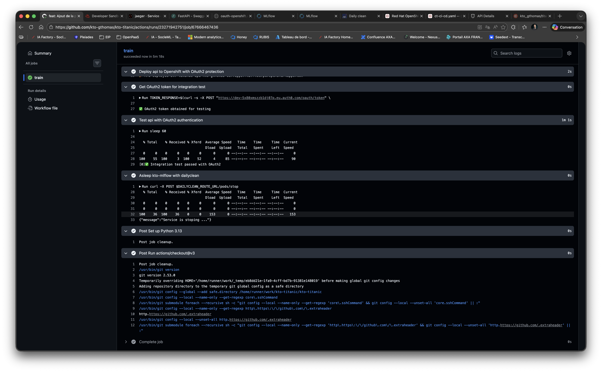
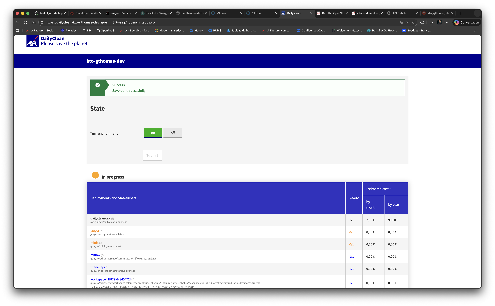
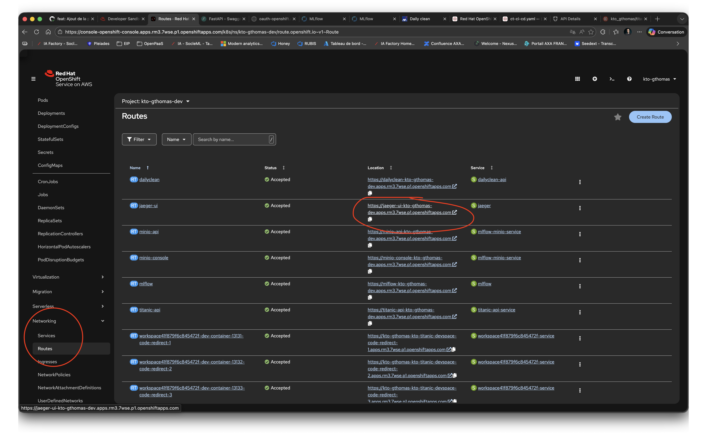
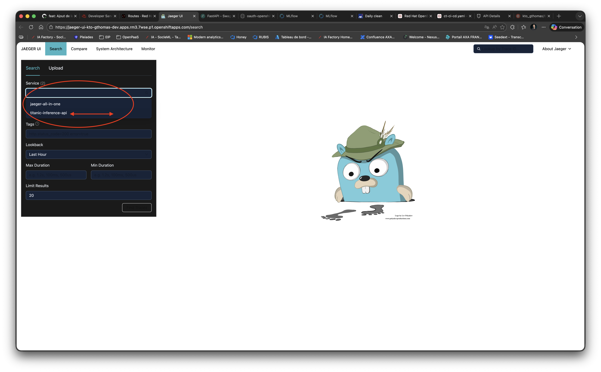
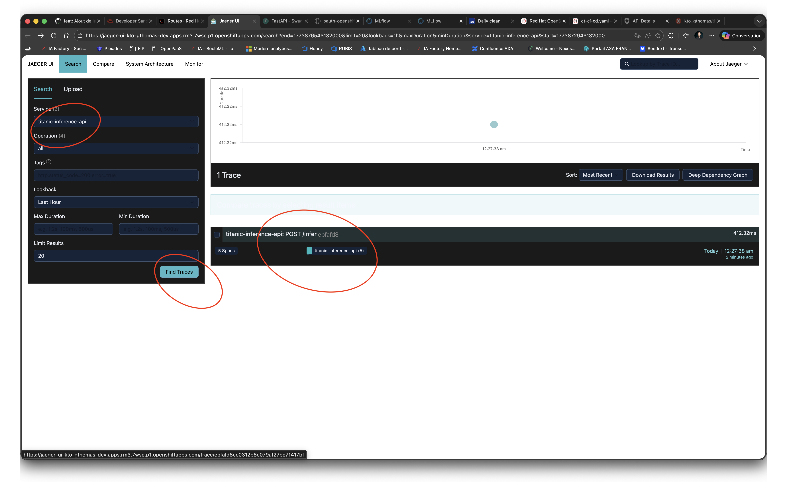
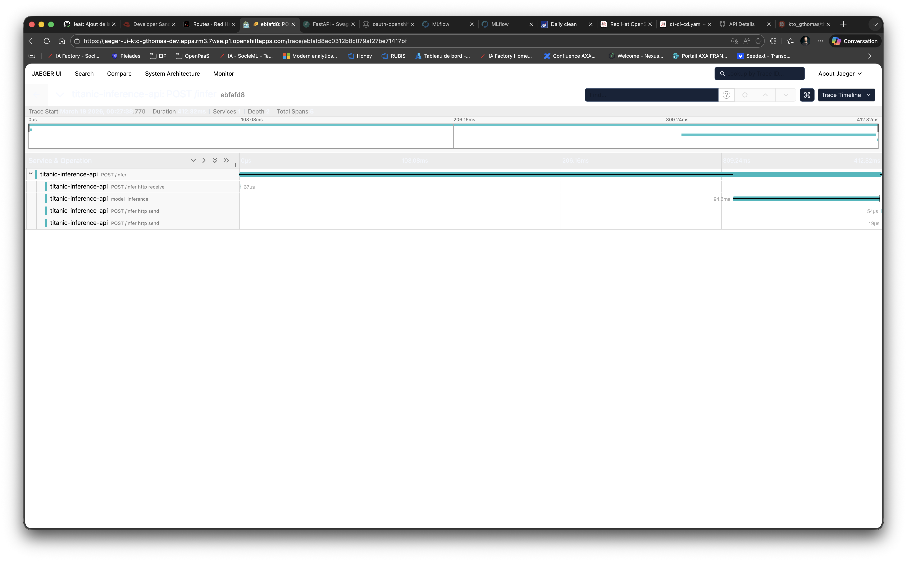