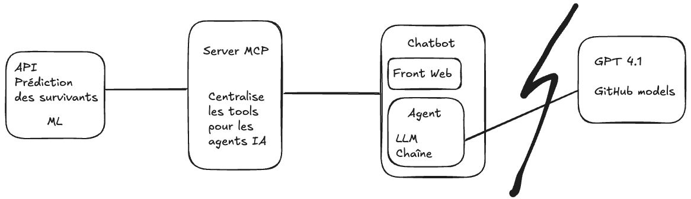

# 14. Construire un chatbot Agentic avec LLM, MCP et LangChain

Dans ce chapitre, nous allons construire un chatbot Agentic en utilisant un modèle de langage de grande taille (LLM), 
le Model Context Protocol (MCP) et la bibliothèque LangChain. Nous allons créer un chatbot capable de comprendre et 
de répondre à des questions complexes en utilisant plusieurs contextes.

Avant de commencer, afin que tout le monde parte du même point, vérifiez que vous n'avez aucune modification en cours 
sur votre working directory avec `git status`.
Si c'est le cas, veillez à pusher votre code sur git pour ne pas perdre votre travail.


> ⚠️ **Attention** : En cas de doute, sollicitez le professeur, car il est possible que votre contrôle continu en soit affecté.

Pour rappel, les commandes utiles sont :
```bash
git add .
git commit -m "your message"
git push origin main
```

## Qu'est-ce qu'un agent Agentic ?

Un agent "Agentic" est un système intelligent qui utilise un modèle de langage (LLM) pour raisonner, décomposer un 
objectif complexe en tâches plus petites et utiliser des outils (tools) pour atteindre cet objectif. Contrairement aux 
simples chatbots qui répondent à des questions basées sur un contexte unique, un agent peut interagir avec son 
environnement, collecter des informations et effectuer des actions.

Les caractéristiques clés d'un agent Agentic sont :
- **Raisonnement et planification** : Capacité à décomposer un problème complexe en une séquence d'étapes.
- **Utilisation d'outils** : Capacité à utiliser des outils externes (par exemple, des API, des bases de données, 
des moteurs de recherche) pour obtenir des informations ou effectuer des actions.
- **Mémoire** : Capacité à se souvenir des interactions passées pour informer les décisions futures (pas couvert dans ce projet).
- **Autonomie** : Capacité à fonctionner avec une intervention humaine minimale pour atteindre un objectif donné (pas couvert dans ce projet).

## Présentation de Streamlit
Streamlit est une bibliothèque Python open-source qui permet de créer rapidement des applications web interactives,
notamment des dashboards et des chatbots. Elle est particulièrement populaire pour les projets de data science et d'IA, 
car elle permet de visualiser facilement les données et d'interagir avec des modèles de machine learning.

## Présentation de LangChain

LangChain est un framework open-source conçu pour simplifier le développement d'applications basées sur les modèles de 
langage (LLM). Il fournit des abstractions et des composants modulaires pour construire des chaînes et des agents complexes.

Les principaux composants de LangChain incluent :
- **Modèles (Models)** : Intégrations avec divers LLMs (par exemple, OpenAI, Hugging Face).
- **Prompts** : Modèles de prompts pour guider les réponses du LLM.
- **Chaînes (Chains)** : Séquences d'appels à des LLMs ou à d'autres utilitaires.
- **Agents** : Systèmes qui utilisent un LLM pour décider des actions à entreprendre et des outils (tools) à utiliser.
- **Index** : Structures pour charger, stocker et interroger des données textuelles.
- **Mémoire (Memory)** : Mécanismes pour conserver l'état entre les appels d'une chaîne ou d'un agent.

LangChain permet de créer rapidement des applications puissantes comme des chatbots, des systèmes de questions-réponses 
sur des documents et des agents autonomes.

## Présentation de MCP (Model Context Protocol)

Le Model Context Protocol (MCP) est une **norme ouverte** introduite par **Anthropic en novembre 2024**. Il fournit un 
"langage" sécurisé et standardisé permettant aux LLM de communiquer avec des données, des applications et des services externes.

Concrètement, un **serveur MCP** expose des **"tools"** (outils) que le LLM peut appeler automatiquement pour obtenir 
des informations ou déclencher des actions. Le LLM n'a pas besoin de connaître les détails techniques des services : 
il découvre les outils disponibles et décide de les utiliser en fonction de la question posée.

```
Sans MCP : Chatbot → Code custom spécifique pour chaque service externe
Avec MCP : Chatbot → MCP Client → MCP Server → N'importe quel service externe
```

✅ Standard ouvert et réutilisable (Claude Desktop, LangChain, Continue, etc.)
✅ L'IA découvre automatiquement les outils disponibles
✅ Ajout de nouveaux outils sans modifier le chatbot

### Client MCP et Serveur MCP

L'architecture MCP repose sur deux rôles distincts :

**Le Serveur MCP** est le composant qui expose les outils. Il déclare la liste des tools disponibles (nom, description, 
paramètres attendus) et les exécute quand le client les appelle. 
Dans notre projet, le serveur MCP expose le tool `predict_survival` qui appelle l'API ML en interne.

**Le Client MCP** est le composant qui se connecte au serveur pour découvrir et utiliser les tools. Dans notre projet, 
c'est le chatbot (via LangChain) qui joue le rôle de client : il interroge le serveur pour connaître les tools disponibles, 
puis les transmet au LLM qui décide de les appeler ou non.

```
Client MCP (Chatbot)          Serveur MCP
        │                          │
        │── list_tools() ─────────>│  "Quels outils as-tu ?"
        │<─ [predict_survival] ────│  "J'ai ce tool"
        │                          │
        │── call_tool(...) ────────>│  "Appelle predict_survival"
        │<─ "Did not survive" ─────│  "Voici le résultat"
```

## Présentation de Streamable HTTP

**Streamable HTTP** est le mécanisme de transport utilisé par MCP pour faire communiquer le chatbot avec le serveur 
MCP. Il s'appuie sur HTTP standard, mais avec la capacité de recevoir des réponses en continu (streaming), ce qui est 
utile quand la réponse est longue ou progressive.

| | HTTP classique | Streamable HTTP (MCP) |
|---|---|---|
| **Requête** | Client → Serveur (POST/GET) | Client → Serveur (POST) |
| **Réponse** | Une seule réponse complète | Réponse immédiate ou streaming continu |
| **Usage** | API REST standard | Communication entre agent LLM et MCP Server |
| **Standard** | HTTP/1.1, HTTP/2 | Défini par la spec MCP (Anthropic) |

En pratique dans notre projet, le chatbot envoie ses appels d'outils au serveur MCP via HTTP POST, et reçoit la réponse 
directement ou en streaming.

## Présentation de FastMCP

**FastMCP** est la bibliothèque Python officielle pour créer des serveurs MCP simplement. Elle fournit une API de 
haut niveau qui masque toute la complexité du protocole MCP, à la manière de ce que FastAPI fait pour les API REST.

Son principe est simple : on décore une fonction Python avec `@mcp.tool()` et elle devient automatiquement un 
outil que le LLM peut découvrir et appeler.

```python
from mcp.server.fastmcp import FastMCP

mcp = FastMCP(
    name="titanic-mcp-server",
    streamable_http_path="/mcp",
)

@mcp.tool()
def predict_survival(pclass: int, sex: str, sibsp: int, parch: int) -> str:
    """Predict if a Titanic passenger would survive."""
    # Appel à l'API ML en interne
    ...

if __name__ == "__main__":
    mcp.run(transport="streamable-http")
```

**Avantages de FastMCP** :
- ✅ Décorateur simple (`@mcp.tool()`) pour exposer n'importe quelle fonction
- ✅ Validation automatique des paramètres (types, schémas)
- ✅ Le LLM utilise la **docstring** de la fonction pour comprendre à quoi sert l'outil
- ✅ Gère automatiquement le transport Streamable HTTP

## Présentation du projet



Notre projet connecte trois services indépendants via le protocole MCP :

```
┌──────────────────────────────────────────────────┐
│              CHATBOT (Streamlit)                 │
│   Interface utilisateur + LangChain + GPT-4o     │
│           (Client MCP Streamable HTTP)           │
└─────────────────────┬────────────────────────────┘
                      │ MCP Protocol (Streamable HTTP)
┌─────────────────────▼────────────────────────────┐
│              MCP SERVER (FastMCP)                │
│     Expose le tool : predict_survival            │
└─────────────────────┬────────────────────────────┘
                      │ HTTP REST
┌─────────────────────▼────────────────────────────┐
│                 API ML (FastAPI)                 │
│    Prédiction Random Forest (Titanic)            │
│           Endpoint : POST /infer                 │
└──────────────────────────────────────────────────┘
```

### Flux d'une question

Voici ce qui se passe quand un utilisateur demande : *"Un homme de 3ème classe survivrait-il ?"*

1. **Streamlit** envoie la question à l'agent LangChain.
2. **LangChain + GPT-4o** analyse la question et décide d'appeler le tool `predict_survival`.
3. **Le client MCP** transmet l'appel au serveur MCP via le protocole Streamable HTTP.
4. **Le serveur MCP** appelle l'API ML avec les paramètres extraits (`pclass=3, sex="male"`, ...).
5. **L'API ML** retourne la prédiction (`0` = n'a pas survécu).
6. **LangChain** reformule la réponse : *"Non, avec 18% de chances de survie, il n'aurait probablement pas survécu."*

## Réalisation du chatbot 

Une grosse partie du travail de ce chapitre a déjà été réalisée pour vous. Vous devez compléter les parties manquantes 
indiquées par des TODO dans le code. N'hésitez pas à consulter la documentation de [LangChain](https://www.langchain.com/) 
et [MCP](https://modelcontextprotocol.io/docs/getting-started/intro) pour comprendre 
comment les différentes pièces s'assemblent.

Vous trouverez le code de base du projet dans le dossier `./src/titanic/chatbot/`.
Deux scripts sont proposés :
- `app.py` : le point d'entrée du chatbot Streamlit. Il initialise l'agent LangChain et gère l'interface utilisateur.
- `agent.py` : le code de l'agent LangChain. C'est ici que vous devez implémenter la logique pour 
découvrir les tools MCP et les intégrer dans l'agent, mais aussi la logique de raisonnement pour que l'agent puisse 
décider d'appeler le tool ou non en fonction de la question posée, avec l'aide d'un système prompt. 
C'est enfin ici que vous initierez le client MCP pour communiquer avec le serveur 
MCP et le LLM à utiliser.

Le seul fichier que vous devez modifier est `./src/titanic/chatbot/agent.py`.

### Prérequis : Dépendances du chatbot

Avant de commencer, assurez-vous que la dépendance `langchain-mcp-adapters` est bien présente dans le groupe `chatbot` de votre fichier `pyproject.toml`.

> ⚠️ **Important** : Sans cette dépendance, le chatbot ne pourra pas se connecter au serveur MCP via LangChain.

Vérifiez que votre `pyproject.toml` contient bien, dans la section `[dependency-groups]` :

```toml
[dependency-groups]
chatbot = [
  "streamlit>=1.40.0",
  "langchain>=0.3.0",
  "langchain-community>=0.3.0",
  "langchain-openai>=0.2.0",
  "langchain-mcp-adapters>=0.2.1",  # ← indispensable pour le client MCP
  "httpx>=0.28.0",
]
```

Si elle est absente, ajoutez-la, puis synchronisez vos dépendances :

```bash
uv sync --all-groups
```

### État initial du fichier `agent.py`

Voici l'état initial du fichier `agent.py` que vous devez compléter :

```python
import os
import asyncio
from typing import Any

from langchain_openai import ChatOpenAI
from langchain_core.messages import HumanMessage, SystemMessage
from pydantic import SecretStr
# TODO : Importer le client MCP depuis la librairie facilitant les échanges MCP

# TODO : Définir le système Prompt

class ChatbotAgent:
    def __init__(self) -> None:
        mcp_server_host: str = os.getenv(
            "MCP_SERVER_HOST", "http://titanic-mcp-server.{{ cookiecutter.developer_redhat_username }}-dev.svc.cluster.local:8000"
        )
        # TODO : Mettre en place dans un attribut de classe la configuration du client MCP en déclarant les servers mcp cibles
        # TODO : Mettre en place dans un attribut de classe l'abstraction du LLM de Langchain en tant que ChatOpenAI
        # TODO : Faites en sorte que le mot de passe de l'API soit sécurisé avec pydantic SecretStr

    async def chat_async(self, message: str) -> str:
        """Chat async utilisant l'adaptateur MCP Langchain officiel."""
        # TODO : Créer le client MCP avec la configuration définie dans le constructeur
        # TODO : Récupérer les outils disponibles depuis le client MCP
        # TODO : Lier les outils au LLM pour obtenir un LLM capable d'utiliser les outils
        # TODO : Construire les messages avec le system prompt et le message utilisateur
        # TODO : Invoquer le LLM avec les messages construits
        # TODO : Vérifier si une tool a été appelée dans la réponse
        # TODO : Retourner le résultat du tool si c'est la réponse du llm, sinon, sa réponse générée.
        return ""

    def chat(self, message: str) -> str:
        return asyncio.run(self.chat_async(message))
```

### Étape 1 : Importer le client MCP

La bibliothèque `langchain-mcp-adapters` fournit un client MCP compatible LangChain. Il s'appelle 
`MultiServerMCPClient` et permet de se connecter à plusieurs serveurs MCP en même temps.

Remplacez le `TODO` correspondant par l'import suivant :

```python
from langchain_mcp_adapters.client import MultiServerMCPClient
```

### Étape 2 : Définir le System Prompt

Le System Prompt est le message initial envoyé au LLM pour lui expliquer son rôle et ses contraintes. 
C'est ici que vous guidez le comportement de l'agent : quand utiliser le tool, comment répondre, quoi demander 
si des informations manquent.

Remplacez le `TODO` correspondant par la constante suivante :

```python
SYSTEM_PROMPT = """You are a helpful assistant that predicts Titanic passenger survival.

To make a prediction, use the predict_survival tool with ALL required parameters:
- pclass (integer): Passenger class - 1 (First), 2 (Second), or 3 (Third)
- sex (string): "male" or "female"
- sibsp (integer): Number of siblings/spouses aboard (0-8)
- parch (integer): Number of parents/children aboard (0-9)

If the user doesn't specify all parameters, ask politely for missing information.
NEVER guess values - always ask the user.

Examples:
- "A man" → Ask: "What class? Any family aboard?"
- "A man in third class alone" → Use: pclass=3, sex="male", sibsp=0, parch=0

Be friendly and explain predictions clearly."""
```

### Étape 3 : Configurer le client MCP et le LLM dans le constructeur

Dans le constructeur `__init__`, vous devez stocker la configuration du client MCP et instancier le LLM.

La configuration MCP se présente sous la forme d'un dictionnaire :
- La clé est le nom que vous donnez au serveur (ex: `"titanic"`).
- La valeur est un dictionnaire contenant l'URL du serveur MCP (`/mcp`) et le type de transport (`streamable_http`).

Pour le LLM, on utilise `ChatOpenAI` de LangChain avec le modèle défini dans la variable d'environnement 
`LLM_MODEL` (par défaut `gpt-4o-mini`). La clé API est lue depuis `OPENAI_API_KEY` et encapsulée dans 
un `SecretStr` pour la sécuriser.

Remplacez les `TODO` du constructeur par le code suivant :

```python
        self.mcp_server_host = mcp_server_host
        self.mcp_connections = {"titanic": {"url": f"{mcp_server_host}/mcp", "transport": "streamable_http"}}

        api_key = os.getenv("OPENAI_API_KEY", "dummy-key")
        self.llm = ChatOpenAI(
            model=os.getenv("LLM_MODEL", "gpt-4o-mini"),
            api_key=SecretStr(api_key),
            base_url=os.getenv("OPENAI_BASE_URL", "https://models.github.ai/inference"),
            temperature=0.7,
        )
```

### Étape 4 : Implémenter la méthode `chat_async`

C'est le cœur de l'agent. Cette méthode :
1. Crée le client MCP avec la configuration définie dans le constructeur.
2. Récupère la liste des tools disponibles sur le serveur MCP.
3. Lie ces tools au LLM pour qu'il puisse décider de les appeler.
4. Construit les messages (system prompt + message utilisateur) et les envoie au LLM.
5. Si le LLM décide d'appeler un tool, exécute le tool et retourne son résultat.
6. Sinon, retourne la réponse textuelle du LLM.

Remplacez les `TODO` de `chat_async` par le code suivant :

```python
        mcp_client = MultiServerMCPClient(self.mcp_connections)  # type: ignore

        tools = await mcp_client.get_tools()
        llm_with_tools = self.llm.bind_tools(tools)

        messages = [SystemMessage(content=SYSTEM_PROMPT), HumanMessage(content=message)]
        response = await llm_with_tools.ainvoke(messages)

        if response.tool_calls:
            tool_call = response.tool_calls[0]
            tool_name = tool_call["name"]
            tool_args = tool_call["args"]

            for tool in tools:
                if tool.name == tool_name:
                    result = await tool.ainvoke(tool_args)
                    if hasattr(result, "content") and result.content:
                        content = result.content[0]
                        if hasattr(content, "text"):
                            return content.text
                        return str(content)
                    return str(result)

        return str(response.content)
```

### Notes 
Ignorez, voire, supprimez la méthode privée _call_mcp_tool qui était une ébauche d'implémentation d'appel MCP avant que 
nous utilisions le client officiel.

Des tests unitaires ne fonctionnent plus : test_agent_mcp_config_structure et test_agent_uses_environment_variables.

Voici les corrections : 

```python

def test_agent_mcp_config_structure(agent):
  """Test que la configuration MCP a la bonne structure."""
  assert agent.mcp_connections is not None
  assert "titanic" in agent.mcp_connections

  titanic_config = agent.mcp_connections["titanic"]
  assert titanic_config["url"] == "http://localhost:8000/mcp"
  assert titanic_config["transport"] == "streamable_http"


def test_agent_uses_environment_variables():
  """Test que l'agent utilise correctement les variables d'environnement."""
  os.environ["MCP_SERVER_HOST"] = "http://custom-host:9000"

  agent = ChatbotAgent()

  assert "http://custom-host:9000/mcp" in agent.mcp_connections["titanic"]["url"]

  os.environ["MCP_SERVER_HOST"] = "http://localhost:8000"
  
```
### Résultat final attendu

Votre fichier `agent.py` devrait désormais ressembler à ceci :

```python
import os
import asyncio

from langchain_openai import ChatOpenAI
from langchain_core.messages import HumanMessage, SystemMessage
from pydantic import SecretStr
from langchain_mcp_adapters.client import MultiServerMCPClient

SYSTEM_PROMPT = """You are a helpful assistant that predicts Titanic passenger survival.

To make a prediction, use the predict_survival tool with ALL required parameters:
- pclass (integer): Passenger class - 1 (First), 2 (Second), or 3 (Third)
- sex (string): "male" or "female"
- sibsp (integer): Number of siblings/spouses aboard (0-8)
- parch (integer): Number of parents/children aboard (0-9)

If the user doesn't specify all parameters, ask politely for missing information.
NEVER guess values - always ask the user.

Examples:
- "A man" → Ask: "What class? Any family aboard?"
- "A man in third class alone" → Use: pclass=3, sex="male", sibsp=0, parch=0

Be friendly and explain predictions clearly."""


class ChatbotAgent:
    def __init__(self) -> None:
        mcp_server_host: str = os.getenv(
            "MCP_SERVER_HOST", "http://titanic-mcp-server.{{ cookiecutter.developer_redhat_username }}-dev.svc.cluster.local:8000"
        )

        self.mcp_server_host = mcp_server_host
        self.mcp_connections = {"titanic": {"url": f"{mcp_server_host}/mcp", "transport": "streamable_http"}}

        api_key = os.getenv("OPENAI_API_KEY", "dummy-key")
        self.llm = ChatOpenAI(
            model=os.getenv("LLM_MODEL", "gpt-4o-mini"),
            api_key=SecretStr(api_key),
            base_url=os.getenv("OPENAI_BASE_URL", "https://models.github.ai/inference"),
            temperature=0.7,
        )

    async def chat_async(self, message: str) -> str:
        """Chat async utilisant l'adaptateur MCP Langchain officiel."""
        mcp_client = MultiServerMCPClient(self.mcp_connections)  # type: ignore

        tools = await mcp_client.get_tools()
        llm_with_tools = self.llm.bind_tools(tools)

        messages = [SystemMessage(content=SYSTEM_PROMPT), HumanMessage(content=message)]
        response = await llm_with_tools.ainvoke(messages)

        if response.tool_calls:
            tool_call = response.tool_calls[0]
            tool_name = tool_call["name"]
            tool_args = tool_call["args"]

            for tool in tools:
                if tool.name == tool_name:
                    result = await tool.ainvoke(tool_args)
                    if hasattr(result, "content") and result.content:
                        content = result.content[0]
                        if hasattr(content, "text"):
                            return content.text
                        return str(content)
                    return str(result)

        return str(response.content)

    def chat(self, message: str) -> str:
        return asyncio.run(self.chat_async(message))
```

## Réalisation du Server MCP

La réalisation du serveur MCP suit la même logique que celle du chatbot : une grosse partie du code est déjà en 
place, il vous suffit de compléter les `TODO` dans le fichier `./src/titanic/mcp_server/server.py`.

### État initial du fichier `server.py`

Voici l'état initial du fichier `server.py` que vous devez compléter :

```python
import os
import httpx
# TODO : importer la librairie facilitant la mise en place de server MCP
from starlette.requests import Request
from starlette.responses import JSONResponse, Response

from titanic.mcp_server.auth import token_manager

API_URL = os.getenv("TITANIC_API_URL", "http://titanic-api-service.{{ cookiecutter.developer_redhat_username }}-dev.svc.cluster.local:8080")

# TODO : Créer le server MCP avec le bon nom : "titanic-mcp-server"

# TODO : déclarer cette fonction en tant que tool
async def predict_survival(pclass: int, sex: str, sibsp: int, parch: int) -> str:
    """
    Prédit la survie d'un passager du Titanic.

    Args:
        pclass: Classe du billet (1, 2 ou 3)
        sex: Sexe ("male" ou "female")
        sibsp: Nombre de frères/sœurs/conjoints à bord
        parch: Nombre de parents/enfants à bord

    Returns:
        Prédiction de survie avec message et détails

    """
    # TODO : Implémenter l'appel http sécurisé avec oAuth2 vers l'API titanic
    return "Tool not implemented yet"

# TODO : A des fins de surveillances dans openshift, créer une custom route GET /health pour le server MCP

if __name__ == "__main__":
    # TODO : Démarrer le server web en local, sur le port 8080, en transport streamable-http
    print("toto")
```

Notez que le fichier `auth.py` est déjà entièrement fourni. Il contient un `OAuth2TokenManager` qui gère 
automatiquement l'obtention et le renouvellement d'un token OAuth2 pour sécuriser les appels vers l'API Titanic.
L'instance `token_manager` est prête à l'emploi via `await token_manager.get_token()`.

### Étape 1 : Importer FastMCP

La bibliothèque `fastmcp` permet de créer un serveur MCP en quelques lignes. Remplacez le `TODO` d'import par :

```python
from fastmcp import FastMCP
```

### Étape 2 : Créer l'instance du serveur MCP

Le serveur MCP s'instancie simplement en lui donnant un nom. Ce nom sera affiché lors de la découverte du serveur 
par le client MCP.

Remplacez le `TODO` correspondant par :

```python
mcp = FastMCP("titanic-mcp-server")
```

### Étape 3 : Déclarer la fonction comme un tool MCP

Pour qu'un LLM puisse appeler `predict_survival`, il faut le déclarer comme un **tool** MCP grâce au décorateur 
`@mcp.tool()`. Le LLM utilisera automatiquement la **docstring** de la fonction pour comprendre à quoi sert cet outil 
et quels paramètres lui passer.

Ajoutez le décorateur juste au-dessus de la définition de la fonction :

```python
@mcp.tool()
async def predict_survival(pclass: int, sex: str, sibsp: int, parch: int) -> str:
```

### Étape 4 : Implémenter l'appel HTTP vers l'API Titanic

Le corps de la fonction doit appeler l'API ML Titanic en HTTP, en transmettant les paramètres du passager, 
et en ajoutant le token OAuth2 dans les en-têtes si disponible.

On utilise `httpx.AsyncClient` pour effectuer la requête de façon asynchrone. Le résultat (`0` ou `1`) est 
ensuite traduit en un message lisible pour l'utilisateur.

Remplacez le `TODO` du corps de la fonction par :

```python
    try:
        payload = {"pclass": pclass, "sex": sex, "sibSp": sibsp, "parch": parch}
        headers: dict[str, str] = {"Content-Type": "application/json"}

        token = await token_manager.get_token()
        if token:
            headers["Authorization"] = f"Bearer {token}"

        async with httpx.AsyncClient() as client:
            resp = await client.post(f"{API_URL}/infer", json=payload, headers=headers, timeout=10.0)
            resp.raise_for_status()
            result = resp.json()

        prediction = result[0] if isinstance(result, list) else result
        survived = bool(prediction)

        if survived:
            return (
                f"Good news! According to the prediction model, this passenger would have SURVIVED the Titanic "
                f"disaster (prediction: {prediction})."
            )
        else:
            return (
                f"Unfortunately, according to the prediction model, this passenger would NOT have survived the "
                f"Titanic disaster (prediction: {prediction})."
            )
    except Exception as e:
        return f"Sorry, I encountered an error while trying to predict: {e!s}"
```

### Étape 5 : Ajouter un endpoint de health check

OpenShift (et Kubernetes) ont besoin d'un endpoint `/health` pour vérifier que le service est opérationnel. 
FastMCP permet d'ajouter des routes HTTP personnalisées avec `@mcp.custom_route()`.

Remplacez le `TODO` correspondant par :

```python
@mcp.custom_route("/health", methods=["GET"])
async def health_check(request: Request) -> Response:
    """Health check endpoint pour Kubernetes."""
    return JSONResponse({"status": "healthy"})
```

### Étape 6 : Démarrer le serveur

Le serveur doit démarrer en mode `streamable-http` (le transport MCP), sur le host et le port définis par 
les variables d'environnement `HOST` et `PORT`, en exposant les outils sur le chemin `/mcp`.

Remplacez le bloc `if __name__ == "__main__":` par :

```python
if __name__ == "__main__":
    host = os.getenv("HOST", "0.0.0.0")
    port = int(os.getenv("PORT", "8000"))
    mcp.run(transport="streamable-http", host=host, port=port, path="/mcp")
```

### Résultat final attendu

Votre fichier `server.py` devrait désormais ressembler à ceci :

```python
import os
import httpx
from fastmcp import FastMCP
from starlette.requests import Request
from starlette.responses import JSONResponse, Response

from titanic.mcp_server.auth import token_manager

API_URL = os.getenv("TITANIC_API_URL", "http://titanic-api-service.{{ cookiecutter.developer_redhat_username }}-dev.svc.cluster.local:8080")

mcp = FastMCP("titanic-mcp-server")


@mcp.tool()
async def predict_survival(pclass: int, sex: str, sibsp: int, parch: int) -> str:
    """
    Prédit la survie d'un passager du Titanic.

    Args:
        pclass: Classe du billet (1, 2 ou 3)
        sex: Sexe ("male" ou "female")
        sibsp: Nombre de frères/sœurs/conjoints à bord
        parch: Nombre de parents/enfants à bord

    Returns:
        Prédiction de survie avec message et détails

    """
    try:
        payload = {"pclass": pclass, "sex": sex, "sibSp": sibsp, "parch": parch}
        headers: dict[str, str] = {"Content-Type": "application/json"}

        token = await token_manager.get_token()
        if token:
            headers["Authorization"] = f"Bearer {token}"

        async with httpx.AsyncClient() as client:
            resp = await client.post(f"{API_URL}/infer", json=payload, headers=headers, timeout=10.0)
            resp.raise_for_status()
            result = resp.json()

        prediction = result[0] if isinstance(result, list) else result
        survived = bool(prediction)

        if survived:
            return (
                f"Good news! According to the prediction model, this passenger would have SURVIVED the Titanic "
                f"disaster (prediction: {prediction})."
            )
        else:
            return (
                f"Unfortunately, according to the prediction model, this passenger would NOT have survived the "
                f"Titanic disaster (prediction: {prediction})."
            )
    except Exception as e:
        return f"Sorry, I encountered an error while trying to predict: {e!s}"


@mcp.custom_route("/health", methods=["GET"])
async def health_check(request: Request) -> Response:
    """Health check endpoint pour Kubernetes."""
    return JSONResponse({"status": "healthy"})


if __name__ == "__main__":
    host = os.getenv("HOST", "0.0.0.0")
    port = int(os.getenv("PORT", "8000"))
    mcp.run(transport="streamable-http", host=host, port=port, path="/mcp")
```

## Création des repository Quay.io

Avant d'aller plus loin, afin de pouvoir déployer le chatbot et le serveur MCP sur OpenShift, vous devez créer deux 
repository sur Quay.io pour héberger les images Docker de ces services :
- `titanic-chatbot` : pour l'image du chatbot Streamlit.
- `titanic-mcp-server` : pour l'image du serveur MCP.

Vous l'avez déjà fait maintes fois dans les chapitres précédents, je vous laisse vous reporter à ces parties.
Attention, n'oubliez pas de configurer votre quay robot avec les permissions adéquates (Admin) sur ces deux nouveaux repository.

## Mettre à jour les github actions

Maintenant que le code du chatbot et du serveur MCP est prêt, il faut automatiser leur déploiement via des 
GitHub Actions. Deux pipelines sont à compléter dans `.github/workflows/` :
- `deploy-chatbot.yml` : build, test et déploiement du chatbot Streamlit.
- `deploy-mcp-server.yml` : build, test et déploiement du serveur MCP.

Ces deux pipelines suivent la même structure que la pipeline de l'API (vue au chapitre 11), en y ajoutant 
la gestion des secrets spécifiques à chaque service.

### Pipeline du chatbot (`deploy-chatbot.yml`)

#### État initial

```yaml
name: Deploy Titanic Chatbot

on:
  push:
    branches:
      - main
    paths:
      - 'src/titanic/chatbot/**'
      - '/tests/chatbot/**'
      - 'k8s/chatbot/**'
      - '.github/workflows/deploy-chatbot.yml'
  workflow_dispatch:

env:
  CHATBOT_IMAGE_NAME: quay.io/{{ cookiecutter.quay_username }}/titanic/chatbot
  CHATBOT_DEPLOYMENT_NAME: titanic-chatbot
  CHATBOT_SECRET_NAME: chatbot-secrets
  CHATBOT_ROUTE_NAME: titanic-chatbot

jobs:
  build-and-deploy:
    runs-on: ubuntu-latest

    steps:
      - name: Checkout code
        uses: actions/checkout@v3

      - name: Set up Python {{ cookiecutter.__python_version }}
        uses: actions/setup-python@v3
        with:
          python-version: {{ cookiecutter.__python_version }}
      - name: Install dependencies
        run: |
          echo "To implement"
          
          # TODO: Saisir la suite de cette pipeline. Devrait apparaître : 
          # Install depencies, Launch unit tests,
          # Configure docker and kubectl, Build and push Docker image
          # Create or update Secret, Delete Chatbot pod to refresh secret,
          # Deploy to OpenShift
```

#### Étape 1 : Installer les dépendances et lancer les tests

Comme pour la pipeline de l'API, on installe les dépendances avec `uv` et on lance les tests unitaires du 
groupe `chatbot`.

Remplacez le bloc `Install dependencies` par :

```yaml
      - name: Install dependencies
        run: |
          python -m pip install --upgrade pip
          pip install uv
          uv sync --group chatbot
      - name: Launch unit tests
        run: |
          uv run pytest tests/chatbot
```

#### Étape 2 : Configurer Docker et kubectl

Même bloc que dans la pipeline de l'API : connexion à Quay.io et configuration du contexte kubectl vers votre 
namespace OpenShift.

```yaml
      - name: Configure docker and kubectl
        run: |
          docker login -u="${{vars.QUAY_ROBOT_USERNAME}}" -p="${{secrets.QUAY_ROBOT_TOKEN}}" quay.io
          kubectl config set-cluster openshift-cluster --server=${{vars.OPENSHIFT_SERVER}}
          kubectl config set-credentials openshift-credentials --token=${{secrets.OPENSHIFT_TOKEN}}
          kubectl config set-context openshift-context --cluster=openshift-cluster --user=openshift-credentials --namespace=${{vars.OPENSHIFT_USERNAME}}-dev
          kubectl config use openshift-context
```

#### Étape 3 : Build et push de l'image Docker

```yaml
      - name: Build and push Docker image
        run: |
          docker build -f k8s/chatbot/Dockerfile -t ${{ env.CHATBOT_IMAGE_NAME }}:latest .
          docker push ${{ env.CHATBOT_IMAGE_NAME }}:latest
```

#### Étape 4 : Créer ou mettre à jour le Secret

Le chatbot a besoin d'un token GitHub Models pour appeler le LLM. Ce secret est stocké dans Kubernetes et 
injecté dans le pod au démarrage. À chaque déploiement, on le recrée pour s'assurer qu'il est à jour.

```yaml
      - name: Create or update Secret
        run: |
          if kubectl get secret ${{ env.CHATBOT_SECRET_NAME }} 2>/dev/null; then
            echo "Secret exists, updating..."
            kubectl delete secret ${{ env.CHATBOT_SECRET_NAME }}
          fi
          kubectl create secret generic ${{ env.CHATBOT_SECRET_NAME }} \
            --from-literal=github-models-token="${{ secrets.GH_MODELS_TOKEN }}"
          echo "✅ Secret created/updated"
```

> 💡 N'oubliez pas d'ajouter le secret `GH_MODELS_TOKEN` dans les secrets de votre repository GitHub 
> (Settings → Secrets and variables → Actions).

#### Étape 5 : Redémarrer le pod pour prendre en compte le secret

Un pod Kubernetes ne recharge pas automatiquement un secret mis à jour. On supprime donc le pod existant 
pour qu'il soit recréé avec la nouvelle valeur :

```yaml
      - name: Delete Chatbot pod to refresh secret
        run: |
          POD=$(kubectl get pods -l app=${{ env.CHATBOT_DEPLOYMENT_NAME }} -o jsonpath='{.items[0].metadata.name}' 2>/dev/null || true)
          if [ -n "$POD" ]; then
            kubectl delete pod $POD
            echo "✅ Pod ${{ env.CHATBOT_DEPLOYMENT_NAME }} supprimé, il va être recréé avec le secret à jour"
          else
            echo "⚠️ Aucun pod ${{ env.CHATBOT_DEPLOYMENT_NAME }} trouvé à supprimer (premier déploiement)"
          fi
```

#### Étape 6 : Déployer sur OpenShift

```yaml
      - name: Deploy to OpenShift
        run: |
          kubectl apply -f k8s/chatbot/chatbot.yaml
          echo "✅ Deployment updated"
```

#### Étape 7 : Afficher l'URL de la route

On récupère l'URL publique du chatbot et on l'affiche dans le résumé de la pipeline GitHub :

```yaml
      - name: Get route URL
        run: |
          ROUTE_URL=$(kubectl get route ${{ env.CHATBOT_ROUTE_NAME }} -o jsonpath='{.spec.host}')
          echo "🚀 Chatbot deployed at: https://${ROUTE_URL}"
          echo "## 🚢 Titanic Chatbot Deployment" >> $GITHUB_STEP_SUMMARY
          echo "" >> $GITHUB_STEP_SUMMARY
          echo "✅ **Status**: Deployed successfully" >> $GITHUB_STEP_SUMMARY
          echo "🔗 **URL**: https://${ROUTE_URL}" >> $GITHUB_STEP_SUMMARY
          echo "📦 **Image**: ${{ env.CHATBOT_IMAGE_NAME }}:latest" >> $GITHUB_STEP_SUMMARY
          echo "🔐 **Secret**: ${{ env.CHATBOT_SECRET_NAME }} updated" >> $GITHUB_STEP_SUMMARY
```

#### Résultat final attendu pour `deploy-chatbot.yml`

```yaml
name: Deploy Titanic Chatbot

on:
  push:
    branches:
      - main
    paths:
      - 'src/titanic/chatbot/**'
      - '/tests/chatbot/**'
      - 'k8s/chatbot/**'
      - '.github/workflows/deploy-chatbot.yml'
  workflow_dispatch:

env:
  CHATBOT_IMAGE_NAME: quay.io/{{ cookiecutter.quay_username }}/titanic/chatbot
  CHATBOT_DEPLOYMENT_NAME: titanic-chatbot
  CHATBOT_SECRET_NAME: chatbot-secrets
  CHATBOT_ROUTE_NAME: titanic-chatbot

jobs:
  build-and-deploy:
    runs-on: ubuntu-latest

    steps:
      - name: Checkout code
        uses: actions/checkout@v3

      - name: Set up Python {{ cookiecutter.__python_version }}
        uses: actions/setup-python@v3
        with:
          python-version: {{ cookiecutter.__python_version }}

      - name: Install dependencies
        run: |
          python -m pip install --upgrade pip
          pip install uv
          uv sync --group chatbot

      - name: Launch unit tests
        run: |
          uv run pytest tests/chatbot

      - name: Configure docker and kubectl
        run: |
          docker login -u="${{vars.QUAY_ROBOT_USERNAME}}" -p="${{secrets.QUAY_ROBOT_TOKEN}}" quay.io
          kubectl config set-cluster openshift-cluster --server=${{vars.OPENSHIFT_SERVER}}
          kubectl config set-credentials openshift-credentials --token=${{secrets.OPENSHIFT_TOKEN}}
          kubectl config set-context openshift-context --cluster=openshift-cluster --user=openshift-credentials --namespace=${{vars.OPENSHIFT_USERNAME}}-dev
          kubectl config use openshift-context

      - name: Build and push Docker image
        run: |
          docker build -f k8s/chatbot/Dockerfile -t ${{ env.CHATBOT_IMAGE_NAME }}:latest .
          docker push ${{ env.CHATBOT_IMAGE_NAME }}:latest

      - name: Create or update Secret
        run: |
          if kubectl get secret ${{ env.CHATBOT_SECRET_NAME }} 2>/dev/null; then
            echo "Secret exists, updating..."
            kubectl delete secret ${{ env.CHATBOT_SECRET_NAME }}
          fi
          kubectl create secret generic ${{ env.CHATBOT_SECRET_NAME }} \
            --from-literal=github-models-token="${{ secrets.GH_MODELS_TOKEN }}"
          echo "✅ Secret created/updated"

      - name: Delete Chatbot pod to refresh secret
        run: |
          POD=$(kubectl get pods -l app=${{ env.CHATBOT_DEPLOYMENT_NAME }} -o jsonpath='{.items[0].metadata.name}' 2>/dev/null || true)
          if [ -n "$POD" ]; then
            kubectl delete pod $POD
            echo "✅ Pod ${{ env.CHATBOT_DEPLOYMENT_NAME }} supprimé, il va être recréé avec le secret à jour"
          else
            echo "⚠️ Aucun pod ${{ env.CHATBOT_DEPLOYMENT_NAME }} trouvé à supprimer (premier déploiement)"
          fi

      - name: Deploy to OpenShift
        run: |
          kubectl apply -f k8s/chatbot/chatbot.yaml
          echo "✅ Deployment updated"

      - name: Get route URL
        run: |
          ROUTE_URL=$(kubectl get route ${{ env.CHATBOT_ROUTE_NAME }} -o jsonpath='{.spec.host}')
          echo "🚀 Chatbot deployed at: https://${ROUTE_URL}"
          echo "## 🚢 Titanic Chatbot Deployment" >> $GITHUB_STEP_SUMMARY
          echo "" >> $GITHUB_STEP_SUMMARY
          echo "✅ **Status**: Deployed successfully" >> $GITHUB_STEP_SUMMARY
          echo "🔗 **URL**: https://${ROUTE_URL}" >> $GITHUB_STEP_SUMMARY
          echo "📦 **Image**: ${{ env.CHATBOT_IMAGE_NAME }}:latest" >> $GITHUB_STEP_SUMMARY
          echo "🔐 **Secret**: ${{ env.CHATBOT_SECRET_NAME }} updated" >> $GITHUB_STEP_SUMMARY
```

---

### Pipeline du serveur MCP (`deploy-mcp-server.yml`)

#### État initial

```yaml
name: Deploy MCP Server

on:
  push:
    branches:
      - main
    paths:
      - 'src/titanic/mcp_server/**'
      - '/tests/mcp_server/**'
      - 'k8s/mcp_server/**'
      - '.github/workflows/deploy-mcp-server.yml'
  workflow_dispatch:

env:
  MCP_SERVER_IMAGE_NAME: quay.io/{{ cookiecutter.quay_username }}/titanic/mcp-server
  MCP_SERVER_DEPLOYMENT_NAME: titanic-mcp-server
  MCP_SERVER_SECRET_NAME: mcp-oauth2-credentials

jobs:
  build-and-deploy:
    runs-on: ubuntu-latest

    steps:
      - name: Checkout code
        uses: actions/checkout@v3

      - name: Set up Python {{ cookiecutter.__python_version }}
        uses: actions/setup-python@v3
        with:
          python-version: {{ cookiecutter.__python_version }}
      - name: Install dependencies
        run: |
          echo "To implement"
          
          # TODO: Saisir la suite de cette pipeline. Devrait apparaître : 
          # Install depencies, Launch unit tests,
          # Configure docker and kubectl, Build and push Docker image
          # Create OAuth2 secret, Delete MCP Server pod to refresh secret,
          # Configure MCP manifest with OAuth2 domain, Deploy to OpenShift
```

#### Étape 1 : Installer les dépendances et lancer les tests

```yaml
      - name: Install dependencies
        run: |
          python -m pip install --upgrade pip
          pip install uv
          uv sync --group mcp-server
      - name: Launch unit tests
        run: |
          uv run pytest tests/mcp_server
```

#### Étape 2 : Configurer Docker et kubectl

Identique aux autres pipelines :

```yaml
      - name: Configure docker and kubectl
        run: |
          docker login -u="${{vars.QUAY_ROBOT_USERNAME}}" -p="${{secrets.QUAY_ROBOT_TOKEN}}" quay.io
          kubectl config set-cluster openshift-cluster --server=${{vars.OPENSHIFT_SERVER}}
          kubectl config set-credentials openshift-credentials --token=${{secrets.OPENSHIFT_TOKEN}}
          kubectl config set-context openshift-context --cluster=openshift-cluster --user=openshift-credentials --namespace=${{vars.OPENSHIFT_USERNAME}}-dev
          kubectl config use openshift-context
```

#### Étape 3 : Build et push de l'image Docker

```yaml
      - name: Build and push Docker image
        run: |
          docker build -f k8s/mcp_server/Dockerfile -t ${{ env.MCP_SERVER_IMAGE_NAME }}:latest .
          docker push ${{ env.MCP_SERVER_IMAGE_NAME }}:latest
```

#### Étape 4 : Créer le secret OAuth2

Le serveur MCP doit s'authentifier auprès de l'API Titanic via OAuth2. Les credentials (`client-id` et 
`client-secret`) sont stockés dans un secret Kubernetes. On utilise ici `--dry-run=client -o yaml | kubectl apply -f -` 
pour créer ou mettre à jour le secret de façon idempotente :

```yaml
      - name: Create OAuth2 secret
        run: |
          if kubectl get secret ${{ env.MCP_SERVER_SECRET_NAME }} &>/dev/null; then
            kubectl delete secret ${{ env.MCP_SERVER_SECRET_NAME }}
          fi
          kubectl create secret generic ${{ env.MCP_SERVER_SECRET_NAME }} \
            --from-literal=client-id="${{ secrets.OAUTH2_CLIENT_ID }}" \
            --from-literal=client-secret="${{ secrets.OAUTH2_CLIENT_SECRET }}" \
            --dry-run=client -o yaml | kubectl apply -f -
          echo "✅ OAuth2 credentials secret created/updated"
```

> 💡 N'oubliez pas d'ajouter `OAUTH2_CLIENT_ID` et `OAUTH2_CLIENT_SECRET` dans les secrets de votre 
> repository GitHub.

#### Étape 5 : Redémarrer le pod pour prendre en compte le secret

```yaml
      - name: Delete MCP Server pod to refresh secret
        run: |
          POD=$(kubectl get pods -l app=${{ env.MCP_SERVER_DEPLOYMENT_NAME }} -o jsonpath='{.items[0].metadata.name}' 2>/dev/null || true)
          if [ -n "$POD" ]; then
            kubectl delete pod $POD
            echo "✅ Pod ${{ env.MCP_SERVER_DEPLOYMENT_NAME }} supprimé, il va être recréé avec le secret à jour"
          else
            echo "⚠️ Aucun pod ${{ env.MCP_SERVER_DEPLOYMENT_NAME }} trouvé à supprimer (premier déploiement)"
          fi
```

#### Étape 6 : Injecter le domaine OAuth2 dans le manifeste

Le manifeste Kubernetes du serveur MCP contient un placeholder `PLACEHOLDER_OAUTH2_DOMAIN` pour le domaine 
OAuth2 (comme pour l'API au chapitre 11). On le remplace avec `sed` avant d'appliquer le manifeste :

```yaml
      - name: Configure MCP manifest with OAuth2 domain
        run: |
          sed -i 's|PLACEHOLDER_OAUTH2_DOMAIN|${{ vars.OAUTH2_DOMAIN }}|g' k8s/mcp_server/mcp-server.yaml
          echo "✅ OAuth2 domain configured: ${{ vars.OAUTH2_DOMAIN }}"
```

#### Étape 7 : Déployer sur OpenShift

```yaml
      - name: Deploy to OpenShift
        run: |
          kubectl apply -f k8s/mcp_server/mcp-server.yaml
          echo "✅ MCP Server deployment updated"
          echo "## 🔧 MCP Server Deployment" >> $GITHUB_STEP_SUMMARY
          echo "" >> $GITHUB_STEP_SUMMARY
          echo "✅ **Status**: Deployed successfully" >> $GITHUB_STEP_SUMMARY
          echo "📦 **Image**: ${{ env.MCP_SERVER_IMAGE_NAME }}:latest" >> $GITHUB_STEP_SUMMARY
```

#### Résultat final attendu pour `deploy-mcp-server.yml`

```yaml
name: Deploy MCP Server

on:
  push:
    branches:
      - main
    paths:
      - 'src/titanic/mcp_server/**'
      - '/tests/mcp_server/**'
      - 'k8s/mcp_server/**'
      - '.github/workflows/deploy-mcp-server.yml'
  workflow_dispatch:

env:
  MCP_SERVER_IMAGE_NAME: quay.io/{{ cookiecutter.quay_username }}/titanic/mcp-server
  MCP_SERVER_DEPLOYMENT_NAME: titanic-mcp-server
  MCP_SERVER_SECRET_NAME: mcp-oauth2-credentials

jobs:
  build-and-deploy:
    runs-on: ubuntu-latest

    steps:
      - name: Checkout code
        uses: actions/checkout@v3

      - name: Set up Python {{ cookiecutter.__python_version }}
        uses: actions/setup-python@v3
        with:
          python-version: {{ cookiecutter.__python_version }}

      - name: Install dependencies
        run: |
          python -m pip install --upgrade pip
          pip install uv
          uv sync --group mcp-server

      - name: Launch unit tests
        run: |
          uv run pytest tests/mcp_server

      - name: Configure docker and kubectl
        run: |
          docker login -u="${{vars.QUAY_ROBOT_USERNAME}}" -p="${{secrets.QUAY_ROBOT_TOKEN}}" quay.io
          kubectl config set-cluster openshift-cluster --server=${{vars.OPENSHIFT_SERVER}}
          kubectl config set-credentials openshift-credentials --token=${{secrets.OPENSHIFT_TOKEN}}
          kubectl config set-context openshift-context --cluster=openshift-cluster --user=openshift-credentials --namespace=${{vars.OPENSHIFT_USERNAME}}-dev
          kubectl config use openshift-context

      - name: Build and push Docker image
        run: |
          docker build -f k8s/mcp_server/Dockerfile -t ${{ env.MCP_SERVER_IMAGE_NAME }}:latest .
          docker push ${{ env.MCP_SERVER_IMAGE_NAME }}:latest

      - name: Create OAuth2 secret
        run: |
          if kubectl get secret ${{ env.MCP_SERVER_SECRET_NAME }} &>/dev/null; then
            kubectl delete secret ${{ env.MCP_SERVER_SECRET_NAME }}
          fi
          kubectl create secret generic ${{ env.MCP_SERVER_SECRET_NAME }} \
            --from-literal=client-id="${{ secrets.OAUTH2_CLIENT_ID }}" \
            --from-literal=client-secret="${{ secrets.OAUTH2_CLIENT_SECRET }}" \
            --dry-run=client -o yaml | kubectl apply -f -
          echo "✅ OAuth2 credentials secret created/updated"

      - name: Delete MCP Server pod to refresh secret
        run: |
          POD=$(kubectl get pods -l app=${{ env.MCP_SERVER_DEPLOYMENT_NAME }} -o jsonpath='{.items[0].metadata.name}' 2>/dev/null || true)
          if [ -n "$POD" ]; then
            kubectl delete pod $POD
            echo "✅ Pod ${{ env.MCP_SERVER_DEPLOYMENT_NAME }} supprimé, il va être recréé avec le secret à jour"
          else
            echo "⚠️ Aucun pod ${{ env.MCP_SERVER_DEPLOYMENT_NAME }} trouvé à supprimer (premier déploiement)"
          fi

      - name: Configure MCP manifest with OAuth2 domain
        run: |
          sed -i 's|PLACEHOLDER_OAUTH2_DOMAIN|${{ vars.OAUTH2_DOMAIN }}|g' k8s/mcp_server/mcp-server.yaml
          echo "✅ OAuth2 domain configured: ${{ vars.OAUTH2_DOMAIN }}"

      - name: Deploy to OpenShift
        run: |
          kubectl apply -f k8s/mcp_server/mcp-server.yaml
          echo "✅ MCP Server deployment updated"
          echo "## 🔧 MCP Server Deployment" >> $GITHUB_STEP_SUMMARY
          echo "" >> $GITHUB_STEP_SUMMARY
          echo "✅ **Status**: Deployed successfully" >> $GITHUB_STEP_SUMMARY
          echo "📦 **Image**: ${{ env.MCP_SERVER_IMAGE_NAME }}:latest" >> $GITHUB_STEP_SUMMARY
```

Vous pouvez désormais committer et pusher vos modifications sur la branche `main` pour déclencher les pipelines de 
déploiement du chatbot et du serveur MCP. Une fois les pipelines terminés, le chatbot sera accessible à l'URL affichée 
dans le résumé de la pipeline, et le serveur MCP sera opérationnel pour répondre aux appels du chatbot.

Pour ouvrir votre chatbot une fois déployé, rendez-vous sur votre console OpenShift, puis dans Routes, et cliquez sur 
le lien de votre route `titanic-chatbot`. Vous devriez voir l'interface Streamlit du chatbot, prête à répondre à 
vos questions sur la survie des passagers du Titanic !

NOTES POUR MOI : Faire les captures d'écran du chatbot en action, et du serveur MCP dans les logs OpenShift, pour illustrer ce chapitre dans le guide.

> ⚠️ **Évaluations** : Commitez et poussez vos modifications sur la branche `main` pour prendre en compte vos modifications et
déclencher les pipelines CI/CD. Si vous venez de réinstaller votre kto-mlflow, il est possible que vous deviez redéployer l'API pour que le serveur MCP puisse communiquer avec.
Pour ce faire, faites simple, modifier quelque chose dans le code de l'API (même un espace) et poussez sur `main` pour 
déclencher le pipeline de déploiement de l'API. Ensuite, vérifiez que le pipeline du serveur MCP et du chatbot passe bien 
(il doit se déclencher automatiquement après le déploiement de l'API).
Testez votre chatbot comme ci-dessus et faites-moi parvenir vos captures d'écran du chatbot en action (l'url doit apparaitre).


## Monitorer votre agent et votre serveur MCP

### Pourquoi monitorer un système Agentic ?

Dans les chapitres précédents, nous avons instrumenté notre API REST avec OpenTelemetry pour mesurer ses temps de 
réponse. Pour un agent Agentic, l'observabilité est encore **plus critique**, pour plusieurs raisons :

- **Debugging** : Un agent enchaîne plusieurs appels (LLM → MCP → API). Sans traçage, il est impossible de savoir 
  quelle étape a échoué ou est lente.
- **Sécurité** : Les appels aux LLMs peuvent être coûteux ou contenir des informations sensibles. Il faut pouvoir 
  auditer ce qui a été envoyé et reçu.
- **Évaluation de la qualité** : Quels tools le LLM a-t-il appelé ? Avec quels arguments ? La réponse était-elle 
  correcte ? L'observabilité permet de constituer un corpus de traces pour évaluer le comportement du modèle.
- **Contrôle des coûts** : Chaque appel au LLM coûte de l'argent. Les traces permettent de mesurer la consommation 
  de tokens et d'optimiser les prompts.
- **Propagation de contexte** : Dans une architecture distribuée (Chatbot → MCP Server → API), la propagation 
  du `traceparent` W3C permet de corréler toutes les spans d'une même requête utilisateur dans Jaeger, de bout en bout.

```
Utilisateur → Chatbot (span: chatbot.chat)
                 └─→ MCP Server (span: mcp.predict_survival)
                          └─→ API ML (span: model_inference)
```

### Présentation de Traceloop / OpenLLMetry

**Traceloop** (anciennement **OpenLLMetry**) est une bibliothèque open source d'observabilité spécialisée pour les 
applications LLM. Elle s'appuie sur OpenTelemetry et instrumente **automatiquement** les frameworks populaires 
(LangChain, OpenAI, Anthropic, etc.) sans avoir à modifier chaque appel manuellement.

```python
from traceloop.sdk import Traceloop

Traceloop.init(
    app_name="titanic-chatbot",
    exporter=_jaeger_exporter,
)
```

Une seule ligne suffit pour obtenir des traces détaillées sur :
- Les appels au LLM (modèle, prompt, tokens utilisés, durée)
- Les appels aux tools LangChain
- Les chaînes et agents LangChain

| | OTEL classique | Traceloop / OpenLLMetry |
|---|---|---|
| **Instrumentation** | Manuelle (`tracer.start_as_current_span`) | Automatique (décorateurs + monkey-patching) |
| **LangChain** | Non instrumenté | ✅ Instrumenté automatiquement |
| **Tokens LLM** | Non capturé | ✅ Capturé (prompt, completion, total) |
| **Usage** | API REST standard | Applications LLM / Agentic |

### Étape 1 : Créer un groupe de dépendances OTEL partagé dans `pyproject.toml`

Plutôt que de dupliquer les dépendances OTEL dans chaque groupe (`api`, `chatbot`, `mcp-server`), on crée un 
groupe `otel` dédié que les autres groupes peuvent inclure via `{include-group = "otel"}`.

Voici l'état initial du fichier `pyproject.toml` (partie `[dependency-groups]`) :

```toml
[dependency-groups]
api = [
    "fastapi>=0.119.0",
    "opentelemetry-api>=1.39.0",
    "opentelemetry-sdk>=1.39.0",
    "opentelemetry-exporter-otlp>=1.39.0",
    "opentelemetry-instrumentation-fastapi>=0.60b0",
    "uvicorn>=0.37.0",
    "pyjwt[crypto]>=2.8.0",
]
training = [
    "mlflow[extras]==3.8.1",
    "setuptools>=80.9.0", # for ydata-profiling dependency, bug with python 3.13
    "ydata-profiling==4.18.0",
]
chatbot = [
    "streamlit>=1.40.0",
    "langchain>=0.3.0",
    "langchain-community>=0.3.0",
    "langchain-openai>=0.2.0",
    "langchain-mcp-adapters>=0.2.1",
    "fastmcp>=0.4.0",
    "httpx>=0.28.0",
]
mcp-server = [
    "uvicorn>=0.37.0",
    "fastmcp>=0.4.0",
    "httpx>=0.28.0",
]
dev = [
    "pytest>=8.0.0",
    "pytest-asyncio>=0.23.0",
    "pre-commit>=3.7.1",
    "ruff>=0.14.9",
    "pyright>=1.1.407",
    "httpx>=0.28.0",
]

```

Ajoutez le groupe `otel` et faites-le inclure dans `api`, `chatbot` et `mcp-server`. Pour `chatbot`, 
ajoutez également la dépendance `traceloop-sdk` pour l'instrumentation automatique de LangChain.

Modifiez le fichier `pyproject.toml` comme suit :

```toml
[dependency-groups]
otel = [
    "opentelemetry-api>=1.39.0",
    "opentelemetry-sdk>=1.39.0",
    "opentelemetry-exporter-otlp>=1.39.0",
]
api = [
    {include-group = "otel"},
    "fastapi>=0.119.0",
    "opentelemetry-instrumentation-fastapi>=0.60b0",
    "uvicorn>=0.37.0",
    "pyjwt[crypto]>=2.8.0",
]
training = [
    "mlflow[extras]==3.8.1",
    "setuptools>=80.9.0", # for ydata-profiling dependency, bug with python 3.13
    "ydata-profiling==4.18.0",
]
chatbot = [
    {include-group = "otel"},
    "streamlit>=1.40.0",
    "langchain>=0.3.0",
    "langchain-community>=0.3.0",
    "langchain-openai>=0.2.0",
    "langchain-mcp-adapters>=0.2.1",
    "fastmcp>=0.4.0",
    "httpx>=0.28.0",
    "traceloop-sdk>=0.39.0",
]
mcp-server = [
    {include-group = "otel"},
    "uvicorn>=0.37.0",
    "fastmcp>=0.4.0",
    "httpx>=0.28.0",
]
dev = [
    "pytest>=8.0.0",
    "pytest-asyncio>=0.23.0",
    "pre-commit>=3.7.1",
    "ruff>=0.14.9",
    "pyright>=1.1.407",
    "httpx>=0.28.0",
]

```

> 💡 Le mécanisme `{include-group = "otel"}` est une fonctionnalité de `uv` qui permet d'éviter la duplication 
> des dépendances. Il est équivalent à copier-coller les dépendances du groupe `otel` dans chaque groupe qui l'inclut.

### Étape 2 : Instrumenter `agent.py` avec OTEL et Traceloop

Reprenez votre fichier `agent.py` complété précédemment et ajoutez l'instrumentation OTEL.

#### Imports à ajouter

En haut du fichier, après les imports existants, ajoutez :

```python
from opentelemetry import trace
from opentelemetry.sdk.trace import TracerProvider
from opentelemetry.sdk.trace.export import BatchSpanProcessor
from opentelemetry.exporter.otlp.proto.http.trace_exporter import OTLPSpanExporter as HTTPSpanExporter
from opentelemetry.sdk.resources import Resource
from opentelemetry.propagate import inject, set_global_textmap
from opentelemetry.trace.propagation.tracecontext import TraceContextTextMapPropagator
from traceloop.sdk import Traceloop
```

#### Configuration OTEL à ajouter au niveau module (avant la classe)

```python
JAEGER_ENDPOINT = os.getenv("JAEGER_ENDPOINT", "http://jaeger.{{ cookiecutter.developer_redhat_username }}-dev.svc.cluster.local:4318/v1/traces")

set_global_textmap(TraceContextTextMapPropagator())

resource = Resource(attributes={"service.name": "titanic-chatbot"})
provider = TracerProvider(resource=resource)
_jaeger_exporter = HTTPSpanExporter(endpoint=JAEGER_ENDPOINT)
processor = BatchSpanProcessor(_jaeger_exporter)
provider.add_span_processor(processor)
trace.set_tracer_provider(provider)

# OpenLLMetry : instrumente automatiquement LangChain/OpenAI et envoie vers Jaeger
Traceloop.init(
    app_name="titanic-chatbot",
    exporter=_jaeger_exporter,
    disable_batch=False,
    telemetry_enabled=False,
)

tracer = trace.get_tracer(__name__)
```

#### Fonction utilitaire pour la propagation W3C

La propagation du `traceparent` permet à Jaeger de corréler les spans du chatbot avec ceux du serveur MCP. 
Ajoutez cette fonction avant la classe :

```python
def _make_otel_headers() -> dict[str, str]:
    """Injecte le traceparent W3C dans un dict de headers."""
    headers: dict[str, str] = {}
    inject(headers)
    return headers
```

#### Modification de `chat_async`

Dans la méthode `chat_async`, encapsulez le code dans un span et injectez les headers OTEL dans la connexion MCP :

```python
    async def chat_async(self, message: str) -> str:
        """Chat async utilisant l'adaptateur MCP Langchain officiel."""
        with tracer.start_as_current_span("chatbot.chat") as span:
            span.set_attribute("user.message.length", len(message))

            # Injecter le traceparent W3C dans les headers HTTP du transport MCP
            otel_headers = _make_otel_headers()
            mcp_connections_with_trace = {
                "titanic": {
                    **self.mcp_connections["titanic"],
                    "headers": otel_headers,
                }
            }

            mcp_client = MultiServerMCPClient(mcp_connections_with_trace)  # type: ignore

            tools = await mcp_client.get_tools()
            llm_with_tools = self.llm.bind_tools(tools)

            messages = [SystemMessage(content=SYSTEM_PROMPT), HumanMessage(content=message)]
            response = await llm_with_tools.ainvoke(messages)

            if response.tool_calls:
                tool_call = response.tool_calls[0]
                tool_name = tool_call["name"]
                tool_args = tool_call["args"]
                span.set_attribute("tool.name", tool_name)

                for tool in tools:
                    if tool.name == tool_name:
                        result = await tool.ainvoke(tool_args)
                        if hasattr(result, "content") and result.content:
                            content = result.content[0]
                            if hasattr(content, "text"):
                                return content.text
                            return str(content)
                        return str(result)

            return str(response.content)
```

#### Résultat final attendu pour `agent.py`

```python
import os
import asyncio

from langchain_openai import ChatOpenAI
from langchain_core.messages import HumanMessage, SystemMessage
from pydantic import SecretStr
from langchain_mcp_adapters.client import MultiServerMCPClient
from opentelemetry import trace
from opentelemetry.sdk.trace import TracerProvider
from opentelemetry.sdk.trace.export import BatchSpanProcessor
from opentelemetry.exporter.otlp.proto.http.trace_exporter import OTLPSpanExporter as HTTPSpanExporter
from opentelemetry.sdk.resources import Resource
from opentelemetry.propagate import inject, set_global_textmap
from opentelemetry.trace.propagation.tracecontext import TraceContextTextMapPropagator
from traceloop.sdk import Traceloop

SYSTEM_PROMPT = """You are a helpful assistant that predicts Titanic passenger survival.

To make a prediction, use the predict_survival tool with ALL required parameters:
- pclass (integer): Passenger class - 1 (First), 2 (Second), or 3 (Third)
- sex (string): "male" or "female"
- sibsp (integer): Number of siblings/spouses aboard (0-8)
- parch (integer): Number of parents/children aboard (0-9)

If the user doesn't specify all parameters, ask politely for missing information.
NEVER guess values - always ask the user.

Examples:
- "A man" → Ask: "What class? Any family aboard?"
- "A man in third class alone" → Use: pclass=3, sex="male", sibsp=0, parch=0

Be friendly and explain predictions clearly."""

JAEGER_ENDPOINT = os.getenv("JAEGER_ENDPOINT", "http://jaeger.{{ cookiecutter.developer_redhat_username }}-dev.svc.cluster.local:4318/v1/traces")

set_global_textmap(TraceContextTextMapPropagator())

resource = Resource(attributes={"service.name": "titanic-chatbot"})
provider = TracerProvider(resource=resource)
_jaeger_exporter = HTTPSpanExporter(endpoint=JAEGER_ENDPOINT)
processor = BatchSpanProcessor(_jaeger_exporter)
provider.add_span_processor(processor)
trace.set_tracer_provider(provider)

Traceloop.init(
    app_name="titanic-chatbot",
    exporter=_jaeger_exporter,
    disable_batch=False,
    telemetry_enabled=False,
)

tracer = trace.get_tracer(__name__)


def _make_otel_headers() -> dict[str, str]:
    """Injecte le traceparent W3C dans un dict de headers."""
    headers: dict[str, str] = {}
    inject(headers)
    return headers


class ChatbotAgent:
    def __init__(self) -> None:
        mcp_server_host: str = os.getenv(
            "MCP_SERVER_HOST", "http://titanic-mcp-server.{{ cookiecutter.developer_redhat_username }}-dev.svc.cluster.local:8000"
        )

        self.mcp_server_host = mcp_server_host
        self.mcp_connections = {"titanic": {"url": f"{mcp_server_host}/mcp", "transport": "streamable_http"}}

        api_key = os.getenv("OPENAI_API_KEY", "dummy-key")
        self.llm = ChatOpenAI(
            model=os.getenv("LLM_MODEL", "gpt-4o-mini"),
            api_key=SecretStr(api_key),
            base_url=os.getenv("OPENAI_BASE_URL", "https://models.github.ai/inference"),
            temperature=0.7,
        )

    async def chat_async(self, message: str) -> str:
        """Chat async utilisant l'adaptateur MCP Langchain officiel."""
        with tracer.start_as_current_span("chatbot.chat") as span:
            span.set_attribute("user.message.length", len(message))

            otel_headers = _make_otel_headers()
            mcp_connections_with_trace = {
                "titanic": {
                    **self.mcp_connections["titanic"],
                    "headers": otel_headers,
                }
            }

            mcp_client = MultiServerMCPClient(mcp_connections_with_trace)  # type: ignore

            tools = await mcp_client.get_tools()
            llm_with_tools = self.llm.bind_tools(tools)

            messages = [SystemMessage(content=SYSTEM_PROMPT), HumanMessage(content=message)]
            response = await llm_with_tools.ainvoke(messages)

            if response.tool_calls:
                tool_call = response.tool_calls[0]
                tool_name = tool_call["name"]
                tool_args = tool_call["args"]
                span.set_attribute("tool.name", tool_name)

                for tool in tools:
                    if tool.name == tool_name:
                        result = await tool.ainvoke(tool_args)
                        if hasattr(result, "content") and result.content:
                            content = result.content[0]
                            if hasattr(content, "text"):
                                return content.text
                            return str(content)
                        return str(result)

            return str(response.content)

    def chat(self, message: str) -> str:
        return asyncio.run(self.chat_async(message))
```

### Étape 3 : Instrumenter `server.py` avec OTEL

Reprenez votre fichier `server.py` complété précédemment et ajoutez l'instrumentation OTEL.

#### Imports à ajouter

```python
from fastmcp.server.middleware import Middleware, MiddlewareContext
from collections.abc import Callable, Awaitable
from fastmcp.server.dependencies import get_http_headers
from opentelemetry import context as otel_context, trace
from opentelemetry.sdk.trace import TracerProvider
from opentelemetry.sdk.trace.export import BatchSpanProcessor
from opentelemetry.exporter.otlp.proto.http.trace_exporter import OTLPSpanExporter as HTTPSpanExporter
from opentelemetry.sdk.resources import Resource
from opentelemetry.propagate import extract, inject, set_global_textmap
from opentelemetry.propagators.composite import CompositePropagator
from opentelemetry.trace.propagation.tracecontext import TraceContextTextMapPropagator
```

#### Configuration OTEL à ajouter au niveau module (après les imports)

```python
JAEGER_ENDPOINT = os.getenv("JAEGER_ENDPOINT", "http://jaeger.{{ cookiecutter.developer_redhat_username }}-dev.svc.cluster.local:4318/v1/traces")

resource = Resource(attributes={"service.name": "titanic-mcp-server"})
provider = TracerProvider(resource=resource)
processor = BatchSpanProcessor(HTTPSpanExporter(endpoint=JAEGER_ENDPOINT))
provider.add_span_processor(processor)
trace.set_tracer_provider(provider)
set_global_textmap(CompositePropagator([TraceContextTextMapPropagator()]))

tracer = trace.get_tracer(__name__)
```

#### Middleware OTEL pour la propagation du contexte

Le middleware FastMCP intercepte chaque requête entrante et extrait le `traceparent` W3C transmis par le chatbot, 
permettant à Jaeger de lier les spans du serveur MCP à ceux du chatbot.

Ajoutez ce middleware après la création de l'instance `mcp` :

```python
class OtelMiddleware(Middleware):
    """Extrait le traceparent W3C des headers HTTP entrants via le middleware FastMCP natif."""

    async def on_request(self, ctx: MiddlewareContext, call_next: Callable[..., Awaitable[object]]) -> object:  # type: ignore[override]
        headers = get_http_headers() or {}
        otel_ctx = extract(dict(headers))
        token = otel_context.attach(otel_ctx)
        try:
            return await call_next(ctx)
        finally:
            otel_context.detach(token)


mcp.add_middleware(OtelMiddleware())
```

#### Modification de `predict_survival`

Encapsulez le corps de la fonction dans un span OTEL pour tracer l'appel et ses attributs :

```python
@mcp.tool()
async def predict_survival(pclass: int, sex: str, sibsp: int, parch: int) -> str:
    """..."""
    with tracer.start_as_current_span("mcp.predict_survival") as span:
        span.set_attribute("passenger.pclass", pclass)
        span.set_attribute("passenger.sex", sex)
        span.set_attribute("passenger.sibsp", sibsp)
        span.set_attribute("passenger.parch", parch)

        try:
            payload = {"pclass": pclass, "sex": sex, "sibSp": sibsp, "parch": parch}
            headers: dict[str, str] = {"Content-Type": "application/json"}

            inject(headers)  # Propagation W3C TraceContext vers l'API Titanic

            token = await token_manager.get_token()
            if token:
                headers["Authorization"] = f"Bearer {token}"

            async with httpx.AsyncClient() as client:
                resp = await client.post(f"{API_URL}/infer", json=payload, headers=headers, timeout=10.0)
                resp.raise_for_status()
                result = resp.json()

            prediction = result[0] if isinstance(result, list) else result
            survived = bool(prediction)
            span.set_attribute("prediction.result", int(prediction))

            if survived:
                return (
                    f"Good news! According to the prediction model, this passenger would have SURVIVED the Titanic "
                    f"disaster (prediction: {prediction})."
                )
            else:
                return (
                    f"Unfortunately, according to the prediction model, this passenger would NOT have survived the "
                    f"Titanic disaster (prediction: {prediction})."
                )
        except Exception as e:
            span.record_exception(e)
            return f"Sorry, I encountered an error while trying to predict: {e!s}"
```

#### Résultat final attendu pour `server.py`

```python
import os
import httpx
from fastmcp import FastMCP
from fastmcp.server.middleware import Middleware, MiddlewareContext
from collections.abc import Callable, Awaitable
from fastmcp.server.dependencies import get_http_headers
from starlette.requests import Request
from starlette.responses import JSONResponse, Response
from opentelemetry import context as otel_context, trace
from opentelemetry.sdk.trace import TracerProvider
from opentelemetry.sdk.trace.export import BatchSpanProcessor
from opentelemetry.exporter.otlp.proto.http.trace_exporter import OTLPSpanExporter as HTTPSpanExporter
from opentelemetry.sdk.resources import Resource
from opentelemetry.propagate import extract, inject, set_global_textmap
from opentelemetry.propagators.composite import CompositePropagator
from opentelemetry.trace.propagation.tracecontext import TraceContextTextMapPropagator

from titanic.mcp_server.auth import token_manager

API_URL = os.getenv("TITANIC_API_URL", "http://titanic-api-service.{{ cookiecutter.developer_redhat_username }}-dev.svc.cluster.local:8080")
JAEGER_ENDPOINT = os.getenv("JAEGER_ENDPOINT", "http://jaeger.{{ cookiecutter.developer_redhat_username }}-dev.svc.cluster.local:4318/v1/traces")

resource = Resource(attributes={"service.name": "titanic-mcp-server"})
provider = TracerProvider(resource=resource)
processor = BatchSpanProcessor(HTTPSpanExporter(endpoint=JAEGER_ENDPOINT))
provider.add_span_processor(processor)
trace.set_tracer_provider(provider)
set_global_textmap(CompositePropagator([TraceContextTextMapPropagator()]))

tracer = trace.get_tracer(__name__)

mcp = FastMCP("titanic-mcp-server")


class OtelMiddleware(Middleware):
    """Extrait le traceparent W3C des headers HTTP entrants via le middleware FastMCP natif."""

    async def on_request(self, ctx: MiddlewareContext, call_next: Callable[..., Awaitable[object]]) -> object:  # type: ignore[override]
        headers = get_http_headers() or {}
        otel_ctx = extract(dict(headers))
        token = otel_context.attach(otel_ctx)
        try:
            return await call_next(ctx)
        finally:
            otel_context.detach(token)


mcp.add_middleware(OtelMiddleware())


@mcp.tool()
async def predict_survival(pclass: int, sex: str, sibsp: int, parch: int) -> str:
    """
    Prédit la survie d'un passager du Titanic.

    Args:
        pclass: Classe du billet (1, 2 ou 3)
        sex: Sexe ("male" ou "female")
        sibsp: Nombre de frères/sœurs/conjoints à bord
        parch: Nombre de parents/enfants à bord

    Returns:
        Prédiction de survie avec message et détails

    """
    with tracer.start_as_current_span("mcp.predict_survival") as span:
        span.set_attribute("passenger.pclass", pclass)
        span.set_attribute("passenger.sex", sex)
        span.set_attribute("passenger.sibsp", sibsp)
        span.set_attribute("passenger.parch", parch)

        try:
            payload = {"pclass": pclass, "sex": sex, "sibSp": sibsp, "parch": parch}
            headers: dict[str, str] = {"Content-Type": "application/json"}

            inject(headers)

            token = await token_manager.get_token()
            if token:
                headers["Authorization"] = f"Bearer {token}"

            async with httpx.AsyncClient() as client:
                resp = await client.post(f"{API_URL}/infer", json=payload, headers=headers, timeout=10.0)
                resp.raise_for_status()
                result = resp.json()

            prediction = result[0] if isinstance(result, list) else result
            survived = bool(prediction)
            span.set_attribute("prediction.result", int(prediction))

            if survived:
                return (
                    f"Good news! According to the prediction model, this passenger would have SURVIVED the Titanic "
                    f"disaster (prediction: {prediction})."
                )
            else:
                return (
                    f"Unfortunately, according to the prediction model, this passenger would NOT have survived the "
                    f"Titanic disaster (prediction: {prediction})."
                )
        except Exception as e:
            span.record_exception(e)
            return f"Sorry, I encountered an error while trying to predict: {e!s}"


@mcp.custom_route("/health", methods=["GET"])
async def health_check(request: Request) -> Response:
    """Health check endpoint pour Kubernetes."""
    return JSONResponse({"status": "healthy"})


if __name__ == "__main__":
    host = os.getenv("HOST", "0.0.0.0")
    port = int(os.getenv("PORT", "8000"))
    mcp.run(transport="streamable-http", host=host, port=port, path="/mcp")
```

### Ce que vous verrez dans Jaeger

Une fois vos services déployés et instrumentés, ouvrez l'interface Jaeger (via la route OpenShift `jaeger`). 
Posez une question au chatbot, puis cherchez le service `titanic-chatbot` dans Jaeger. Vous devriez voir une 
trace distribuée de bout en bout comme celle-ci :

```
chatbot.chat  ────────────────────────────────────────────── 450ms
  ├─ LangChain: ChatOpenAI  ──────────────────────────────── 380ms
  │    └─ tool.name: predict_survival
  └─ mcp.predict_survival  ──────────────────────────────────  60ms
       ├─ passenger.pclass: 3
       ├─ passenger.sex: male
       └─ model_inference  ─────────────────────────────────   8ms
            └─ prediction.result: 0
```

Chaque span vous donne la durée, les attributs (classe, sexe, résultat de la prédiction) et la relation 
parent-enfant entre les services. C'est la puissance du **distributed tracing** appliqué à un système Agentic !

NOTES POUR MOI : Ajouter une capture d'écran de Jaeger avec la trace du chatbot et du serveur MCP, pour illustrer ce chapitre dans le guide.

> ⚠️ **Évaluations** : Commitez et poussez vos modifications sur la branche `main` pour prendre en compte vos modifications et
déclencher les pipelines CI/CD. Retestez votre chatbot pour générer des traces dans Jaeger, et faites-moi parvenir 
une capture d'écran de Jaeger montrant la trace distribuée du chatbot et du serveur MCP (avec url apparente).